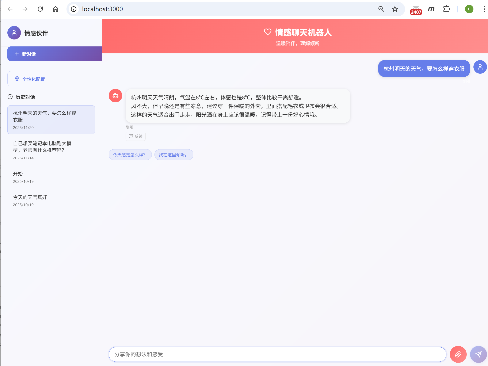
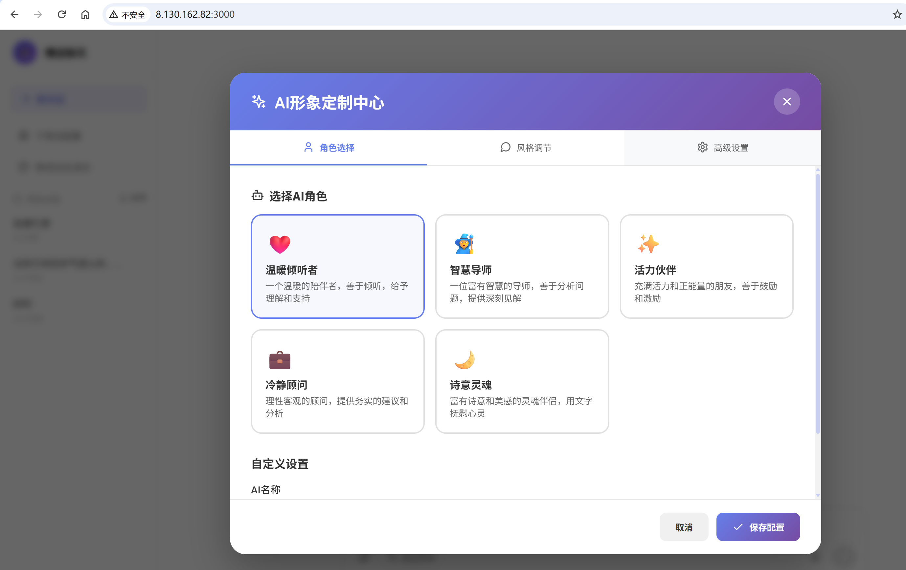

# 心语情感陪伴机器人 🤖💝

一个基于 **阿里云通义千问(Qwen)** + **Agent架构** + **RAG知识库** + **向量数据库** 的智能情感支持聊天机器人，具有情感识别、共情回应、主动服务、长期记忆和数据分析能力。

> **参考项目**: [emotional_chat](https://github.com/congde/emotional_chat.git)

> **🆕 更新说明 v3.0.0**: 
> - ✅ 从 OpenAI GPT 迁移至阿里云通义千问(Qwen)
> - ✅ 集成 Agent 智能核心（从被动响应升级到主动服务）
> - ✅ 集成 RAG 知识库系统（专业心理健康知识增强）
> - ✅ 分层服务架构重构（更好的可维护性和扩展性）
> - ✅ Docker 容器化支持（一键部署）

## 📑 目录

- [功能特点](#-功能特点)
- [快速开始](#-快速开始)
- [系统架构](#️-系统架构)
- [技术栈](#️-技术栈)
- [项目结构](#-项目结构)
- [API接口文档](#-api接口文档)
- [核心功能](#-核心功能)
- [界面预览](#-界面预览)
- [生产部署](#-生产部署)
- [Makefile命令](#️-makefile-命令速查)
- [相关文档](#-相关文档)
- [版本历史](#-版本历史)
- [贡献指南](#-贡献指南)

## ✨ 功能特点

### 核心功能
- 🎭 **情感识别**: 智能分析用户情感状态（开心、难过、焦虑、愤怒等）
- 🎯 **意图识别**: ✅ 混合式意图识别系统，准确理解用户意图（6大类型）
- 💝 **共情回应**: 根据情感状态和意图生成温暖、理解的回应
- 🧠 **长期记忆**: ✅ Chroma 向量数据库，支持跨会话语义检索
- 📚 **RAG知识库**: ✅ 集成专业心理健康知识库，提供科学依据的建议
- 🤖 **Agent智能核心**: ✅ 从被动响应升级到主动服务，智能任务规划和工具调用
- 🎙️ **多模态交互**: 🆕 支持语音识别、语音合成、图像理解，融合文本/语音/图像情感
- 🗄️ **数据持久化**: MySQL + Redis 多层存储架构
- 📊 **情感趋势分析**: 分析用户情感变化趋势和模式
- 🔄 **上下文理解**: 基于对话历史和用户画像提供连贯的回应
- 🚨 **危机检测**: 自动识别危机情况，提供专业求助资源

### 技术特性
- 🚀 **高性能架构**: FastAPI + LangChain + 分层服务架构
- 🎨 **现代化界面**: React 18 + Styled Components + 打字机效果
- ⌨️ **打字机效果**: 智能打字机动画，根据情绪调整速度和光标颜色
- 🎙️ **多模态处理**: 🆕 Whisper语音识别 + gTTS语音合成 + DeepFace人脸情绪识别
- 🐳 **容器化部署**: Docker Compose 一键部署
- 📈 **监控体系**: Prometheus + Grafana 完整监控
- 🔒 **安全过滤**: 自动检测高风险词汇并提供专业求助信息
- 🇨🇳 **中文优化**: 使用通义千问模型，对中文理解和表达更加自然
- 🔄 **数据库迁移**: Alembic 管理数据库版本
- 🤝 **混合架构**: 规则引擎 + 机器学习分类器双重保障

### 🌟 通义千问模型优势

- **卓越的中文能力**: 针对中文场景深度优化，理解和表达更自然
- **情感共情出色**: 在心理健康场景表现优异，回复温暖细腻
- **稳定可靠**: 阿里云基础设施保障，服务稳定性高
- **成本优化**: 相比国外模型，性价比更高

### 🤖 Agent智能核心（核心功能）

**状态**: ✅ 已完成集成

从"被动响应"升级到"主动服务"的智能对话系统。

**核心组件**:
- 🧠 **Planner (规划器)**: 智能任务分解和策略选择
- 🛠️ **Tool Caller (工具调用器)**: 10+ 内置工具自动调用
- 💾 **Memory Hub (记忆中枢)**: 长短期记忆管理和用户画像
- 🔄 **Reflector (反思器)**: 主动回访和策略优化
- ⚙️ **Agent Core (核心控制器)**: 统筹协调所有组件

**工作原理**:
```
用户输入 → Agent Core
            ↓
    ┌──────┴──────┐
    │   Planner   │ 分析目标、分解任务
    └──────┬──────┘
           ↓
    ┌──────┴──────┐
    │  Memory Hub │ 检索记忆、构建画像
    └──────┬──────┘
           ↓
    ┌──────┴──────┐
    │ Tool Caller │ 调用工具、执行任务
    └──────┬──────┘
           ↓
    ┌──────┴──────┐
    │  Reflector  │ 评估效果、规划回访
    └──────┬──────┘
           ↓
      智能回复生成
```

**详细文档**: 查看 [AGENT_README.md](AGENT_README.md)

### ⌨️ 打字机效果系统

**状态**: ✅ 已完成集成

为AI回复添加了智能打字机效果，让对话更加生动有趣。

**核心特性**:
- 🎭 **情绪化打字**: 根据AI情绪调整打字速度和光标颜色
- ⚡ **智能速度**: 标点符号停顿、中文字符优化、空格快速通过
- 🎮 **交互控制**: 点击暂停/恢复、暂停指示器
- 🎨 **视觉增强**: 闪烁光标、情绪色彩、动画效果

**情绪化配置**:
```
😢 悲伤情绪: 40ms速度 + 蓝色光标 (#74b9ff)
😠 愤怒情绪: 20ms速度 + 红色光标 (#ff7675)  
😊 开心情绪: 25ms速度 + 绿色光标 (#00b894)
😐 中性情绪: 30ms速度 + 黑色光标 (#333)
```

**技术实现**:
- React组件化设计
- 动态速度计算算法
- 情绪状态映射
- 用户交互控制

### 🎯 意图识别系统

**状态**: ✅ 已完成集成

采用"规则+模型"的混合架构，准确识别用户意图，为对话生成提供关键依据。

**核心特性**:
- 🔍 **混合识别**: 规则引擎（快速）+ ML分类器（准确）
- 🚨 **危机优先**: 优先检测危机情况，确保安全第一
- 💡 **智能Prompt**: 根据意图自动构建针对性的响应策略
- ⚡ **高效处理**: 关键词快速匹配，毫秒级响应

**6大意图类型**:
| 意图 | 说明 | 示例 |
|------|------|------|
| **emotion** | 情感表达 | "我好难过"、"今天心情不好" |
| **advice** | 寻求建议 | "怎么办？"、"你有什么建议" |
| **conversation** | 普通对话 | "今天天气不错" |
| **function** | 功能请求 | "提醒我吃药" |
| **crisis** | 危机干预 | "不想活了" ⚠️ |
| **chat** | 闲聊 | "你好"、"在吗" |

**测试意图识别**:
```bash
# 运行测试套件
python3 test_intent_module.py

# 测试API接口
curl -X POST http://localhost:8000/intent/analyze \
  -H "Content-Type: application/json" \
  -d '{"text": "我该怎么办？", "user_id": "test_user"}'
```

**详细文档**: 查看 [docs/意图识别模块说明.md](docs/意图识别模块说明.md)

### 📚 RAG知识库系统

**状态**: ✅ 已完成集成

集成专业心理健康知识库，提供有科学依据的建议。

**特性**:
- 📖 **知识加载**: 支持 PDF、文本等多种格式
- 🔍 **语义检索**: 基于向量相似度检索相关知识
- 💡 **智能增强**: 自动判断何时使用知识库
- 🎯 **精准匹配**: 6大类心理健康知识分类

**知识类别**:
1. 认知行为疗法（CBT）
2. 正念减压技术（MBSR）
3. 积极心理学
4. 焦虑应对策略
5. 睡眠改善方法
6. 情绪调节技巧

**初始化知识库**:
```bash
# 初始化内置知识
make rag-init

# 或直接运行
python init_rag_knowledge.py
```

**详细文档**: 查看 [docs/RAG实施步骤.md](docs/RAG实施步骤.md)

### 🧠 记忆系统

**多层记忆架构**:
```
短期记忆 (MySQL)    +    长期记忆 (Chroma向量数据库)
当前会话对话              跨会话语义相似对话
      ↓                        ↓
            上下文融合
                 ↓
            用户画像
                 ↓
          智能回复生成
```

**特性**:
- 🔍 **语义检索**: 基于语义相似度检索历史对话
- 🌐 **跨会话记忆**: 不限于当前会话，可访问所有历史对话
- 👤 **用户画像**: 自动构建用户性格特征和偏好
- 😊 **情感模式学习**: 学习用户的情感表达模式

## 🚀 快速开始

> 💡 **提示**: 完整详细的安装指南请查看 [快速开始详细指南](#快速开始详细指南)

### 快速启动（3步）

```bash
# 1. 安装依赖
make install

# 2. 初始化数据库
make db-upgrade

# 3. 启动服务
make run              # 后端服务
cd frontend && npm start  # 前端服务（新终端）
```

### 访问地址

- 🌐 **前端界面**: http://localhost:3000
- 🔌 **后端API**: http://localhost:8000
- 📖 **API文档**: http://localhost:8000/docs

### Docker 一键部署

```bash
# 配置环境变量
cp config.env.example config.env
nano config.env

# 启动所有服务
docker-compose up -d
```

---

## 快速开始详细指南

### 1. 环境准备

#### 1.1 安装系统依赖

```bash
# CentOS/RHEL/Alibaba Cloud Linux
sudo yum install -y cmake gcc gcc-c++ make

# Ubuntu/Debian
sudo apt update && sudo apt install -y cmake gcc g++ make build-essential
```

#### 1.2 安装Python依赖

```bash
cd /home/workSpace/emotional_chat

# 检查Python版本
python3 --version

# 安装依赖（Python 3.10+）
pip3 install --user -r requirements.txt
# 或 python3.10 -m pip install --user -r requirements.txt

cd frontend && npm install && cd ..
```

#### 1.3 配置环境变量

```bash
cp config.env.example config.env
nano config.env  # 配置API密钥和数据库信息
```

**必需配置项**:
- `LLM_API_KEY` 或 `DASHSCOPE_API_KEY`: 阿里云通义千问API密钥
- `MYSQL_HOST`, `MYSQL_USER`, `MYSQL_PASSWORD`: MySQL数据库配置

> 📝 **获取API Key**: 访问 [阿里云 DashScope](https://dashscope.console.aliyun.com/) 创建API Key

#### 1.4 安装MySQL

```bash
# Ubuntu/Debian
sudo apt install mysql-server mysql-client
sudo systemctl start mysql

# CentOS/RHEL
sudo yum install mysql-server mysql
sudo systemctl start mysql
```

### 2. 初始化数据库

```bash
# 创建数据库
mysql -u root -p -e "CREATE DATABASE emotional_chat CHARACTER SET utf8mb4 COLLATE utf8mb4_unicode_ci;"

# 运行数据库迁移
make db-upgrade

# 初始化RAG知识库（推荐）
make rag-init
```

### 3. 启动服务

**后端服务**:
```bash
python3 run_backend.py
# 或使用 uvicorn（从项目根目录）
python3 -m uvicorn backend.app:app --host 0.0.0.0 --port 8000 --reload
```

**前端服务**（新终端）:
```bash
cd frontend
npm start
```

### 4. 验证服务

```bash
# 健康检查
curl http://localhost:8000/health

# 测试聊天接口
curl -X POST http://localhost:8000/chat \
  -H "Content-Type: application/json" \
  -d '{"message": "你好", "user_id": "test_user"}'
```

### 5. 故障排除

**常见问题**:
- 端口冲突: `netstat -tulpn | grep :8000` 查看占用
- 依赖安装失败: 确保已安装 CMake 和编译工具
- 数据库连接失败: 检查 `config.env` 中的数据库配置

> 📖 **更多帮助**: 查看 [完整安装指南](#快速开始详细指南) 或提交 Issue

---

## 🏗️ 系统架构

### 总体架构图

```
┌─────────────────────────────────────────────────────┐
│                   前端层 (Frontend)                   │
│              React 18 + Styled Components            │
│                    端口: 3000                         │
└──────────────────────┬──────────────────────────────┘
                       │ HTTP/WebSocket
┌──────────────────────▼──────────────────────────────┐
│                    路由层 (Router)                    │
│    Chat | Memory | Feedback | Evaluation | RAG       │
│                    Agent Router                       │
└──────────────────────┬──────────────────────────────┘
                       │
┌──────────────────────▼──────────────────────────────┐
│                   服务层 (Service)                    │
│  ChatService | MemoryService | ContextService        │
│              AgentService (可选)                      │
└──────────────────────┬──────────────────────────────┘
                       │
┌──────────────────────▼──────────────────────────────┐
│                 核心层 (Core/Module)                  │
│  ┌──────────────┐  ┌──────────────┐  ┌───────────┐  │
│  │ Agent Core   │  │  RAG Module  │  │ LLM Module│  │
│  │ • Planner    │  │ • KB Manager │  │• Qwen API │  │
│  │ • Tool Caller│  │ • Retriever  │  │• LangChain│  │
│  │ • Memory Hub │  │ • Embedder   │  └───────────┘  │
│  │ • Reflector  │  └──────────────┘                  │
│  └──────────────┘                                    │
└──────────────────────┬──────────────────────────────┘
                       │
┌──────────────────────▼──────────────────────────────┐
│                  数据层 (Data)                        │
│  ┌──────────┐  ┌──────────┐  ┌──────────┐           │
│  │  MySQL   │  │ ChromaDB │  │  Redis   │           │
│  │关系数据库 │  │向量数据库│  │  缓存    │           │
│  └──────────┘  └──────────┘  └──────────┘           │
└─────────────────────────────────────────────────────┘
```

### 分层服务架构详解

#### 1. 路由层 (Router Layer)
负责API接口定义和请求分发

```
backend/routers/
├── chat.py          - 聊天接口
├── memory.py        - 记忆管理接口
├── feedback.py      - 用户反馈接口
├── evaluation.py    - 评估系统接口
└── agent.py         - Agent智能接口
```

#### 2. 服务层 (Service Layer)
业务逻辑封装和编排

```
backend/services/
├── chat_service.py      - 聊天服务
├── memory_service.py    - 记忆服务
├── context_service.py   - 上下文服务
└── agent_service.py     - Agent服务（可选）
```

#### 3. 核心层 (Core/Module Layer)
核心功能模块

```
backend/modules/
├── agent/          - Agent智能核心
│   ├── core/       - Agent Core, Planner, Tool Caller等
│   ├── services/   - Agent服务实现
│   └── routers/    - Agent路由
├── rag/            - RAG知识库系统
│   ├── core/       - 知识库管理、检索
│   ├── services/   - RAG服务
│   └── routers/    - RAG路由
└── llm/            - LLM模型封装
    ├── core/       - LLM核心功能
    ├── providers/  - LLM提供商封装（OpenAI、Anthropic等）
    └── services/   - LLM服务
```

#### 4. 数据层 (Data Layer)
数据存储和管理

- **MySQL**: 用户数据、对话历史、情感记录
- **ChromaDB**: 向量存储、语义检索
- **Redis**: 缓存、会话状态（生产环境）

> 📖 **详细架构文档**: 查看相关模块文档

## 🛠️ 技术栈

### 后端技术

#### 核心框架
- **Python 3.10+**: 主要开发语言
  - 使用 `requirements.txt` 安装依赖
- **FastAPI 0.83+**: 现代化的Web框架
- **LangChain 0.1+**: 对话流管理和记忆管理
- **Pydantic**: 数据验证和序列化

#### AI & 大模型
- **阿里云通义千问 (Qwen Plus)**: 大语言模型
- **LangChain-OpenAI**: LLM集成
- **Sentence Transformers**: 文本嵌入模型

#### 数据存储
- **MySQL 8.0**: 关系型数据库（用户数据、对话历史）
- **ChromaDB 0.4+**: 向量数据库（语义检索、长期记忆）
- **Redis 7**: 缓存和会话管理（生产环境）
- **SQLAlchemy 1.4+**: ORM框架
- **Alembic**: 数据库迁移工具

#### 文档处理
- **PyPDF 3.17+**: PDF文档解析
- **python-multipart**: 文件上传支持

#### 运维工具
- **Docker & Docker Compose**: 容器化部署
- **Prometheus**: 指标监控
- **Grafana**: 数据可视化
- **Elasticsearch & Kibana**: 日志聚合和分析
- **Nginx**: 反向代理

### 前端技术
- **React 18**: UI框架
- **Styled Components**: CSS-in-JS样式方案
- **Framer Motion**: 动画效果库
- **Axios**: HTTP客户端

### 开发工具
- **Makefile**: 命令行工具集成
- **Python dotenv**: 环境变量管理
- **Logging**: 结构化日志系统

## 🚀 快速开始

### 1. 环境准备

#### 1.1 安装系统依赖（必需）

**安装 CMake 和编译工具**

某些 Python 包（如 `dlib`、`opencv-python`）需要从源码编译，因此需要安装编译工具：

```bash
# CentOS/RHEL/Alibaba Cloud Linux
sudo yum install -y cmake gcc gcc-c++ make

# Ubuntu/Debian
sudo apt update
sudo apt install -y cmake gcc g++ make build-essential

# 验证安装
cmake --version
gcc --version
```

**注意**：
- `dlib`（face-recognition 的依赖）需要 CMake 编译，预计编译时间 10-30 分钟
- `opencv-python` 也需要编译，预计编译时间 5-15 分钟
- 如果不需要人脸识别功能，可以注释掉 `requirements.txt` 中的 `face-recognition>=1.3.0`

#### 1.2 安装Python依赖
```bash
# 进入项目目录
cd /home/emotional_chat

# 检查Python版本
python3 --version

# 安装依赖（Python 3.10+）
pip3 install --user -r requirements.txt

# 注意：如果遇到 dlib 编译失败，请确保已安装 CMake
# 如果遇到版本冲突，请参考对应 requirements 文件中的注释说明

# 安装前端依赖
cd frontend
npm install
cd ..
```

#### 1.3 配置环境变量
```bash
# 复制环境变量模板
cp config.env.example config.env

# 编辑配置文件
nano config.env
```

配置内容：
```bash
# API配置 - 使用阿里云通义千问(Qwen)
LLM_API_KEY=your_qwen_api_key_here
# 或者使用 DASHSCOPE_API_KEY (兼容旧版本)
# DASHSCOPE_API_KEY=your_qwen_api_key_here
LLM_BASE_URL=https://dashscope.aliyuncs.com/compatible-mode/v1

# MySQL数据库配置
MYSQL_HOST=localhost
MYSQL_PORT=3306
MYSQL_USER=root
MYSQL_PASSWORD=your_password
MYSQL_DATABASE=emotional_chat

# 模型配置 - 使用通义千问
DEFAULT_MODEL=qwen-plus
TEMPERATURE=0.7
MAX_TOKENS=1000

# 服务器配置
HOST=0.0.0.0
PORT=8000
DEBUG=true
```

**获取通义千问 API Key**：
1. 访问阿里云 DashScope 平台：https://dashscope.console.aliyun.com/
2. 登录阿里云账号
3. 创建 API Key
4. 将 API Key 填入 `config.env` 文件

#### 1.4 安装和配置MySQL
```bash
# Ubuntu/Debian
sudo apt update
sudo apt install mysql-server mysql-client

# CentOS/RHEL
sudo yum install mysql-server mysql

# 启动MySQL服务
sudo systemctl start mysql
sudo systemctl enable mysql

# 配置MySQL（可选）
sudo mysql_secure_installation
```

### 2. 初始化数据库

#### 2.1 创建MySQL数据库
```bash
# 登录MySQL
mysql -u root -p

# 创建数据库
CREATE DATABASE emotional_chat CHARACTER SET utf8mb4 COLLATE utf8mb4_unicode_ci;

# 退出MySQL
exit;
```

#### 2.2 运行数据库迁移
```bash
# 方法1：使用Makefile（推荐）
make db-init          # 初始化数据库
make db-upgrade       # 升级到最新版本

# 方法2：使用Alembic命令
alembic upgrade head  # 升级到最新版本

# 查看数据库状态
make db-current       # 查看当前版本
make db-history       # 查看迁移历史
```

#### 2.3 初始化RAG知识库（可选但推荐）
```bash
# 使用Makefile
make rag-init

# 或直接运行
python init_rag_knowledge.py
```

### 3. 启动服务

#### 3.1 启动后端服务
```bash
# 方法1：使用启动脚本（推荐，避免文件监视限制问题）
python3 run_backend.py

# 方法2：直接在backend目录启动
cd backend
python3 -m uvicorn backend.app:app --host 0.0.0.0 --port 8000 --reload
```

> **注意**：启动脚本会自动切换到 backend 目录运行，避免 watchfiles 扫描 frontend/node_modules 导致的文件监视限制问题。

后端服务将在 `http://localhost:8000` 启动，API文档可在 `http://localhost:8000/docs` 查看。

#### 3.2 启动前端服务
```bash
# 新开一个终端窗口
cd /home/emotional_chat/frontend

# 启动前端服务（端口3000）
npm start
```

前端应用将在 `http://localhost:3000` 启动。


### 4. 验证服务

**检查后端服务**
```bash
# 健康检查
curl http://localhost:8000/health
# 预期响应包含: version: "3.0.0", agent_enabled: true

# 查看系统信息（了解架构）
curl http://localhost:8000/system/info

# 查看API根路径
curl http://localhost:8000/
# 预期响应包含: Agent智能核心、RAG知识库等功能列表

# 测试普通聊天接口
curl -X POST http://localhost:8000/chat \
  -H "Content-Type: application/json" \
  -d '{"message": "你好，我今天心情很好！", "user_id": "test_user"}'

# 测试Agent接口（如果启用）
curl -X POST http://localhost:8000/agent/chat \
  -H "Content-Type: application/json" \
  -d '{"message": "我最近睡不好，怎么办？", "user_id": "test_user"}'

# 查看API文档
open http://localhost:8000/docs  # 或在浏览器中访问
```

**检查前端服务**
- 打开浏览器访问 `http://localhost:3000`
- 应该能看到现代化的聊天界面

**检查数据库连接**
```bash
# 使用Makefile
make db-check

# 查看表结构
mysql -u root -p emotional_chat -e "SHOW TABLES;"
```

**检查RAG知识库**
```bash
# 测试RAG系统
make rag-test

# 或查看知识库状态
curl http://localhost:8000/rag/status
```

### 5. 使用说明

1. 打开浏览器访问 `http://localhost:3000`
2. 在输入框中输入你的想法和感受
3. 机器人会分析你的情感并给出共情回应
4. 支持多轮对话，机器人会记住对话历史
5. 查看API文档：http://localhost:8000/docs

### 6. 故障排除

**后端启动失败**
```bash
# 检查Python版本
python3 --version

# 检查依赖安装
pip3 list | grep fastapi

# 手动安装依赖（Python 3.10+）
python3 --version  # 先检查版本
pip3 install --user -r requirements.txt

# 检查MySQL连接
python3 setup_database.py
```

**前端启动失败**
```bash
# 检查Node.js版本
node --version
npm --version

# 清理并重新安装依赖
cd frontend
rm -rf node_modules package-lock.json
npm install
```

**端口冲突**
```bash
# 检查端口占用
netstat -tulpn | grep :8000
netstat -tulpn | grep :3000

# 杀死占用端口的进程
sudo kill -9 <PID>
```

## 🎯 快速启动总结

### 方式一：使用Makefile（推荐）

```bash
# 1. 安装依赖
make install

# 2. 初始化数据库
make db-upgrade

# 3. 初始化RAG知识库（可选）
make rag-init

# 4. 启动后端服务
make run
```

### 方式二：使用Docker Compose

```bash
# 一键启动所有服务（包含监控栈）
docker-compose up -d

# 查看服务状态
docker-compose ps
```

### 方式三：传统方式

**终端1 - 启动后端：**
```bash
# 在项目根目录运行（推荐）
python3 run_backend.py

# 或者使用uvicorn
cd backend
python3 -m uvicorn backend.app:app --host 0.0.0.0 --port 8000 --reload
```

**终端2 - 启动前端：**
```bash
cd frontend
npm start
```

### 访问地址

- 🌐 前端界面：http://localhost:3000
- 🔌 后端API：http://localhost:8000
- 📖 API文档：http://localhost:8000/docs
- 📊 系统信息：http://localhost:8000/system/info

### 测试系统

```bash
# 测试后端健康状态
curl http://localhost:8000/health

# 查看系统信息
curl http://localhost:8000/

# 测试普通聊天
curl -X POST http://localhost:8000/chat \
  -H "Content-Type: application/json" \
  -d '{"message": "你好", "user_id": "test_user"}'

# 测试Agent聊天（智能模式）
curl -X POST http://localhost:8000/agent/chat \
  -H "Content-Type: application/json" \
  -d '{"message": "我最近压力很大", "user_id": "test_user"}'

# 测试RAG知识库
curl -X POST http://localhost:8000/rag/search \
  -H "Content-Type: application/json" \
  -d '{"query": "如何减压", "top_k": 3}'
```

### 常用Makefile命令

```bash
make help         # 查看所有可用命令
make db-check     # 检查数据库连接
make db-current   # 查看当前数据库版本
make rag-test     # 测试RAG系统
make rag-demo     # RAG效果对比演示
```

## 📁 项目结构

```
emotional_chat/
├── backend/                          # 后端代码目录
│   ├── __init__.py                  
│   ├── app.py                       # ✅ FastAPI应用工厂（主入口）
│   ├── main.py                      # 旧版主程序（兼容性）
│   │
│   ├── routers/                     # 路由层 - API接口定义
│   │   ├── __init__.py
│   │   ├── chat.py                  # 聊天接口
│   │   ├── enhanced_chat.py         # 增强版聊天接口
│   │   ├── streaming_chat.py        # 流式聊天接口
│   │   ├── memory.py                # 记忆管理接口
│   │   ├── feedback.py              # 反馈接口
│   │   ├── evaluation.py            # 评估接口
│   │   ├── agent.py                 # Agent智能接口
│   │   ├── emotion_analysis.py      # 情感分析接口
│   │   ├── performance.py           # 性能监控接口
│   │   └── personalization.py       # 个性化配置接口
│   │
│   ├── services/                    # 服务层 - 业务逻辑
│   │   ├── __init__.py
│   │   ├── chat_service.py          # 聊天服务
│   │   ├── enhanced_chat_service.py # 增强版聊天服务
│   │   ├── optimized_chat_service.py # 优化版聊天服务
│   │   ├── memory_service.py        # 记忆服务
│   │   ├── enhanced_memory_manager.py # 增强版记忆管理
│   │   ├── context_service.py       # 上下文服务
│   │   ├── enhanced_context_assembler.py # 增强版上下文组装
│   │   ├── agent_service.py         # Agent服务
│   │   ├── personalization_service.py # 个性化服务
│   │   ├── user_profile_builder.py  # 用户画像构建
│   │   ├── emotion_trend_analyzer.py # 情感趋势分析
│   │   ├── advanced_sentiment_analyzer.py # 高级情感分析
│   │   ├── proactive_recall_system.py # 主动回访系统
│   │   ├── performance_optimizer.py # 性能优化器
│   │   └── prompt_composer.py       # Prompt组合器
│   │
│   ├── modules/                     # 模块层 - 核心功能
│   │   ├── agent/                   # ✅ Agent智能核心模块
│   │   │   ├── core/                # Agent核心组件
│   │   │   ├── services/            # Agent服务
│   │   │   ├── routers/             # Agent路由
│   │   │   ├── models/              # Agent数据模型
│   │   │   └── protocol/            # Agent协议
│   │   │
│   │   ├── rag/                     # ✅ RAG知识库系统
│   │   │   ├── core/                # RAG核心
│   │   │   │   ├── knowledge_base.py   # 知识库管理
│   │   │   │   └── retriever.py        # 检索器
│   │   │   ├── services/            # RAG服务
│   │   │   ├── routers/             # RAG路由
│   │   │   └── models/              # RAG数据模型
│   │   │
│   │   ├── llm/                     # LLM模型封装
│   │   │   ├── core/                # LLM核心
│   │   │   ├── providers/           # LLM提供商封装
│   │   │   ├── services/            # LLM服务
│   │   │   └── models/              # LLM数据模型
│   │   │
│   │   ├── intent/                  # 意图识别模块
│   │   │   ├── core/                # 意图识别核心
│   │   │   ├── services/            # 意图识别服务
│   │   │   ├── routers/             # 意图识别路由
│   │   │   └── models/              # 意图识别数据模型
│   │   │
│   │   └── multimodal/              # 多模态处理模块
│   │       ├── core/                # 多模态核心
│   │       └── services/            # 多模态服务
│   │
│   ├── agent/                        # Agent核心实现（独立模块）
│   │   ├── __init__.py
│   │   ├── agent_core.py            # Agent核心控制器
│   │   ├── planner.py               # 任务规划器
│   │   ├── tool_caller.py           # 工具调用器
│   │   ├── memory_hub.py            # 记忆中枢
│   │   ├── reflector.py             # 反思优化器
│   │   ├── tools/                   # Agent工具集
│   │   │   ├── calendar_api.py      # 日历工具
│   │   │   ├── scheduler_service.py # 调度服务
│   │   │   ├── psychology_db.py     # 心理学数据库
│   │   │   └── audio_player.py      # 音频播放器
│   │   └── README.md                # Agent模块文档
│   │
│   ├── plugins/                      # 插件系统
│   │   ├── __init__.py
│   │   ├── base_plugin.py           # 插件基类
│   │   ├── plugin_manager.py        # 插件管理器
│   │   ├── weather_plugin.py        # 天气插件
│   │   ├── news_plugin.py           # 新闻插件
│   │   └── README.md                # 插件系统文档
│   │
│   ├── core/                         # 核心工具和接口
│   │   ├── config.py                # 核心配置
│   │   ├── interfaces.py            # 接口定义
│   │   ├── exceptions.py            # 异常定义
│   │   ├── factories.py             # 工厂模式
│   │   ├── config/                  # 配置子目录
│   │   ├── exceptions/              # 异常子目录
│   │   ├── interfaces/              # 接口子目录
│   │   └── utils/                   # 工具函数
│   │
│   ├── config/                       # 配置文件目录
│   │   ├── emotion_strategy.yaml    # 情感策略配置
│   │   └── performance_config.py    # 性能配置
│   │
│   ├── middleware/                   # 中间件
│   │   ├── __init__.py
│   │   ├── error_handler.py         # 错误处理中间件
│   │   └── logging_middleware.py    # 日志中间件
│   │
│   ├── schemas/                      # 数据模式定义
│   │   ├── __init__.py
│   │   ├── chat_schemas.py          # 聊天数据模式
│   │   └── common_schemas.py        # 通用数据模式
│   │
│   ├── utils/                        # 工具函数
│   │   └── sentiment_classifier.py  # 情感分类器
│   │
│   ├── validators/                   # 数据验证器
│   │
│   ├── tests/                        # 测试目录
│   │   ├── __init__.py
│   │   ├── unit/                    # 单元测试
│   │   ├── integration/             # 集成测试
│   │   ├── e2e/                     # 端到端测试
│   │   └── fixtures/                # 测试 fixtures
│   │
│   ├── migrations/                   # 数据库迁移（Alembic）
│   │
│   ├── database.py                   # 数据库模型（SQLAlchemy）
│   ├── models.py                     # Pydantic数据模型
│   ├── dependencies.py               # FastAPI依赖注入
│   ├── logging_config.py             # 日志配置
│   ├── emotion_analyzer.py           # 情感分析器
│   ├── vector_store.py               # 向量数据库操作
│   ├── memory_manager.py             # 记忆管理器
│   ├── memory_extractor.py          # 记忆提取器
│   ├── context_assembler.py         # 上下文组装器
│   ├── evaluation_engine.py          # 评估引擎
│   ├── feedback_analyzer.py          # 反馈分析器
│   ├── multimodal_services.py        # 多模态服务
│   ├── prompt_optimizer.py           # Prompt优化器
│   └── xinyu_prompt.py               # 心语Prompt模板
│
├── frontend/                         # 前端代码目录
│   ├── public/                      
│   │   └── index.html               
│   ├── src/                         
│   │   ├── App.js                   # React主组件
│   │   ├── index.js                 # 入口文件
│   │   ├── index.css                # 全局样式
│   │   ├── components/              # 组件目录
│   │   │   ├── TypewriterText.js    # 打字机效果组件
│   │   │   ├── ChatContainer.js     # 聊天容器组件
│   │   │   ├── FeedbackModal.js     # 反馈模态框
│   │   │   ├── MultimodalInput.js   # 多模态输入组件
│   │   │   ├── PersonalizationPanel.js # 个性化面板
│   │   │   ├── Sidebar.js           # 侧边栏组件
│   │   │   └── StyleComparison.js   # 样式对比组件
│   │   ├── services/                # 服务层
│   │   │   └── ChatAPI.js           # API调用封装
│   │   ├── hooks/                   # React Hooks
│   │   ├── utils/                   # 工具函数
│   │   ├── styles/                  # 样式文件
│   │   └── constants/                # 常量定义
│   ├── package.json                 
│   └── package-lock.json            
│
├── alembic/                          # 数据库迁移
│   ├── versions/                    # 迁移脚本
│   ├── env.py                       # Alembic环境
│   └── alembic.ini                  # Alembic配置
│
├── docs/                             # 文档目录
│   ├── RAG实施步骤.md               # RAG系统文档
│   ├── 记忆系统架构.md              # 记忆系统文档
│   ├── 意图识别模块说明.md          # 意图识别文档
│   ├── 增强版输入处理器使用指南.md  # 输入处理器文档
│   ├── 生产部署指南.md              # 生产部署文档
│   ├── API接口文档.md               # API接口文档
│   ├── plugin_system_guide.md       # 插件系统指南
│   ├── performance_optimization_guide.md # 性能优化指南
│   ├── 个性化配置功能文档.md        # 个性化配置文档
│   └── ...                          # 更多文档
│
├── examples/                         # 示例代码
│   ├── intent_recognition_demo.py   # 意图识别示例
│   ├── performance_optimization_example.py # 性能优化示例
│   └── response_generation_example.py # 响应生成示例
│
├── knowledge_base/                   # 知识库文件存储
│
├── chroma_db/                        # ChromaDB向量数据库存储
├── uploads/                          # 文件上传目录
├── log/                              # 日志目录
│
├── config.py                         # 全局配置
├── config.env                        # 环境变量配置 ⚠️ 包含密钥
├── config.env.example                # 环境变量模板
├── env_example.txt                   # 旧版环境变量模板（已弃用）
├── run_backend.py                    # 后端启动脚本
├── simple_backend.py                 # 简化版后端（测试用）
├── db_manager.py                     # 数据库管理工具
├── init_rag_knowledge.py            # RAG知识库初始化
├── quick_start.py                    # 快速启动脚本
├── demo_agent.py                     # Agent演示脚本
├── test_agent.py                     # Agent测试脚本
├── test_sentiment_offline.py         # 离线情感测试
├── test_weather_plugin.py            # 天气插件测试
├── requirements.txt                  # Python 3.10+ 依赖
├── Makefile                          # 命令行工具
├── Dockerfile                        # Docker镜像构建
├── docker-compose.yml               # Docker容器编排
├── alembic.ini                      # Alembic配置
├── AGENT_README.md                  # Agent模块文档
├── PYTHON310_INSTALL.md             # Python 3.10 安装指南
├── LICENSE                           
└── README.md                         # 项目文档（本文件）
```

### 核心文件说明

#### 🔥 应用入口

| 文件 | 用途 | 说明 |
|------|------|------|
| `backend/app.py` | ✅ 应用工厂 | FastAPI应用创建和配置（v3.0） |
| `backend/main.py` | 旧版入口 | 兼容性保留 |
| `run_backend.py` | 启动脚本 | 推荐的启动方式 |

#### 📊 架构层级

| 层级 | 目录 | 说明 |
|------|------|------|
| 路由层 | `backend/routers/` | API接口定义和请求分发（chat, agent, memory等） |
| 服务层 | `backend/services/` | 业务逻辑封装和编排（chat_service, memory_service等） |
| 模块层 | `backend/modules/` | Agent、RAG、LLM、Intent、Multimodal核心模块 |
| Agent层 | `backend/agent/` | Agent核心实现（独立模块，包含工具集） |
| 插件层 | `backend/plugins/` | 插件系统（weather, news等扩展功能） |
| 中间件层 | `backend/middleware/` | 中间件（错误处理、日志等） |
| 数据层 | `backend/database.py` | 数据模型和数据库操作 |

#### 🤖 核心模块

| 模块 | 路径 | 说明 |
|------|------|------|
| Agent核心 | `backend/modules/agent/` | Agent模块化实现（core, services, routers） |
| Agent实现 | `backend/agent/` | Agent核心实现（agent_core, planner, tools等） |
| RAG系统 | `backend/modules/rag/` | 知识库管理和检索增强 |
| LLM封装 | `backend/modules/llm/` | 通义千问API封装（支持多提供商） |
| 意图识别 | `backend/modules/intent/` | 混合式意图识别系统 |
| 多模态 | `backend/modules/multimodal/` | 多模态处理（语音、图像等） |
| 插件系统 | `backend/plugins/` | 可扩展插件架构（weather, news等） |

#### 🛠️ 工具和配置

| 文件/目录 | 说明 |
|----------|------|
| `config.env` | 环境变量（API密钥、数据库配置）⚠️ 不要提交 |
| `backend/config/` | 配置文件目录（emotion_strategy.yaml等） |
| `Makefile` | 命令行工具（db-init, rag-init等） |
| `docker-compose.yml` | Docker容器编排（完整监控栈） |
| `alembic/` | 数据库版本管理 |
| `backend/tests/` | 测试套件（unit, integration, e2e） |
| `backend/schemas/` | 数据模式定义（Pydantic models） |
| `backend/utils/` | 工具函数库 |
| `examples/` | 示例代码和演示 |

## 📡 API接口文档

> 📖 **完整API文档**: 查看 [docs/API接口文档.md](docs/API接口文档.md) - 包含所有接口的详细说明、请求参数、响应示例和错误处理

### 主要接口概览

| 接口 | 方法 | 说明 |
|------|------|------|
| `/` | GET | 系统信息和功能列表 |
| `/health` | GET | 健康检查 |
| `/chat` | POST | 普通聊天接口 |
| `/agent/chat` | POST | Agent智能聊天接口 |
| `/sessions/{id}/history` | GET | 获取会话历史 |
| `/rag/search` | POST | RAG知识库检索 |
| `/agent/tools` | GET | Agent可用工具列表 |

### 快速测试

```bash
# 健康检查
curl http://localhost:8000/health

# 测试聊天
curl -X POST http://localhost:8000/chat \
  -H "Content-Type: application/json" \
  -d '{"message": "你好", "user_id": "test_user"}'
```

### 交互式文档

访问 **http://localhost:8000/docs** 查看完整的 Swagger UI 交互式文档，支持在线测试所有接口。

## 🎯 核心功能实现

### 1. Agent智能核心

**工作流程**:
```
用户输入
  ↓
Planner 分析目标 → 制定策略
  ↓
Memory Hub 检索记忆 → 构建画像
  ↓
Tool Caller 执行工具 → 获取资源
  ↓
生成回复 + 情感分析
  ↓
Reflector 评估效果 → 规划回访
```

**核心能力**:
- ✅ 智能任务分解和规划
- ✅ 10+ 工具自动调用
- ✅ 长短期记忆管理
- ✅ 用户画像构建
- ✅ 主动回访关怀
- ✅ 策略反思优化

### 2. RAG知识增强

**检索流程**:
```
用户问题
  ↓
问题分析 → 判断是否需要知识库
  ↓
向量检索 → 查找相关知识
  ↓
知识融合 → 增强prompt
  ↓
生成回复（基于知识 + 共情）
```

**特点**:
- ✅ 6大类专业心理健康知识
- ✅ 语义相似度检索
- ✅ 自动判断知识增强时机
- ✅ 支持PDF等多种格式导入

### 3. 情感分析系统

**分析维度**:
- 情感类型：开心、难过、焦虑、愤怒、平静等
- 情感强度：0-10分量化评估
- 关键词提取：识别情绪触发词
- 趋势分析：跨会话情感变化追踪

**实现方式**:
- 使用通义千问 API 进行情感理解
- 结合历史数据进行情感模式学习
- 自动记录情感分析结果到数据库

### 4. 记忆系统

**三层记忆架构**:

```
┌─────────────────────────────────┐
│  短期记忆 (Working Memory)       │
│  当前会话上下文（最近5-10条）     │
└──────────────┬──────────────────┘
               ↓
┌─────────────────────────────────┐
│  长期记忆 (Long-term Memory)     │
│  ChromaDB向量存储（所有历史）     │
└──────────────┬──────────────────┘
               ↓
┌─────────────────────────────────┐
│  用户画像 (User Profile)         │
│  性格特征、偏好、情感基线         │
└─────────────────────────────────┘
```

**功能**:
- ✅ 自动记忆提取和存储
- ✅ 语义相似度检索
- ✅ 跨会话记忆访问
- ✅ 用户画像自动构建

### 5. 评估和反馈系统

**自动评估**:
- 回复质量评估（1-5分）
- 共情度评估
- 实用性评估
- 用户满意度预测

**反馈收集**:
- 点赞/点踩
- 文字反馈
- 问题标注
- 改进建议收集

## 🔧 API接口

### 聊天接口
```http
POST http://localhost:8000/chat
Content-Type: application/json

{
  "message": "用户消息",
  "session_id": "会话ID（可选）",
  "user_id": "用户ID（可选）"
}
```

### 会话历史
```http
GET http://localhost:8000/sessions/{session_id}/history?limit=20
```

### 会话摘要
```http
GET http://localhost:8000/sessions/{session_id}/summary
```

## 🎨 界面预览

### 首页界面



现代化的聊天界面设计，包含：
- 情感标签可视化
- 建议按钮快速回复
- 流畅的动画效果
- 响应式设计，支持移动端

### AI形象定制



个性化AI形象定制功能，让AI陪伴更加生动有趣。

## 🔮 未来规划

### 近期计划（v3.1.0）
- [ ] Agent工具库扩展（20+工具）
- [ ] 真实的定时回访系统（APScheduler）
- [ ] 用户偏好学习和个性化推荐
- [ ] 多模态支持（图片理解）
- [ ] 语音转文字集成
- [ ] 性能优化和缓存策略

### 中期计划（v3.5.0）
- [ ] 多语言支持（英语、日语）
- [ ] 专业咨询师对接系统
- [ ] A/B测试框架
- [ ] 高级情感趋势分析和预测
- [ ] 群组聊天支持
- [ ] 移动端适配优化

### 长期计划（v4.0.0）
- [ ] 联邦学习保护隐私
- [ ] 本地化部署方案
- [ ] 移动端原生App
- [ ] 智能可穿戴设备集成
- [ ] 心理健康生态系统
- [ ] 开放API平台

## 📝 版本历史

### v3.0.0 (2025-10-16) - 当前版本
- ✅ Agent智能核心系统
- ✅ RAG知识库集成
- ✅ 分层服务架构重构
- ✅ Docker容器化部署
- ✅ 完整监控体系
- ✅ 数据库迁移管理（Alembic）
- ✅ 记忆系统升级
- ✅ 自动评估系统
- ✅ 打字机效果系统（情绪化打字动画）

### v2.0.0 (2025-10-10)
- ✅ 从OpenAI迁移到阿里云通义千问
- ✅ ChromaDB向量数据库集成
- ✅ LangChain记忆管理
- ✅ 情感分析优化
- ✅ React前端界面

### v1.0.0 (2025-10-01)
- ✅ 基础聊天功能
- ✅ MySQL数据持久化
- ✅ 情感识别
- ✅ 简单的上下文管理

## 🚀 生产部署

> 📦 **完整部署指南**：[docs/生产部署指南.md](docs/生产部署指南.md) - 从开发环境到生产环境的完整部署方案

项目提供完整的生产级部署方案，支持多种部署方式：

### 快速开始

**Docker Compose 部署（推荐）**：

```bash
# 1. 配置环境变量
cp config.env.example config.env
nano config.env

# 2. 启动服务
docker-compose up -d

# 3. 初始化数据库和知识库
docker-compose exec backend make db-upgrade
docker-compose exec backend make rag-init

# 4. 验证部署
curl http://localhost:8000/health
```

**传统部署**：

```bash
# 1. 安装依赖（Python 3.10+）
python --version  # 先检查版本
pip install -r requirements.txt

# 2. 配置环境
cp config.env.example config.env
nano config.env

# 3. 初始化数据库
make db-upgrade

# 4. 初始化知识库
make rag-init

# 5. 启动服务
python run_backend.py
```

### 部署检查清单

- [ ] 配置生产环境的`config.env`文件
- [ ] 更新CORS允许的域名（不要使用`*`）
- [ ] 配置反向代理（Nginx）
- [ ] 启用HTTPS/SSL证书
- [ ] 配置数据库备份策略
- [ ] 设置日志轮转
- [ ] 配置监控和告警
- [ ] 初始化数据库（`make db-upgrade`）
- [ ] 初始化RAG知识库（`make rag-init`）

### 部署架构

```
┌─────────────────────────────────────────────────────────┐
│                    用户浏览器                            │
│               (访问: http://your-domain.com)            │
└──────────────────────┬──────────────────────────────────┘
                       │
┌──────────────────────▼──────────────────────────────────┐
│                  Nginx 反向代理                          │
│              (端口: 80, 443)                            │
└─────┬──────────────────────────┬────────────────────────┘
      │                          │
┌─────▼──────────┐      ┌────────▼──────────┐
│   前端服务      │      │   后端API服务      │
│  React 18      │      │  FastAPI + Python │
│  端口: 3000    │      │  端口: 8000       │
└────────────────┘      └────┬──────┬───────┘
                             │      │
              ┌──────────────┼──────┼──────────────┐
              │              │      │              │
       ┌──────▼──────┐ ┌────▼────┐ ┌─────────────▼─┐
       │  MySQL      │ │  Redis  │ │   ChromaDB    │
       │  关系数据库  │ │  缓存   │ │   向量数据库  │
       └─────────────┘ └─────────┘ └───────────────┘

监控栈：
┌─────────────┬─────────────┬──────────────┬───────────┐
│ Prometheus  │  Grafana    │  Elasticsearch│  Kibana  │
│  指标采集   │  可视化     │  日志存储    │  日志分析 │
└─────────────┴─────────────┴──────────────┴───────────┘
```

### 完整部署文档

详细的生产部署指南包含：

- ✅ **部署前准备**：配置管理、依赖锁定、启动脚本
- ✅ **Docker容器化部署**：环境一致性、监控集成、数据持久化
- ✅ **云服务器部署**：ECS配置、Gunicorn配置、Systemd服务
- ✅ **HTTPS安全加固**：Let's Encrypt证书、Nginx配置
- ✅ **监控和维护**：Prometheus、Grafana、日志管理
- ✅ **故障排查**：常见问题解决方案

👉 **查看完整文档**：[docs/生产部署指南.md](docs/生产部署指南.md)

## 📝 许可证

MIT License

## 🛠️ Makefile 命令速查

项目提供了便捷的Makefile命令，简化常用操作：

```bash
# 查看所有可用命令
make help

# 安装依赖
make install

# 数据库管理
make db-init          # 初始化数据库
make db-upgrade       # 升级到最新版本
make db-downgrade     # 降级一个版本
make db-current       # 查看当前版本
make db-history       # 查看迁移历史
make db-check         # 检查数据库连接

# RAG知识库
make rag-init         # 初始化知识库
make rag-test         # 测试RAG系统
make rag-demo         # RAG效果对比演示

# 运行服务
make run              # 启动后端服务
```

## 📚 相关文档

### 核心模块文档
- **生产部署**: [docs/生产部署指南.md](docs/生产部署指南.md) - 从开发到生产的完整部署方案 🚀 **新增**
- **Agent模块**: [AGENT_README.md](AGENT_README.md) - Agent智能核心详细文档
- **RAG系统**: [docs/RAG实施步骤.md](docs/RAG实施步骤.md) - RAG知识库实施指南
- **记忆系统**: [docs/记忆系统架构.md](docs/记忆系统架构.md) - 记忆系统架构说明
- **意图识别**: [docs/意图识别模块说明.md](docs/意图识别模块说明.md) - 意图识别系统完整文档
- **输入处理**: [docs/增强版输入处理器使用指南.md](docs/增强版输入处理器使用指南.md) - 增强版输入预处理器 ⭐ **新增**
- **多模态交互**: 多模态情感交互功能（语音识别、图像理解等） 🎙️ **新增**

### 向量数据库教程（新增）
- **📖 教程索引**: [docs/向量数据库教程索引.md](docs/向量数据库教程索引.md) - 向量数据库学习路径导航
- **📘 完整教程**: [docs/向量数据库集成教程_Chroma版.md](docs/向量数据库集成教程_Chroma版.md) - Chroma 集成详细教程
- **⚖️ 技术对比**: [docs/Pinecone_vs_Chroma_对比.md](docs/Pinecone_vs_Chroma_对比.md) - Pinecone vs Chroma 全面对比
- **💻 代码示例**: [examples/README.md](examples/README.md) - 快速入门和完整演示

### API文档
- **API文档**: http://localhost:8000/docs - 交互式API文档（Swagger UI）

## 🤝 贡献指南

欢迎提交Issue和Pull Request来改进这个项目！

### 贡献方式
1. Fork 本项目
2. 创建特性分支 (`git checkout -b feature/AmazingFeature`)
3. 提交更改 (`git commit -m 'Add some AmazingFeature'`)
4. 推送到分支 (`git push origin feature/AmazingFeature`)
5. 开启 Pull Request

### 开发规范
- 遵循PEP 8 Python代码规范
- 添加适当的注释和文档字符串
- 编写单元测试
- 更新相关文档

## 🙏 致谢

- [emotional_chat](https://github.com/congde/emotional_chat.git) - 原始项目参考
- 阿里云通义千问团队 - 提供优秀的中文大语言模型
- LangChain社区 - 提供强大的LLM应用框架
- 所有贡献者和用户的支持

## 📞 联系方式

如有问题或建议，欢迎通过以下方式联系：
- 提交 GitHub Issue
- 发送邮件到项目维护者 congdeyuan@gmail.com
- 微信：jx-yuancongde

---

💝 **让AI更有温度，让陪伴更懂你** 💝

**心语情感陪伴机器人 v3.0.0** - 从被动响应到主动服务，我们一直在进化。
