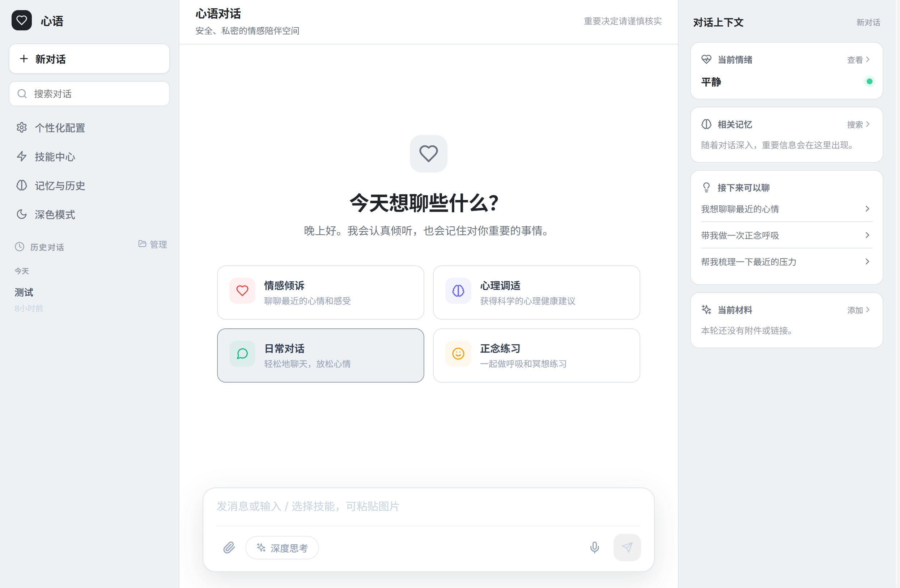

# 心语 · 情感陪伴机器人

[简体中文](README.md) | [English](README.en.md)

一个面向情感支持场景的开源 AI 对话应用。项目由 FastAPI 后端与 React 前端组成，集成情绪与意图识别、长期记忆、RAG 知识库、Agent 技能、流式响应和自动评估，并可连接智谱 GLM、通义千问、OpenAI 等兼容 OpenAI API 的模型服务。

> [!IMPORTANT]
> 本项目用于技术研究与情感支持，不提供医疗诊断或专业心理治疗。遇到紧急危险或自伤风险时，请立即联系当地急救机构、危机干预热线或可信赖的人。



## 功能概览

- 情感与意图理解：识别情绪、强度和对话意图，并针对危机表达执行安全策略。
- 连贯对话：组合当前上下文、历史记忆和用户画像，支持跨会话语义检索。
- RAG 知识库：通过 ChromaDB 检索心理健康、自助练习与组织策略等本地资料。
- Agent 与技能：提供任务规划、工具调用、反思、插件和 Runtime + Skills 架构。
- 多模态交互：支持文件与图片附件、语音处理及流式聊天。
- 质量闭环：包含用户反馈、自动评估、A/B 测试、性能指标和情绪趋势分析。
- 个性化前端：React 18 界面，支持 Markdown、主题、打字机效果和 AI 形象定制。

## 技术栈

| 层级 | 技术 |
| --- | --- |
| 前端 | React 18、Axios、styled-components、react-markdown |
| API | Python 3.10+、FastAPI、Uvicorn、Pydantic v1 |
| AI | OpenAI-compatible API、LangChain、Runtime + Skills |
| 数据 | MySQL / SQLite、ChromaDB、Redis（可选） |
| 运维 | Docker Compose、Nginx、Prometheus、Grafana |

## 快速开始

### 1. 准备环境

- Python 3.10 或 3.11（兼容性最佳）
- Node.js 18+ 与 npm
- 一个兼容 OpenAI API 的模型服务密钥
- MySQL 8（可选；未配置时可使用 SQLite）

```bash
git clone https://github.com/congde/emotional_chat.git
cd emotional_chat
```

### 2. 配置后端

复制示例配置：

```bash
# macOS / Linux
cp config.env.example config.env

# Windows PowerShell
Copy-Item config.env.example config.env
```

至少修改以下三项：

```dotenv
LLM_API_KEY=your_api_key
LLM_BASE_URL=https://open.bigmodel.cn/api/paas/v4/
DEFAULT_MODEL=glm-5.1
```

也可以切换到其他兼容服务，例如通义千问：

```dotenv
LLM_BASE_URL=https://dashscope.aliyuncs.com/compatible-mode/v1
DEFAULT_MODEL=qwen-plus
```

本地不使用 MySQL 时，可在 `config.env` 中启用 SQLite：

```dotenv
USE_SQLITE=1
SQLITE_PATH=./emotional_chat_local.db
```

完整选项见 [`config.env.example`](config.env.example)。请勿提交包含真实密钥的 `config.env`。

### 3. 启动后端

```bash
python -m venv .venv

# macOS / Linux
source .venv/bin/activate

# Windows PowerShell
.venv\Scripts\Activate.ps1

pip install -r requirements.txt
python run_backend.py
```

启动脚本会检查依赖、初始化本地知识库并在 `http://localhost:8000` 提供服务。

- API 文档：<http://localhost:8000/docs>
- 健康检查：<http://localhost:8000/health>

### 4. 启动前端

打开另一个终端：

```bash
cd frontend
npm install
npm start
```

浏览器访问 <http://localhost:3000>。若后端不在本机 `8000` 端口，请创建 `frontend/.env.local`：

```dotenv
REACT_APP_API_URL=http://your-backend-host:8000
```

## 常用命令

在安装了 GNU Make 的环境中，可以使用：

```bash
make help          # 查看全部命令
make install       # 安装 Python 依赖
make run           # 启动后端并初始化知识库
make rag-init      # 初始化 RAG 知识库
make db-upgrade    # 执行数据库迁移
make db-check      # 检查数据库连接
```

运行测试：

```bash
pytest
cd frontend && npm test
```

## Docker 部署

项目提供包含后端、MySQL、Redis、Nginx 与监控组件的 Compose 配置：

```bash
Copy-Item config.env.example config.env  # Windows
docker compose up -d --build
docker compose ps
```

Compose 文件不会构建 React 开发服务器；生产环境前端应先执行 `npm run build`，再交由静态服务器或 Nginx 托管。部署前请修改示例密码、限制 CORS、配置 HTTPS，并按机器资源选择是否启用监控与日志组件。完整说明见 [生产部署指南](docs/生产部署指南.md)。

## 架构

```text
React Web
   │ HTTP / SSE
   ▼
FastAPI routers
   ▼
Chat / Emotion / Intent / Memory / Agent services
   ├── OpenAI-compatible LLM
   ├── ChromaDB knowledge & semantic memory
   ├── MySQL or SQLite persistence
   └── Redis cache (optional)
```

主要目录：

```text
backend/          FastAPI 应用、路由、服务和核心模块
  agent/          Agent 核心与工具调用
  runtime/        Runtime + Skills 对话运行时
  modules/        意图、RAG、LLM 与多模态模块
  routers/        HTTP / SSE API
  services/       聊天、记忆、上下文与个性化服务
frontend/         React Web 客户端
knowledge_base/   内置知识资料
docs/             架构、部署与功能文档
test_*.py         后端测试与评估脚本
```

## 延伸阅读

- [API 接口文档](docs/API接口文档.md)
- [Agent 技术架构](docs/Agent技术架构完整指南.md)
- [记忆系统架构](docs/记忆系统架构.md)
- [RAG 实施步骤](docs/RAG实施步骤.md)
- [Windows 运行指南](docs/Windows运行指南.md)
- [macOS 配置指南](docs/MACBOOK_SETUP.md)
- [版本迭代记录](docs/版本迭代记录.md)

## 参与贡献

欢迎提交 Issue 和 Pull Request。提交前请确保改动聚焦、测试通过，并同步更新相关文档。Python 代码遵循项目现有的 Black/Ruff 配置。

## 联系方式

如有问题或建议，欢迎通过以下方式联系：

- 提交 [GitHub Issue](https://github.com/congde/emotional_chat/issues)
- 发送邮件至项目维护者：[congdeyuan@gmail.com](mailto:congdeyuan@gmail.com)
- 微信：`jx-yuancongde`

## 许可证

本项目采用 [MIT License](LICENSE)。
