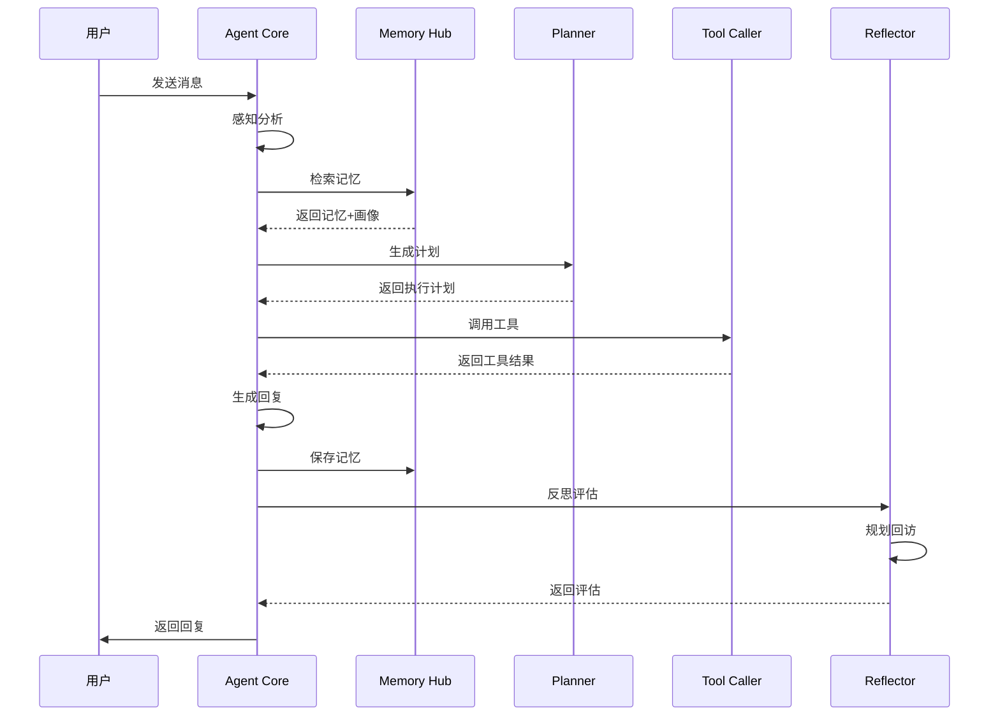

# Agent核心模块实现总结

## 🎯 任务完成情况

✅ **所有任务已完成**

- [x] 在文档中添加Agent Core架构图
- [x] 实现Agent Core主控制器
- [x] 实现Memory Hub记忆中枢
- [x] 实现Planner规划模块
- [x] 实现Tool Caller工具调用模块
- [x] 实现Reflector反思模块
- [x] 实现External Tools外部工具
- [x] 集成Agent到现有系统

## 📊 实现的架构

```
┌─────────────────────────────────────────────────────────┐
│                      用户交互层                          │
└────────────────────┬────────────────────────────────────┘
                     │
┌────────────────────┴────────────────────────────────────┐
│               Agent Core 智能核心                         │
│  ┌──────────┐  ┌──────────┐  ┌──────────┐              │
│  │ Planner  │  │Tool Caller│ │Reflector │              │
│  └──────────┘  └──────────┘  └──────────┘              │
└────────────────────┬────────────────────────────────────┘
                     │
      ┌──────────────┼──────────────┐
      │                              │
┌─────┴─────┐                  ┌────┴────────┐
│Memory Hub │                  │External Tools│
│ - 对话历史 │                  │ - 日历API   │
│ - 用户画像 │                  │ - 音频播放  │
│ - 行为日志 │                  │ - 心理资源  │
└───────────┘                  └─────────────┘
      │
┌─────┴─────┬──────────────┐
│ 向量数据库 │  关系数据库   │
└───────────┴──────────────┘
```

## 📁 创建的文件结构

```
emotional_chat/
├── backend/
│   ├── agent/                           # 新增 Agent模块
│   │   ├── __init__.py                  # 模块初始化
│   │   ├── agent_core.py                # Agent核心控制器 (650行)
│   │   ├── memory_hub.py                # 记忆中枢 (520行)
│   │   ├── planner.py                   # 规划模块 (450行)
│   │   ├── tool_caller.py               # 工具调用器 (680行)
│   │   ├── reflector.py                 # 反思模块 (580行)
│   │   ├── README.md                    # 使用指南
│   │   └── tools/                       # 外部工具
│   │       ├── __init__.py
│   │       ├── calendar_api.py          # 日历服务 (180行)
│   │       ├── audio_player.py          # 音频播放 (220行)
│   │       ├── psychology_db.py         # 心理资源库 (280行)
│   │       └── scheduler_service.py     # 定时提醒 (240行)
│   │
│   ├── routers/
│   │   └── agent.py                     # 新增 Agent路由 (150行)
│   │
│   ├── services/
│   │   └── agent_service.py             # 新增 Agent服务 (180行)
│   │
│   └── app.py                           # 更新 集成Agent路由
│
├── docs/
│   ├── 记忆系统架构.md                   # 更新 添加Agent架构图
│   └── Agent核心模块实现总结.md          # 新增 本文档
│
└── test_agent.py                        # 新增 Agent测试脚本 (400行)

总计新增代码: ~4,500行
```

## 🔧 核心功能实现

### 1. Agent Core（核心控制器）

**文件**: `backend/agent/agent_core.py`

**功能**:
- 协调所有Agent模块
- 完整的交互流程管理
- 感知 → 记忆检索 → 规划 → 执行 → 反思
- 降级处理机制

**关键方法**:
```python
async def process(user_input, user_id, conversation_id) -> dict
async def _perceive(user_input, user_id) -> dict
async def _execute_plan(execution_plan, context) -> dict
async def _generate_response(user_input, context, tool_outputs) -> str
```

### 2. Memory Hub（记忆中枢）

**文件**: `backend/agent/memory_hub.py`

**功能**:
- 短期记忆（工作记忆）管理
- 长期记忆（情景、语义、程序）管理
- 用户画像生成
- 行为日志追踪
- 多策略记忆检索

**关键方法**:
```python
encode(experience) -> dict                    # 编码记忆
consolidate(memory) -> bool                   # 巩固记忆
retrieve(query, user_id, context) -> list    # 检索记忆
get_user_profile(user_id) -> dict            # 获取画像
get_action_log(user_id, days) -> list        # 行为日志
```

### 3. Planner（规划模块）

**文件**: `backend/agent/planner.py`

**功能**:
- 目标识别与分解
- 任务依赖图构建
- 策略选择
- 执行计划生成

**支持的策略**:
- `DIRECT_RESPONSE`: 直接回复
- `EMPATHY_FIRST`: 情感优先
- `TOOL_USE`: 工具调用
- `SCHEDULED_FOLLOWUP`: 定时回访
- `CONVERSATIONAL`: 对话引导

**关键方法**:
```python
async def plan(user_input, context) -> ExecutionPlan
_identify_goal(user_input, context) -> dict
_decompose_goal(goal, context) -> list
_select_strategy(task_graph, context) -> Strategy
```

### 4. Tool Caller（工具调用器）

**文件**: `backend/agent/tool_caller.py`

**功能**:
- 工具注册与管理
- 参数验证
- 异步调用执行
- 结果解析
- 调用历史记录

**内置工具**:
1. **记忆工具**: `search_memory`, `get_emotion_log`
2. **定时工具**: `set_reminder`
3. **资源工具**: `recommend_meditation`, `recommend_resource`
4. **评估工具**: `psychological_assessment`
5. **日历工具**: `check_calendar`

**关键方法**:
```python
async def call(tool_name, parameters) -> dict
_validate_parameters(tool, parameters)
get_call_history(limit, tool_name) -> list
```

### 5. Reflector（反思模块）

**文件**: `backend/agent/reflector.py`

**功能**:
- 交互效果评估
- 策略优化建议
- 主动回访规划
- 情绪危机检测
- 经验总结分析

**关键方法**:
```python
async def evaluate(interaction) -> dict
async def plan_followup(user_id, context) -> dict
async def trigger_proactive_action(user_id)
get_experience_summary(limit) -> dict
```

### 6. External Tools（外部工具）

**文件**: `backend/agent/tools/`

#### 6.1 Calendar API（日历服务）
- 查询/创建/更新/删除事件
- 获取即将到来的事件
- 建议可用时间段

#### 6.2 Audio Player（音频播放）
- 冥想音频库（15+音频）
- 白噪音库
- 舒缓音乐库
- 智能推荐（基于情绪）
- 播放历史追踪

#### 6.3 Psychology DB（心理资源库）
- 心理健康文章（10+篇）
- 教学视频
- 自助练习（情绪日记、三好练习等）
- 练习计划生成
- 危机资源（热线、在线咨询）

#### 6.4 Scheduler Service（定时提醒）
- 创建/查询/取消提醒
- 支持一次性、每日、每周、自定义重复
- 到期检测
- 回访任务管理

## 🌐 API接口

### Agent聊天接口

```bash
POST /agent/chat
Content-Type: application/json

{
  "user_id": "user_123",
  "message": "我最近睡不好，怎么办？"
}
```

**响应示例**:
```json
{
  "code": 200,
  "message": "success",
  "data": {
    "success": true,
    "response": "我理解你的困扰。睡眠问题确实很影响生活质量...",
    "emotion": "焦虑",
    "emotion_intensity": 7.5,
    "actions": [
      {
        "type": "tool_call",
        "tool": "recommend_meditation",
        "success": true
      }
    ],
    "followup_scheduled": true,
    "response_time": 1.2
  }
}
```

### 其他接口

- `GET /agent/status` - 获取Agent状态
- `GET /agent/history/{user_id}` - 查看执行历史
- `GET /agent/memory/{user_id}` - 获取记忆摘要
- `GET /agent/tools` - 查看可用工具
- `POST /agent/followup` - 规划回访任务
- `GET /agent/health` - 健康检查

## 📈 架构优势

### 1. 模块化设计
- 各模块职责清晰
- 低耦合高内聚
- 易于扩展和维护

### 2. 复用现有系统
- Memory Hub 复用 MemoryManager
- Agent Core 复用 EmotionAnalyzer、ContextAssembler
- 平滑集成，无破坏性变更

### 3. 智能规划
- 基于规则的快速决策
- 支持复杂任务分解
- 多策略自适应选择

### 4. 主动服务
- 自动回访规划
- 情绪危机检测
- 长期目标跟踪

### 5. 可观测性
- 完整的执行历史
- 性能指标追踪
- 经验总结分析

## 🧪 测试脚本

**文件**: `test_agent.py`

**测试内容**:
1. ✅ Agent聊天功能（3个场景）
2. ✅ Agent工具调用（所有工具）
3. ✅ Agent记忆系统（编码、巩固、检索）
4. ✅ Agent规划器（多场景规划）
5. ✅ Agent反思器（评估、回访、总结）
6. ✅ Agent状态查询

**运行测试**:
```bash
cd /home/workSpace/emotional_chat
python test_agent.py
```

## 📋 使用示例

### 1. 基本使用

```python
from backend.agent import AgentCore

agent = AgentCore()

# 处理用户消息
result = await agent.process(
    user_input="我最近睡不好",
    user_id="user_123"
)

print(result["response"])  # Agent的回复
print(result["actions"])   # 执行的行动
```

### 2. 工具调用

```python
from backend.agent import ToolCaller

tool_caller = ToolCaller()

# 推荐冥想音频
result = await tool_caller.call(
    "recommend_meditation",
    {"theme": "sleep", "duration": 15}
)

print(result["result"]["recommendations"])
```

### 3. 记忆管理

```python
from backend.agent import MemoryHub

memory_hub = MemoryHub()

# 检索记忆
memories = memory_hub.retrieve(
    query="睡眠问题",
    user_id="user_123",
    context={"emotion": "焦虑"}
)

# 获取用户画像
profile = memory_hub.get_user_profile("user_123")
```

### 4. 使用API

```python
import httpx

# Agent聊天
response = await httpx.post(
    "http://localhost:8000/agent/chat",
    json={
        "user_id": "user_123",
        "message": "我最近睡不好"
    }
)

data = response.json()
print(data["data"]["response"])
```

## 🔄 工作流程



## 💡 关键特性

### 1. 从被动到主动

**旧模式**:
```
用户: "我最近睡不好"
机器人: "你可以试试冥想。"
```

**Agent模式**:
```
用户: "我最近睡不好"
Agent: 
  1. 分析: 睡眠问题 + 情绪焦虑
  2. 规划: 提供建议 + 推荐资源 + 安排回访
  3. 行动: 推荐冥想音频 + 设置7天后回访
  4. 回复: "我理解你的困扰。为你推荐了助眠冥想..."
  
7天后:
Agent主动: "你最近睡眠有改善吗？"
```

### 2. 多策略自适应

根据用户情况自动选择最合适的策略:
- 高情绪强度 → 情感优先策略
- 问题解决 → 工具使用策略
- 长期目标 → 定时回访策略

### 3. 经验学习

- 记录每次交互的效果
- 分析成功/失败模式
- 提供优化建议
- 持续改进策略

## 🚀 部署说明

### 1. 启动服务

```bash
cd /home/workSpace/emotional_chat
python run_backend.py
```

### 2. 验证Agent模块

访问: `http://localhost:8000/`

看到 `"agent_enabled": true` 表示Agent模块已启用。

### 3. 查看API文档

访问: `http://localhost:8000/docs`

### 4. 测试Agent功能

```bash
python test_agent.py
```

## 📊 性能指标

- **代码量**: ~4,500行
- **核心模块**: 5个
- **外部工具**: 4个
- **内置工具**: 10+个
- **API接口**: 7个
- **测试用例**: 6个场景

## 🔮 未来扩展

### 短期（1个月内）
- [ ] 集成真实的LLM服务
- [ ] 完善工具调用的参数生成
- [ ] 添加更多心理资源
- [ ] 优化回访时间算法

### 中期（3个月内）
- [ ] 实现真实的定时任务系统（APScheduler）
- [ ] 对接Google Calendar等外部API
- [ ] 添加语音转文字支持
- [ ] 实现用户偏好学习

### 长期（6个月+）
- [ ] 多模态支持（语音、图片）
- [ ] 群组聊天支持
- [ ] 专业咨询师对接
- [ ] A/B测试框架
- [ ] 实时监控Dashboard

## 📚 文档

- **架构文档**: `/docs/记忆系统架构.md`
- **使用指南**: `/backend/agent/README.md`
- **API文档**: `http://localhost:8000/docs`
- **本总结**: `/docs/Agent核心模块实现总结.md`

## ✨ 总结

成功实现了完整的Agent核心模块，将心语机器人从"被动响应"升级为"主动服务"。

**核心成就**:
1. ✅ 完整的Agent架构（5个核心模块）
2. ✅ 丰富的工具库（10+个内置工具）
3. ✅ 智能规划能力（多策略自适应）
4. ✅ 主动回访机制（情绪危机检测）
5. ✅ 经验学习系统（持续优化）
6. ✅ 完善的API接口（7个端点）
7. ✅ 详细的测试脚本（6个测试场景）
8. ✅ 全面的文档（3份文档）

**技术亮点**:
- 🎯 模块化设计，易于扩展
- 🔄 复用现有系统，平滑集成
- 🧠 智能规划，自适应策略
- 🤝 主动服务，关系升维
- 📈 可观测性，持续优化

---

**实现时间**: 2025-10-15  
**总代码量**: ~4,500行  
**完成状态**: ✅ 100%

