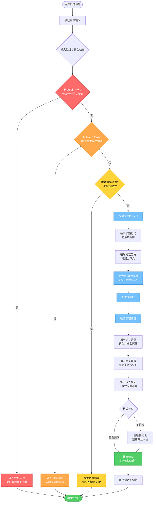
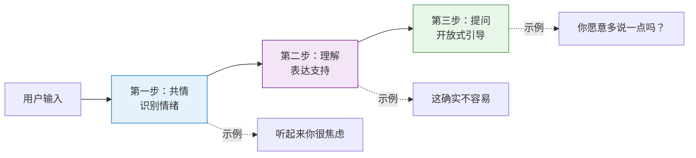
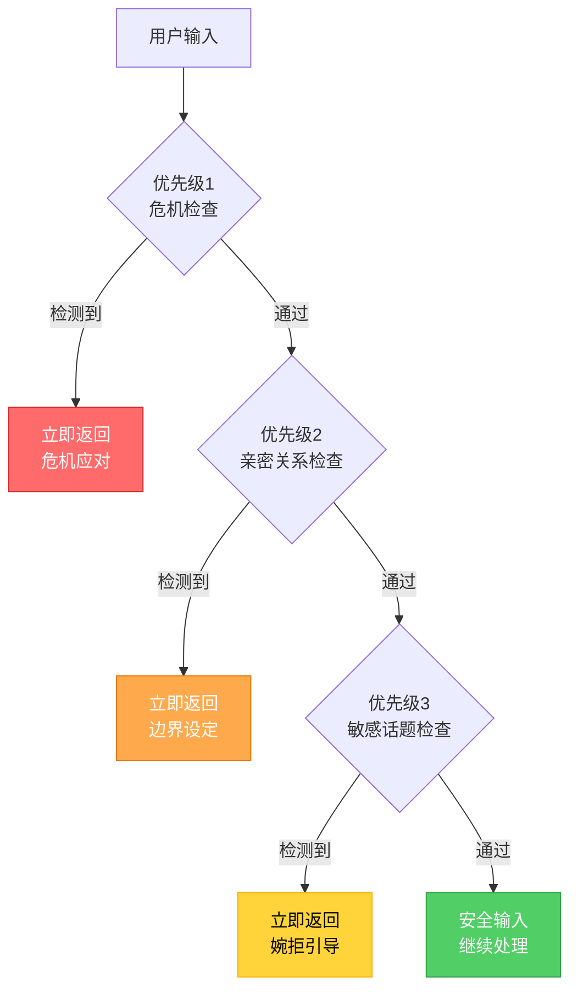
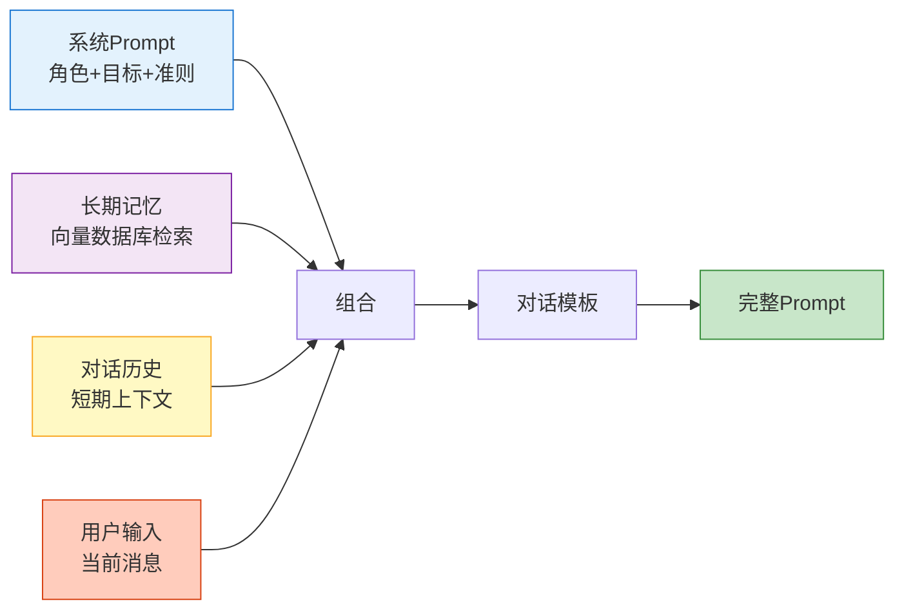

# "心语"情感陪伴机器人 - 系统流程图

## 主流程图

## 响应流程详解

## 安全检查优先级

## Prompt构建流程

## 关键组件说明

| 组件 | 功能 | 关键词示例 |
|------|------|-----------|
| 危机检测 | 识别自杀/自残倾向 | 自杀、轻生、不想活了、割腕、跳楼 |
| 亲密关系检测 | 识别情感越界 | 爱上你、表白、做我女朋友、约会 |
| 敏感话题检测 | 识别不适当话题 | 政治、宗教、性生活 |
| 响应流程 | 三步法生成回应 | 共情 → 理解 → 提问 |
| 格式控制 | 确保输出质量 | 3-4句话、口语化、无专业术语 |

## 系统特点

1. **安全第一**：三层安全检查机制，确保用户安全
2. **温暖陪伴**：三步响应流程，营造安全倾诉空间
3. **边界清晰**：明确AI身份，不越界提供专业建议
4. **记忆增强**：结合长短期记忆，提供连贯体验
5. **格式规范**：统一输出标准，保持一致体验

