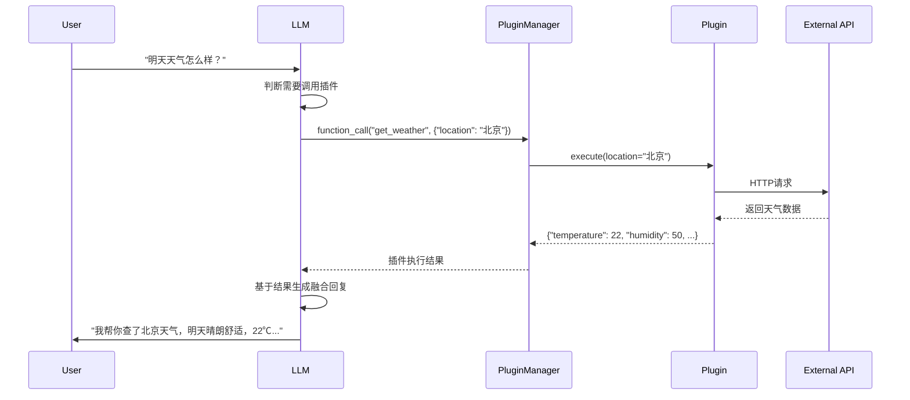

# 插件系统使用指南

## 快速开始

### 1. 配置环境变量

在项目根目录的 `config.env` 文件中添加 API 密钥：

```bash
# 天气 API（二选一，推荐 OpenWeatherMap）
OPENWEATHER_API_KEY=your_openweather_key
# HEFENG_WEATHER_API_KEY=your_hefeng_key

# 新闻 API（NewsAPI）
NEWS_API_KEY=your_newsapi_key

# LLM API（必需，支持 OpenAI、通义千问等）
LLM_API_KEY=your_llm_key
LLM_BASE_URL=https://api.openai.com/v1
DEFAULT_MODEL=gpt-4
```

### 2. 启动服务

```bash
python run_backend.py
```

### 3. 测试插件系统

```bash
# 查看已注册的插件
curl http://localhost:8000/plugins/list

# 查看插件使用统计
curl http://localhost:8000/plugins/stats
```

## 对话示例

### 示例1：询问天气

**请求**：
```bash
curl -X POST http://localhost:8000/chat \
  -H "Content-Type: application/json" \
  -d '{
    "message": "明天去北京出差，天气怎么样？",
    "user_id": "user123",
    "session_id": "session456"
  }'
```

**响应**：
```json
{
  "response": "我理解你出差前的小小紧张。我帮你查了北京的天气，明天晴朗舒适，温度22℃，湿度适中，很适合出行。建议你带把晴雨伞以防万一，还有轻便外套。把需要的东西列个清单，一项项打勾会让你更有掌控感。祝你出差顺利~",
  "session_id": "session456",
  "emotion": "anxious",
  "suggestions": ["我理解你现在的心情", "可以告诉我发生了什么吗？", "你并不孤单"],
  "plugin_used": "get_weather",
  "plugin_result": {
    "location": "北京",
    "temperature": 22,
    "description": "晴",
    "humidity": 50,
    "wind_speed": 3.5
  }
}
```

### 示例2：询问新闻

**请求**：
```bash
curl -X POST http://localhost:8000/chat \
  -H "Content-Type: application/json" \
  -d '{
    "message": "最近有什么心理健康方面的新闻？",
    "user_id": "user123",
    "session_id": "session789"
  }'
```

**预期响应**：
```json
{
  "response": "我感受到你现在的压力和迷茫。我为你找了几条关于压力管理的新闻，希望能给你一些启发。第一条是关于心理健康意识提升的报道，第二条是运动与健康的最新研究。想聊聊具体是什么让你感到迷茫吗？",
  "session_id": "session789",
  "emotion": "frustrated",
  "plugin_used": "get_latest_news",
  "plugin_result": {
    "category": "health",
    "count": 3,
    "articles": [
      {
        "title": "心理健康科普",
        "description": "普及心理健康知识，提高公众认知",
        "source": "健康生活"
      }
    ]
  }
}
```

## 开发指南

### 添加新插件

以"股票查询"插件为例：

#### 1. 创建插件文件

```python
# backend/plugins/stock_plugin.py
from backend.plugins.base_plugin import BasePlugin
from typing import Dict, Any
import requests
import logging

logger = logging.getLogger(__name__)

class StockPlugin(BasePlugin):
    """股票查询插件"""
    
    def __init__(self, api_key: str = None):
        super().__init__(
            name="get_stock_price",
            description="查询股票的实时价格和基本信息",
            api_key=api_key
        )
        self.base_url = "https://api.example.com/stock"
    
    @property
    def function_schema(self) -> Dict[str, Any]:
        return {
            "name": "get_stock_price",
            "description": "查询股票实时价格，用于回答用户关于股价、市场表现的询问",
            "parameters": {
                "type": "object",
                "properties": {
                    "symbol": {
                        "type": "string",
                        "description": "股票代码，如：AAPL、TSLA"
                    }
                },
                "required": ["symbol"]
            }
        }
    
    def validate_params(self, **kwargs) -> bool:
        symbol = kwargs.get("symbol")
        if not symbol or not isinstance(symbol, str):
            logger.warning(f"无效的股票代码: {symbol}")
            return False
        return True
    
    def execute(self, **kwargs) -> Dict[str, Any]:
        if not self.enabled:
            return {"error": "插件已禁用"}
        
        symbol = kwargs.get("symbol")
        if not self.validate_params(**kwargs):
            return {"error": "参数验证失败"}
        
        try:
            # 实现股票查询逻辑
            if not self.api_key:
                return {"error": "股票API密钥未配置"}
            
            # 调用股票API
            response = requests.get(f"{self.base_url}/{symbol}", 
                                  headers={"Authorization": f"Bearer {self.api_key}"})
            
            if response.status_code == 200:
                data = response.json()
                return {
                    "symbol": symbol,
                    "price": data.get("price", 0),
                    "change": data.get("change", "0%"),
                    "status": "success"
                }
            else:
                return {"error": f"查询失败: {response.status_code}"}
        
        except Exception as e:
            logger.error(f"股票查询失败: {e}")
            return {"error": f"查询失败: {str(e)}"}
```

#### 2. 注册插件

```python
# backend/modules/llm/core/llm_with_plugins.py

from backend.plugins.stock_plugin import StockPlugin

# 在 EmotionalChatEngineWithPlugins 的 __init__ 方法中
try:
    stock_plugin = StockPlugin(api_key=os.getenv("STOCK_API_KEY"))
    self.plugin_manager.register(stock_plugin)
    print("✓ 股票插件注册成功")
except Exception as e:
    print(f"警告: 股票插件注册失败: {e}")
```

#### 3. 测试插件

```bash
# 重启服务后测试
curl -X POST http://localhost:8000/chat \
  -H "Content-Type: application/json" \
  -d '{
    "message": "苹果公司的股价现在是多少？",
    "user_id": "user123"
  }'
```

## 技术原理

### Function Calling 工作流程



### 关键代码解析

**1. 检测函数调用意图**
```python
# 模型会在响应中包含 function_call 字段
if "function_call" in assistant_message:
    func_name = assistant_message["function_call"]["name"]
    func_args = json.loads(assistant_message["function_call"]["arguments"])
    
    # 记录调用历史
    call_record = {
        "plugin": func_name,
        "params": func_args,
        "timestamp": datetime.now()
    }
    self.call_history.append(call_record)
```

**2. 执行插件**
```python
plugin_result = self.plugin_manager.execute_plugin(func_name, **func_args)

# 更新引用（如果需要）
if plugin_used_ref is not None:
    plugin_used_ref[0] = func_name
if plugin_result_ref is not None:
    plugin_result_ref[0] = plugin_result
```

**3. 生成最终回复**
```python
# 将插件结果传递给模型，让模型生成自然语言回复
messages.append(assistant_message)
messages.append({
    "role": "function",
    "name": func_name,
    "content": json.dumps(plugin_result, ensure_ascii=False)
})
messages.append({
    "role": "user",
    "content": f"基于以下信息：{plugin_result_text}\n\n请用自然、温暖的语言回复用户，不要重复数据本身，而要融合这些信息，给出贴心的建议和陪伴。"
})
```

## 常见问题

### Q: 如何控制插件调用频率？

A: 在 `PluginManager` 中实现调用计数和限制：
```python
def execute_plugin(self, plugin_name: str, **kwargs):
    # 检查调用次数（当前实现中可扩展）
    call_count = len([h for h in self.call_history if h.get("plugin") == plugin_name])
    if call_count > MAX_CALLS_PER_DAY:
        return {"error": "今日调用次数超限"}
    
    # 记录调用历史
    call_record = {
        "plugin": plugin_name,
        "params": kwargs,
        "timestamp": datetime.now()
    }
    self.call_history.append(call_record)
    # ...
```

### Q: 插件调用失败怎么办？

A: 系统会自动降级，提供友好的备用回复，不会让用户体验中断。

### Q: 如何添加权限控制？

A: 在 `BasePlugin` 中添加权限字段，在调用前检查：
```python
class BasePlugin:
    def __init__(self, name: str, description: str, api_key: str = None, 
                 required_permission: str = None):
        self.name = name
        self.description = description
        self.api_key = api_key
        self.required_permission = required_permission
        self.enabled = True
    
    def check_permission(self, user_id: str) -> bool:
        # 检查用户是否有此权限（未来实现）
        if not self.required_permission:
            return True
        # 实现权限检查逻辑
        return True
```

在 `PluginManager` 中调用前检查：
```python
def execute_plugin(self, plugin_name: str, user_id: str = None, **kwargs):
    plugin = self.get_plugin(plugin_name)
    if not plugin.check_permission(user_id):
        return {"error": "权限不足"}
    # ...
```

## 性能优化建议

1. **缓存策略**：对天气、新闻等数据实施短期缓存（5-10分钟）
2. **异步调用**：使用 asyncio 并发处理多个插件调用
3. **批量处理**：合并相似请求，减少 API 调用次数
4. **降级策略**：API 失败时返回缓存数据或模拟数据

## 监控与调试

### 查看插件调用日志

```bash
# 查看调用历史
curl http://localhost:8000/plugins/get_weather/history

# 查看统计信息
curl http://localhost:8000/plugins/stats
```

### 调试模式

在环境变量中设置：
```bash
DEBUG=true
```

查看详细日志输出。

## 贡献

欢迎提交 Issue 和 Pull Request！

## 相关资源

- [OpenAI Function Calling 文档](https://platform.openai.com/docs/guides/function-calling)
- [插件设计原则](https://github.com/yourrepo/wiki/plugin-design)
- [API 密钥申请指南](https://github.com/yourrepo/wiki/api-keys)
