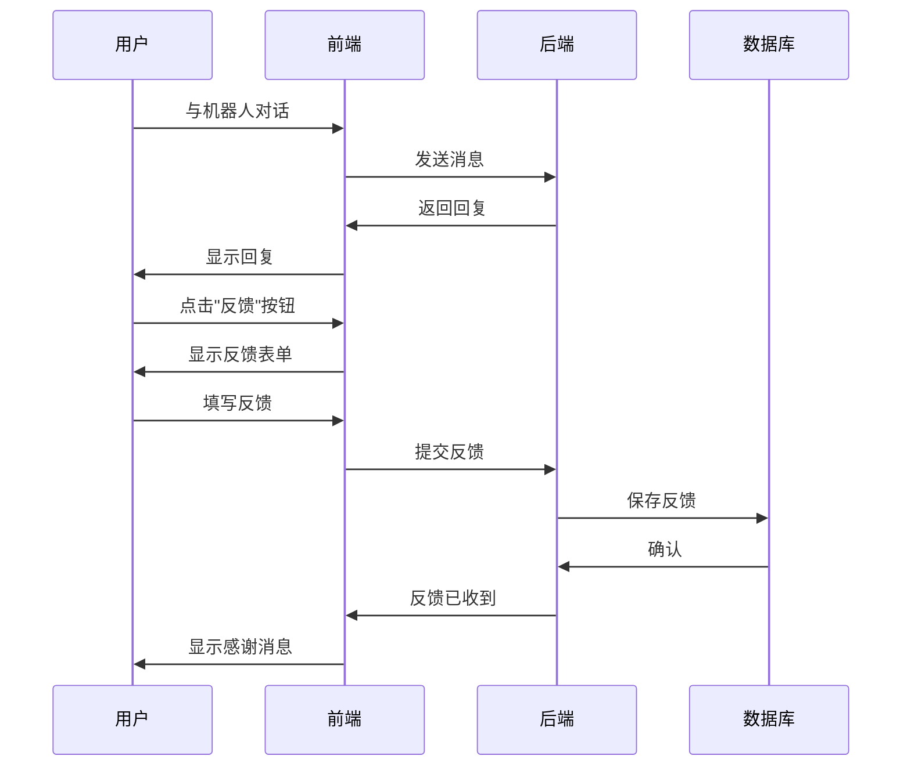
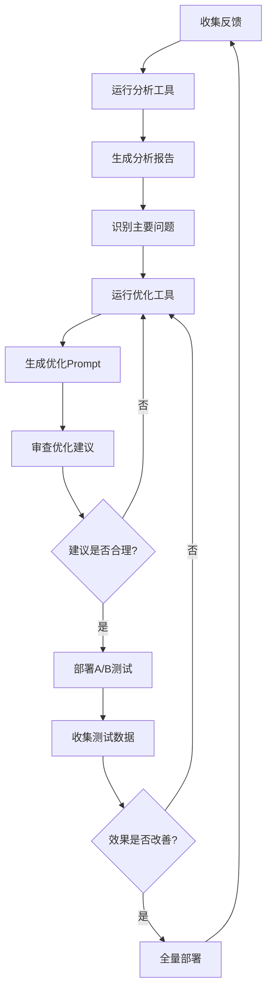

# 用户反馈系统功能说明 📋

## 系统概览

本系统实现了一个完整的用户反馈驱动优化机制，包含以下核心模块：

```
用户反馈系统
├── 前端反馈界面 (React)
│   └── 反馈提交表单
├── 后端API服务 (FastAPI)
│   ├── 反馈提交接口
│   ├── 反馈查询接口
│   └── 反馈统计接口
├── 数据存储层 (MySQL)
│   └── user_feedback表
├── 分析工具 (Python)
│   ├── 反馈分析器
│   └── Prompt优化器
└── 文档与指南
    ├── 使用指南
    └── 快速开始
```

## 新增文件清单

### 后端文件

| 文件 | 说明 | 主要功能 |
|------|------|----------|
| `backend/database.py` | 数据库模型（已更新） | 新增UserFeedback模型和相关操作方法 |
| `backend/models.py` | API模型（已更新） | 新增反馈相关的Pydantic模型 |
| `backend/main.py` | API路由（已更新） | 新增反馈相关的API端点 |
| `backend/feedback_analyzer.py` | 反馈分析工具 | 分析用户反馈，识别问题模式 |
| `backend/prompt_optimizer.py` | Prompt优化器 | 基于分析结果生成优化建议 |

### 前端文件

| 文件 | 说明 | 主要功能 |
|------|------|----------|
| `frontend/src/App.js` | 主应用（已更新） | 新增反馈按钮和模态框 |
| `frontend/src/services/ChatAPI.js` | API服务（已更新） | 新增反馈提交方法 |

### 工具脚本

| 文件 | 说明 | 用途 |
|------|------|------|
| `update_database.py` | 数据库更新脚本 | 创建user_feedback表 |
| `generate_test_feedback.py` | 测试数据生成器 | 生成测试反馈数据 |

### 文档

| 文件 | 说明 |
|------|------|
| `docs/用户反馈驱动优化指南.md` | 完整使用指南 |
| `docs/快速开始-反馈系统.md` | 快速开始教程 |
| `docs/反馈系统功能说明.md` | 本文档 |

## 数据库变更

### 新增表：user_feedback

```sql
CREATE TABLE user_feedback (
    id INT PRIMARY KEY AUTO_INCREMENT,
    session_id VARCHAR(100),
    user_id VARCHAR(100),
    message_id INT,
    feedback_type VARCHAR(50),  -- 反馈类型
    rating INT,                 -- 评分1-5
    comment TEXT,               -- 详细评论
    user_message TEXT,          -- 用户消息快照
    bot_response TEXT,          -- 机器人回复快照
    created_at TIMESTAMP,       -- 创建时间
    is_resolved BOOLEAN,        -- 是否已处理
    INDEX(session_id),
    INDEX(user_id),
    INDEX(message_id)
);
```

### 反馈类型说明

| 类型 | 标识 | 说明 |
|------|------|------|
| 有帮助 | `helpful` | 回复有帮助，用户满意 |
| 答非所问 | `irrelevant` | 回复与问题不相关 |
| 缺乏共情 | `lack_empathy` | 回复缺乏情感共鸣 |
| 越界建议 | `overstepping` | 提供了不应提供的建议 |
| 其他 | `other` | 其他类型的反馈 |

## API端点

### 1. 提交反馈
```http
POST /feedback
Content-Type: application/json

{
  "session_id": "会话ID",
  "user_id": "用户ID",
  "message_id": 消息ID,
  "feedback_type": "反馈类型",
  "rating": 评分,
  "comment": "评论",
  "user_message": "用户消息",
  "bot_response": "机器人回复"
}
```

**响应**：
```json
{
  "feedback_id": 1,
  "session_id": "...",
  "feedback_type": "...",
  "rating": 5,
  "created_at": "2025-10-14T12:00:00",
  "message": "Feedback received successfully"
}
```

### 2. 获取反馈统计
```http
GET /feedback/statistics
```

**响应**：
```json
{
  "total_count": 100,
  "avg_rating": 3.5,
  "by_type": [
    {
      "type": "helpful",
      "count": 50,
      "avg_rating": 4.5
    },
    ...
  ]
}
```

### 3. 获取反馈列表
```http
GET /feedback?feedback_type=irrelevant&limit=100
```

**参数**：
- `feedback_type`（可选）：过滤特定类型
- `limit`（可选）：限制返回数量，默认100

### 4. 获取会话反馈
```http
GET /feedback/session/{session_id}
```

### 5. 标记反馈已解决
```http
PUT /feedback/{feedback_id}/resolve
```

## 命令行工具

### 1. 反馈分析器

**基本用法**：
```bash
python3 backend/feedback_analyzer.py --days 30 --output report.txt
```

**参数**：
- `--days`: 分析最近多少天的数据（默认30）
- `--output`: 输出文件路径
- `--export-json`: 导出JSON格式数据

**输出内容**：
- 反馈类型分布
- 评分分布
- 问题严重程度
- 详细问题分析
- 改进建议

### 2. Prompt优化器

**基本用法**：
```bash
python3 backend/prompt_optimizer.py --output opt.json --report
```

**参数**：
- `--output`: 输出JSON文件路径
- `--report`: 生成对比报告

**输出文件**：
- `opt.json`: 优化建议（JSON格式）
- `opt_prompt.txt`: 优化后的Prompt
- `opt_report.txt`: 对比报告（如果指定--report）

### 3. 数据库更新脚本

**用法**：
```bash
python3 update_database.py
```

### 4. 测试数据生成器

**基本用法**：
```bash
# 生成所有预定义的测试数据
python3 generate_test_feedback.py

# 生成指定数量的测试数据
python3 generate_test_feedback.py --count 50

# 清空现有数据并重新生成
python3 generate_test_feedback.py --clear --count 20
```

## 工作流程

### 日常使用流程



### 优化流程



## 使用示例

### 示例1：快速测试

```bash
# 1. 更新数据库
python3 update_database.py

# 2. 生成测试数据
python3 generate_test_feedback.py --count 30

# 3. 查看统计
curl http://localhost:8000/feedback/statistics | jq

# 4. 生成分析报告
python3 backend/feedback_analyzer.py --days 30 --output test_report.txt

# 5. 查看报告
cat test_report.txt

# 6. 生成优化建议
python3 backend/prompt_optimizer.py --output test_opt.json --report

# 7. 查看优化后的Prompt
cat test_opt_prompt.txt
```

### 示例2：生产环境监控

```bash
# 每天早上运行
TODAY=$(date +%Y%m%d)

# 获取昨天的反馈统计
curl http://localhost:8000/feedback/statistics > stats_$TODAY.json

# 如果发现问题激增，立即分析
python3 backend/feedback_analyzer.py --days 7 --output urgent_report_$TODAY.txt

# 查看最新的负面反馈
curl "http://localhost:8000/feedback?feedback_type=irrelevant&limit=10" | jq '.feedbacks[] | {comment, rating, created_at}'
```

### 示例3：月度优化

```bash
# 月初运行
MONTH=$(date +%Y%m)

# 1. 生成月度报告
python3 backend/feedback_analyzer.py --days 30 \
  --output reports/monthly_$MONTH.txt \
  --export-json reports/monthly_$MONTH.json

# 2. 生成优化建议
python3 backend/prompt_optimizer.py \
  --output optimization/opt_$MONTH.json \
  --report

# 3. 审查优化建议
cat optimization/opt_${MONTH}_report.txt

# 4. 如果决定采用，备份当前Prompt
cp backend/xinyu_prompt.py backend/xinyu_prompt.py.backup_$MONTH

# 5. 手动更新Prompt（或实施A/B测试）

# 6. 标记本月反馈已处理
# 在数据库中标记或记录
```

## 最佳实践

### 1. 反馈收集
- ✅ 保持反馈流程简单，降低用户门槛
- ✅ 提供明确的反馈类型选项
- ✅ 鼓励用户提供详细评论
- ❌ 不要强制要求反馈
- ❌ 不要过于频繁地请求反馈

### 2. 数据分析
- ✅ 定期查看反馈统计
- ✅ 关注趋势变化，不只是绝对数字
- ✅ 深入分析负面反馈的具体内容
- ❌ 不要忽略正面反馈
- ❌ 不要只看数字，要看具体案例

### 3. Prompt优化
- ✅ 小步迭代，每次专注一个问题
- ✅ 优化前仔细审查建议
- ✅ 使用A/B测试验证效果
- ❌ 不要一次改动太多
- ❌ 不要不经测试直接部署

### 4. 效果评估
- ✅ 设定明确的改进目标
- ✅ 收集足够的数据再做决策
- ✅ 记录每次优化的效果
- ❌ 不要急于求成
- ❌ 不要忽视用户真实感受

## 故障排除

### 问题：反馈无法提交
**可能原因**：
1. 后端服务未启动
2. 数据库连接失败
3. CORS配置问题

**解决方案**：
```bash
# 检查后端服务
curl http://localhost:8000/health

# 检查数据库
mysql -u root -p emotional_chat -e "SHOW TABLES;"

# 查看后端日志
tail -f log/app.log
```

### 问题：分析工具报错
**可能原因**：
1. 没有反馈数据
2. Python依赖缺失
3. 数据库连接问题

**解决方案**：
```bash
# 检查数据
curl http://localhost:8000/feedback/statistics

# 安装依赖
pip3 install --user -r requirements.txt

# 测试数据库连接
python3 -c "from backend.database import DatabaseManager; db = DatabaseManager(); print('OK')"
```

## 技术架构

### 数据流

```
用户操作
    ↓
前端React组件
    ↓
ChatAPI (Axios)
    ↓
FastAPI路由
    ↓
DatabaseManager
    ↓
MySQL数据库
    ↓
分析工具 (Python)
    ↓
优化建议 (JSON/TXT)
    ↓
Prompt更新
    ↓
系统改进
```

### 技术栈

**前端**：
- React 18
- Styled Components
- Framer Motion
- Axios
- Lucide React (图标)

**后端**：
- Python 3.8+
- FastAPI
- SQLAlchemy
- MySQL
- Pydantic

**分析工具**：
- Python标准库
- 自定义分析算法

## 总结

用户反馈系统为项目提供了：

1. ✅ **完整的反馈收集机制** - 前后端一体化
2. ✅ **强大的数据分析能力** - 自动识别问题模式
3. ✅ **智能的优化建议** - 基于数据生成Prompt改进方案
4. ✅ **便捷的工具链** - 命令行工具简化操作
5. ✅ **详细的文档** - 使用指南和最佳实践

通过这个系统，你可以：
- 🎯 了解用户真实体验
- 📊 识别系统短板
- 🔧 持续优化Prompt
- 📈 提升用户满意度

---

💡 **持续改进，让AI更懂用户！**

