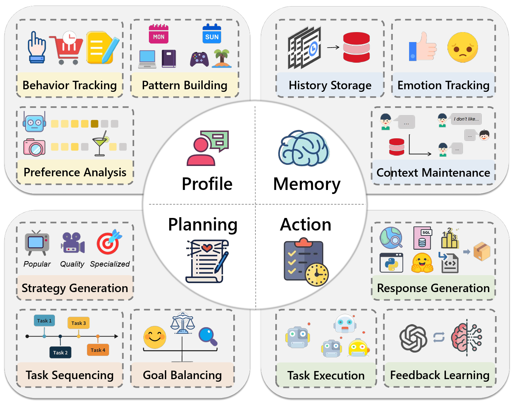
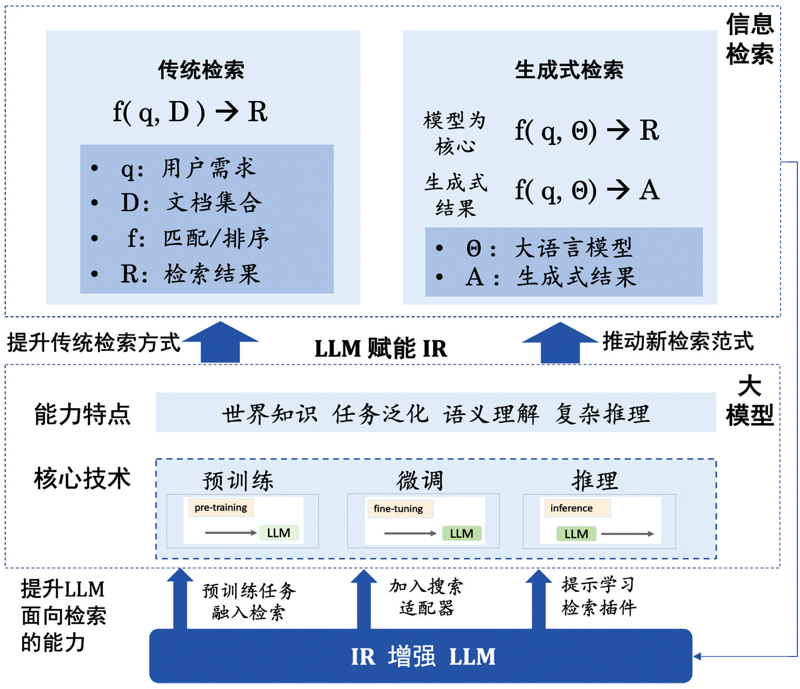

# 大语言模型给搜索推荐系统带来的变革

## 一、为什么大语言模型能改变推荐系统？
推荐系统广泛应用于短视频、电商等各类互联网产品中。推荐方法的本质是拟合历史用户行为数据，预测未来用户行为。推荐系统是过去 10 年中 AI 落地最成功的案例，但是在工业场景中，传统的推荐系统依然存在很多问题。
-用户层面（user）：用户规模大（数以亿计），用户行为多样（千人千面），且受到很多推荐系统不可观测的外界因素影响，导致建模十分困难。
-物料层面（item）：item 之间的很多关联是十分小众的，不易被捕获（共现频次低）。为什么这个用户会同时购买这两个东西，为什么这个用户会同时看这两个视频等等问题，可能是因为非常小众的原因关联起来的，对建模也是一项挑战。
-模型层面：存在很大的泛化问题，我们所熟知的很多平台例如 TikTok，用户每天新上传大量视频，产生非常多的新的低频关联和新的 item，模型可能对新的 item 推荐效果不佳，泛化问题对于主要依靠 id 特征的传统推荐系统而言是困扰多年的严重问题。

以前的推荐系统像个"笨学生"，只能靠用户点击、评分这些数据算推荐，比如"买过A的人也买了B"。但大语言模型（LLM）像个"聪明学霸"，它有两大优势：

### 1. 懂超多知识
比如知道"咖啡机"和"咖啡豆"是搭配的（常识知识），而传统模型可能只知道它们被一起买过。

### 2. 会推理
比如用户搜"夏天穿的透气衬衫"，它能推理出"需要薄款、棉麻材质、浅色"，而传统模型可能只匹配关键词。

> 所以现在大家想把LLM塞进推荐系统，让推荐更准、更懂用户，但怎么塞？下面总结了目前的方法和问题。

## 二、LLM在推荐系统里的应用（三层架构）

### 第一层：让LLM搞懂用户和商品（表示与理解）

#### 单模态（纯文字或纯数据）
把用户的浏览历史变成一段话，让LLM分析"用户最近总看'性价比高的手机'，可能预算有限"。

#### 多模态（图、视频、文字一起上）
用户刷到一张"海边度假"的图，LLM能结合文字评论分析"用户可能想买沙滩鞋+防晒霜"。

#### 给推荐加解释
以前推荐只给结果，现在LLM能写理由，比如"推荐这款咖啡机，因为你之前买过咖啡豆，且喜欢半自动款式"。

---

### 第二层：用LLM生成推荐（规划与利用）

#### 非生成式（老派做法改良）
用LLM优化传统推荐的打分环节，比如算"用户对A商品的兴趣分"时，LLM会结合商品描述、用户评论来算，比以前只看点击更准。

#### 生成式（新玩法）
直接让LLM当"导购"，比如用户输入"想买生日礼物送朋友，预算200元"，LLM直接生成推荐列表，还能写推荐语：

> "这款香薰礼盒颜值高，适合女生，用户评价说香味持久……"

---

### 第三层：在真实场景里落地（工业部署）

#### 大厂怎么用？
淘宝、抖音要处理几亿用户的实时推荐，LLM太大太慢，需要优化：

| 问题 | 解决方案 |
|------|----------|
| **效率问题** | 把LLM压缩成"轻量级版本"，或只在关键环节用（先粗筛商品，再用LLM精排） |
| **冷启动** | 新用户没数据？LLM能根据用户输入的"我喜欢运动"推理出推荐"运动鞋、瑜伽垫" |
| **动态更新** | 用户昨天搜"考研书"，今天搜"咖啡"，LLM能快速判断用户从学习转到放松，推荐"提神咖啡" |

>《A Survey on LLM-powered Agents for Recommender Systems》https://arxiv.org/pdf/2502.10050

上图展示了LLM驱动的推荐系统Agent的四大核心模块：**Profile（用户画像）** 负责行为追踪、模式构建和偏好分析；**Memory（记忆）** 管理历史存储、情感追踪和上下文维护；**Planning（规划）** 进行策略生成、任务排序和目标平衡；**Action（行动）** 执行响应生成、任务执行和反馈学习。这种架构使Agent能够像人类一样理解用户、记忆交互、规划推荐策略并持续优化。

## 三、大模型时代的信息检索架构
OpenAI首席财务官萨拉·弗莱尔（Sarah Friar）透露，公司的搜索市场份额在半年内已从约6%升至12%。她还表示，该数据可能仍被低估：“用户与ChatGPT进行多次轮询（例如5-6次）才解决一个问题，这在传统引擎中被计为多次搜索，而在我们这仅算作一次。”

传统搜索引擎（如百度、Google 等）的核心逻辑是基于关键词匹配和网页排名算法。用户输入一个查询，搜索引擎便从庞大的索引库中检索出包含这些关键词的网页，并根据网页的相关性、权威性和用户点击数据来排名。搜索结果通常是网页列表，用户需要逐个点击链接，阅读网页内容并筛选出所需信息。

这种信息获取方式存在一些问题：
-信息碎片化：用户需要浏览多个网页，每个网页的内容往往是片段化的，不易一次性获取完整的答案。
-信息冗余：搜索引擎返回的结果中，很多内容重复或相似，用户需要花费大量时间筛选。
-信息滞后：搜索引擎的索引更新存在延迟，某些实时性信息难以立即获得。

根据 Statista 的数据显示，截至 2024 年，全球 Google 搜索用户已达到超过 50 亿人，而百度在中国的月活跃用户数也达到了 4 亿以上，表明搜索引擎依然是最主流的信息获取方式。然而，随着人工智能技术的突破，这一格局正在悄然发生变化。

> 参考：赵鑫等《大语言模型时代下的信息检索研究发展趋势》

### 传统检索 vs 生成式检索

| 范式 | 公式 | 说明 |
|------|------|------|
| **传统检索** | f(q, D) → R | q=用户需求，D=文档集合，f=匹配/排序，R=检索结果 |
| **生成式检索** | f(q, Θ) → R/A | Θ=大语言模型，A=生成式结果 |

### LLM赋能信息检索的两个方向

1. **提升传统检索方式**：用LLM增强现有的匹配和排序算法
2. **推动新检索范式**：以模型为核心，直接生成答案

### 大模型的核心能力特点
- **世界知识**：具备广泛的常识和领域知识
- **任务泛化**：一个模型适应多种任务
- **语义理解**：深度理解用户意图
- **复杂推理**：多步骤逻辑推理能力

### 核心技术路线

| 阶段 | 技术 | 检索增强方式 |
|------|------|--------------|
| **预训练** | pre-training → LLM | 预训练任务融入检索 |
| **微调** | fine-tuning → LLM | 加入搜索适配器 |
| **推理** | inference → LLM | 提示学习、检索插件 |

> 💡 **双向增强**：LLM赋能IR（信息检索），同时IR也能增强LLM的能力

## 四、当前面临的挑战

### 🎯 推荐分数不准
LLM生成的推荐"靠谱程度"不一样，比如有时给A商品打9分，有时同类型B商品只打6分，如何让分数统一？

### 🔒 用户隐私
LLM要学很多用户数据，如何避免泄露？比如用户搜"生病买药"，推荐系统不能把这些信息存下来乱用。

### ⚖️ 偏见问题
LLM可能学了网上的偏见，比如推荐工作时给女生多推"文员"，给男生多推"技术岗"，需要让推荐更公平。

### 🔗 多模态融合难
图片、文字、视频一起喂给LLM时，它可能顾此失彼，比如理解了图片里的"猫"，却忘了文字里的"宠物食品"。

---

## 五、未来发展方向

### 1. 让LLM当"全能导购"
直接用自然语言和用户对话，生成推荐：
- 用户说："最近熬夜多"
- LLM推荐："护眼台灯 + 褪黑素"
- 解释："因为你需要保护视力和改善睡眠"

### 2. 更懂时间变化
夏天推荐短袖，冬天自动切换成长袖，不用人工改规则。

### 3. 跨平台推荐
用户在手机搜了"旅行攻略"，打开电脑时，LLM能接着推荐"机票、酒店"，实现多设备同步。

---

## 总结

**LLM让推荐系统从"猜你喜欢"变成"懂你为什么喜欢"**

| 传统推荐 | LLM增强推荐 |
|----------|-------------|
| 根据历史猜你可能买啥 | 理解你的需求、推理你的偏好 |
| 只给结果 | 主动解释"为啥推荐这个" |
| 依赖点击数据 | 结合常识知识推理 |

> ⚠️ 但要解决**效率、隐私、公平**这些问题，才能真正好用。

