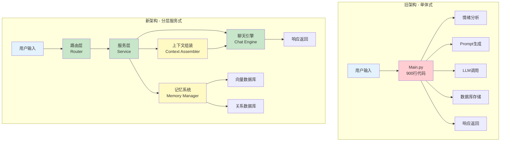
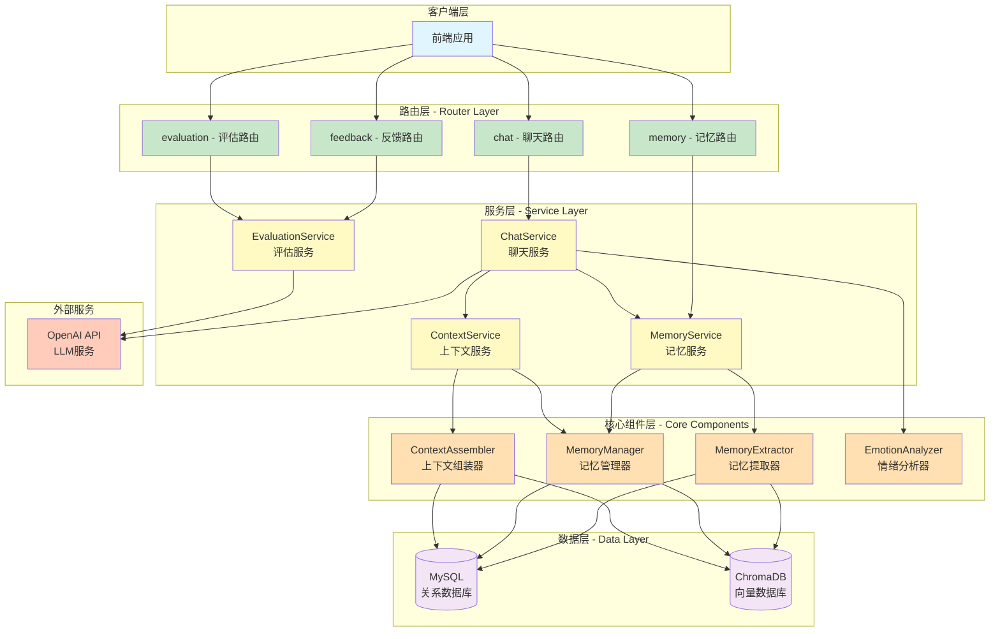
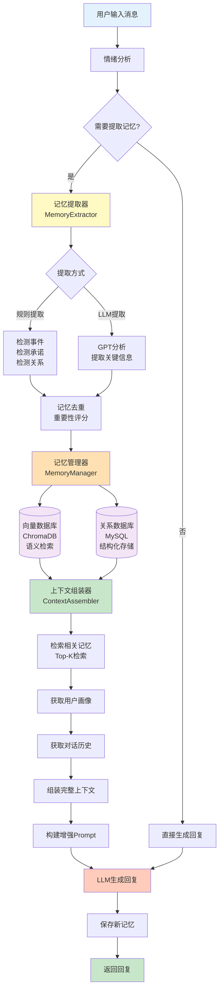
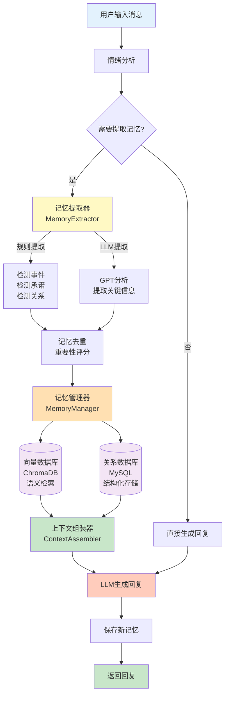

# 心语机器人记忆系统架构文档

## 一、系统架构升级

### 1.1 架构演进对比



### 1.2 新架构层次图



## 二、记忆系统架构升级

### 2.1 记忆系统流程图



精简版


### 2.2 系统架构升级详解

```mermaid
flowchart LR
    subgraph "用户层"
        U[用户]
    end
    
    subgraph "对话接口"
        API[/chat API]
    end
    
    subgraph "上下文组装器"
        CTX[ContextAssembler]
        
        subgraph "短期记忆"
            ST[当前会话历史<br/>最近5轮对话]
        end
        
        subgraph "长期记忆"
            LT1[向量检索<br/>Top-3相关记忆]
            LT2[时间权重<br/>近7天优先]
            LT3[情绪过滤<br/>高强度优先]
        end
        
        subgraph "用户画像"
            UP1[基本信息]
            UP2[性格特征]
            UP3[兴趣偏好]
            UP4[情绪基线]
        end
    end
    
    subgraph "Prompt生成"
        PROMPT["【AI角色】你是心语...<br/>【用户画像】{profile}<br/>【近期记忆】{memories}<br/>【当前对话】{history}<br/>请基于以上信息回复"]
    end
    
    subgraph "大模型"
        LLM[GPT-4 / GPT-4o]
    end
    
    subgraph "记忆更新"
        MEM[存储新记忆<br/>更新用户画像]
    end
    
    U --> API
    API --> CTX
    CTX --> ST & LT1 & UP1
    LT1 --> LT2 --> LT3
    UP1 --> UP2 --> UP3 --> UP4
    ST & LT3 & UP4 --> PROMPT
    PROMPT --> LLM
    LLM --> MEM
    MEM --> U
    
    style U fill:#e1f5fe
    style API fill:#c8e6c9
    style CTX fill:#fff9c4
    style ST fill:#ffecb3
    style LT1 fill:#ffe0b2
    style LT2 fill:#ffe0b2
    style LT3 fill:#ffe0b2
    style UP1 fill:#f3e5f5
    style UP2 fill:#f3e5f5
    style UP3 fill:#f3e5f5
    style UP4 fill:#f3e5f5
    style PROMPT fill:#c8e6c9
    style LLM fill:#ffccbc
    style MEM fill:#fff9c4
```

## 三、核心组件说明

### 3.1 组件职责

| 组件 | 职责 | 主要功能 |
|------|------|---------|
| **MemoryExtractor** | 记忆提取 | 从对话中识别并提取关键信息（事件、情绪、承诺等） |
| **MemoryManager** | 记忆管理 | 向量化存储、语义检索、记忆CRUD操作 |
| **ContextAssembler** | 上下文组装 | 整合用户画像、长短期记忆、对话历史 |
| **ChatService** | 聊天服务 | 统一的聊天接口，协调各组件 |
| **MemoryService** | 记忆服务 | 记忆的业务逻辑层，提供高层API |
| **ContextService** | 上下文服务 | 上下文管理的业务逻辑层 |

### 3.2 数据流向

```
用户输入
  ↓
情绪分析 → 记忆提取
  ↓
记忆管理器 → 向量化 → ChromaDB
           → 结构化 → MySQL
  ↓
上下文组装 ← 检索记忆 ← ChromaDB
           ← 用户画像 ← 文件/数据库
           ← 对话历史 ← MySQL
  ↓
Prompt增强 → LLM → 生成回复
  ↓
保存新记忆 → 向量数据库 & 关系数据库
  ↓
返回用户
```

## 四、记忆系统关键实现

### 4.1 记忆提取规则

```python
# 提取类型
memory_types = {
    "event": "生活事件（考试、面试、约会等）",
    "relationship": "人际关系（分手、吵架、和好等）",
    "commitment": "承诺/计划（我会、我打算、我决定等）",
    "concern": "担忧/焦虑（担心、害怕、压力等）",
    "emotion": "强烈情绪（强度≥7的情绪表达）",
    "preference": "偏好/兴趣"
}

# 提取条件
should_extract = {
    "消息长度 > 10字符",
    "情绪强度 ≥ 7.0",
    "包含关键词（考试、面试、分手等）",
    "消息长度 > 30 且 情绪强度 ≥ 5.0"
}
```

### 4.2 检索策略

```python
# Top-K检索
n_results = 3  # 默认返回3条

# 时间权重
days_limit = 7  # 优先检索近7天记忆

# 重要性阈值
min_importance = 0.5  # 只检索重要性≥0.5的记忆

# 相似度阈值
min_similarity = 0.3  # 只返回相似度≥0.3的记忆

# 排序公式
score = importance * 0.5 + similarity * 0.5
```

### 4.3 上下文注入模板

```
【AI角色】你是一位温暖、耐心的心理陪伴者，名叫"心语"。

【用户画像】
姓名：张三；年龄：25岁；性格：内向、敏感；兴趣：阅读、音乐；
关注：工作压力、人际关系；情绪状态：近期波动较大

【近期记忆】
1. [event] 用户明天有重要考试，感到焦虑
   (情绪: 焦虑, 强度: 8.0, 重要性: 0.9)
2. [relationship] 用户与朋友吵架，关系紧张
   (情绪: 难过, 强度: 7.5, 重要性: 0.8)
3. [concern] 用户担心考试失败会影响就业
   (情绪: 担忧, 强度: 7.0, 重要性: 0.7)

【情绪状态】
当前情绪: 焦虑
情绪强度: 8.0/10
近期情绪: 焦虑(5次), 难过(3次), 压力(2次)
趋势: 情绪波动增强

【当前对话】
用户: 我好担心明天的考试
心语: 听起来你很焦虑，考试确实让人紧张。能跟我说说你最担心什么吗？
用户: 怕考不好，我准备了很久但还是没信心

请基于以上信息，用共情、支持性的语气回复用户。注意：
1. 提及用户之前提到的考试和准备情况
2. 关注用户的情绪波动趋势
3. 保持温暖、耐心的陪伴者角色
4. 回复控制在3-4句话，口语化表达
```

## 五、技术栈

### 5.1 后端技术

| 技术 | 用途 | 版本 |
|------|------|------|
| FastAPI | Web框架 | 0.83+ |
| SQLAlchemy | ORM | 1.4+ |
| ChromaDB | 向量数据库 | 0.4+ |
| LangChain | LLM框架 | 0.1+ |
| OpenAI | LLM服务 | 1.3+ |
| Sentence-Transformers | 文本向量化 | 2.2+ |
| PyMySQL | MySQL驱动 | 1.0+ |

### 5.2 架构模式

- **分层架构**：Router → Service → Core → Data
- **依赖注入**：服务容器管理所有服务实例
- **工厂模式**：应用工厂创建FastAPI实例
- **服务层模式**：业务逻辑与路由分离
- **仓储模式**：数据访问层抽象

## 六、部署说明

### 6.1 目录结构

```
emotional_chat/
├── backend/
│   ├── app.py              # 应用工厂
│   ├── dependencies.py     # 依赖注入
│   ├── routers/            # 路由模块
│   │   ├── chat.py
│   │   ├── memory.py
│   │   ├── feedback.py
│   │   └── evaluation.py
│   ├── services/           # 服务层
│   │   ├── chat_service.py
│   │   ├── memory_service.py
│   │   └── context_service.py
│   ├── database.py         # 数据库模型
│   ├── vector_store.py     # 向量数据库
│   ├── memory_extractor.py # 记忆提取器
│   ├── memory_manager.py   # 记忆管理器
│   └── context_assembler.py # 上下文组装器
├── docs/                   # 文档
├── config.env              # 配置文件
└── run_backend.py          # 启动脚本
```

### 6.2 启动命令

```bash
# 安装依赖
pip install -r requirements.txt

# 初始化数据库
python db_manager.py init

# 启动服务
python run_backend.py
```

### 6.3 API文档

启动后访问：
- Swagger UI: http://localhost:8000/docs
- ReDoc: http://localhost:8000/redoc
- 系统信息: http://localhost:8000/system/info

## 七、扩展性设计

### 7.1 易于扩展的点

1. **新增路由**：在`routers/`目录添加新的路由文件
2. **新增服务**：在`services/`目录添加新的服务类
3. **新增记忆类型**：在`MemoryExtractor`中添加新的提取规则
4. **新增检索策略**：在`MemoryManager`中实现新的检索方法
5. **新增数据源**：实现新的数据访问层接口

### 7.2 未来优化方向

1. **分布式部署**：拆分为微服务架构
2. **缓存层**：添加Redis缓存热点数据
3. **异步任务**：使用Celery处理记忆提取等耗时任务
4. **向量数据库升级**：迁移到Pinecone或Qdrant
5. **多模型支持**：支持切换不同的LLM模型
6. **监控告警**：添加Prometheus + Grafana监控
7. **A/B测试**：支持不同记忆策略的效果对比


