# 心语机器人记忆系统架构文档

## 零、Agent Core架构总览

### 0.1 引入Agent核心模块架构

在原有"大模型 + 向量数据库 + 提示工程"基础上，新增Agent Core智能核心层：

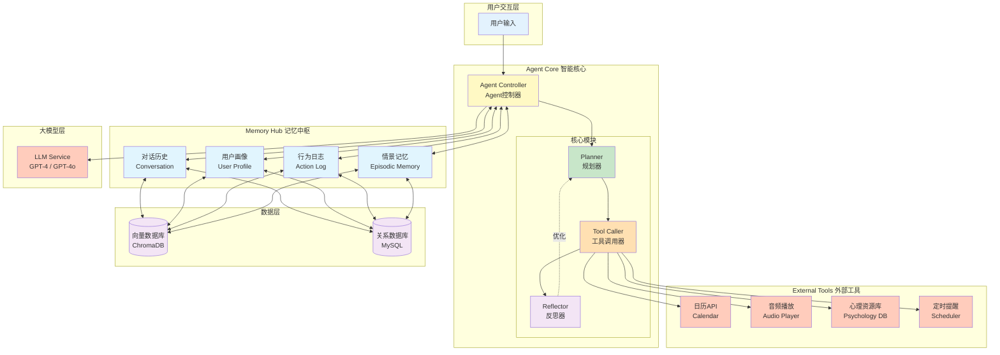

### 0.2 Agent Core数据流

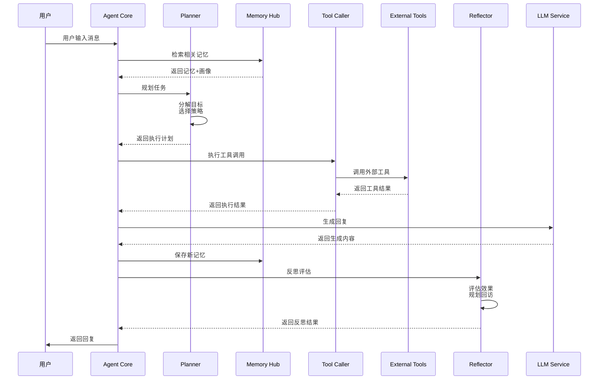

### 0.3 核心模块职责

| 模块 | 职责 | 主要功能 |
|------|------|---------|
| **Agent Controller** | 总控制器 | 协调各模块，管理执行流程 |
| **Planner** | 任务规划 | 目标分解、策略选择、任务排序 |
| **Tool Caller** | 工具调用 | 管理工具库、执行外部调用 |
| **Reflector** | 反思优化 | 效果评估、策略优化、主动回访 |
| **Memory Hub** | 记忆中枢 | 统一记忆接口、多源检索 |
| **External Tools** | 外部工具 | 日历、音频、资源、提醒等服务 |

## 一、系统架构升级

### 1.1 架构演进对比

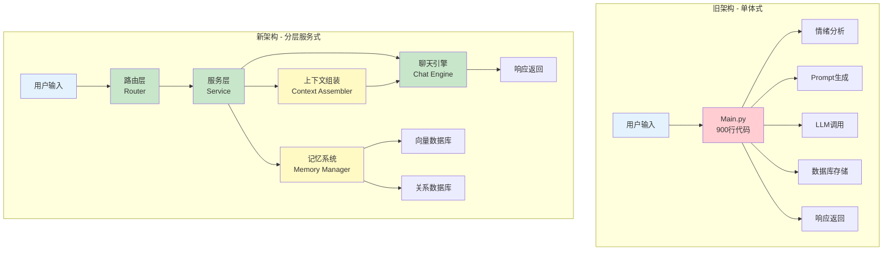

### 1.2 新架构层次图

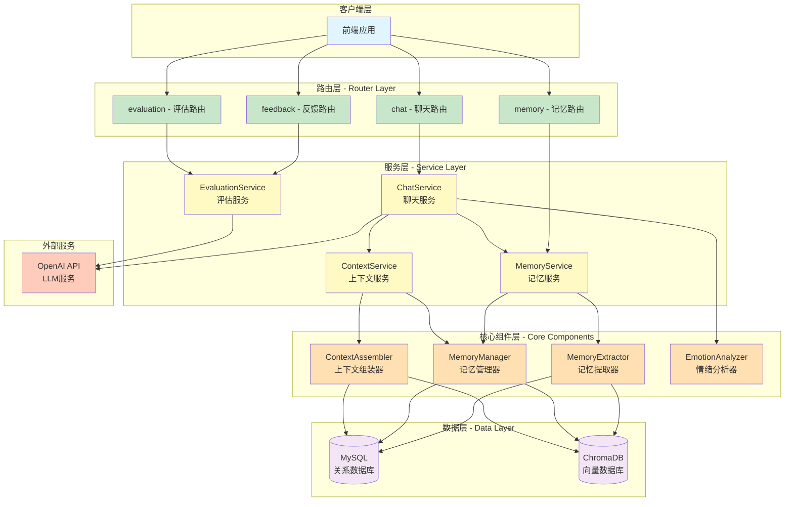

## 二、记忆系统架构升级

### 2.1 记忆系统流程图

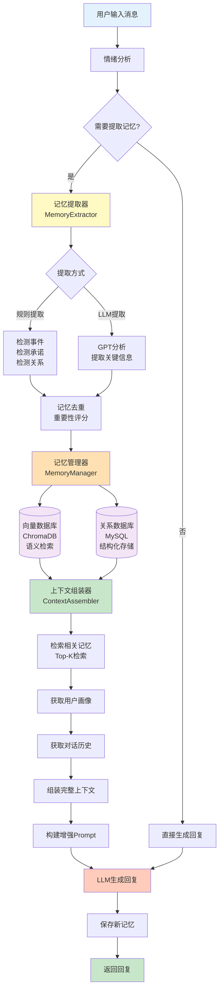

精简版
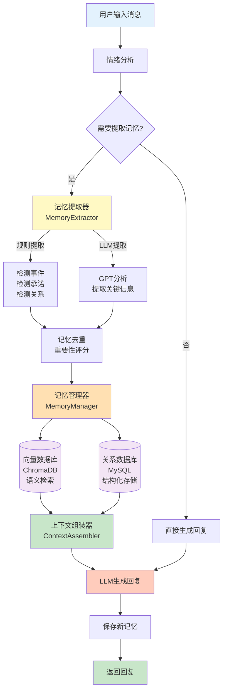

### 2.2 系统架构升级详解

```mermaid
flowchart LR
    subgraph "用户层"
        U[用户]
    end
    
    subgraph "对话接口"
        API[/chat API]
    end
    
    subgraph "上下文组装器"
        CTX[ContextAssembler]
        
        subgraph "短期记忆"
            ST[当前会话历史<br/>最近5轮对话]
        end
        
        subgraph "长期记忆"
            LT1[向量检索<br/>Top-3相关记忆]
            LT2[时间权重<br/>近7天优先]
            LT3[情绪过滤<br/>高强度优先]
        end
        
        subgraph "用户画像"
            UP1[基本信息]
            UP2[性格特征]
            UP3[兴趣偏好]
            UP4[情绪基线]
        end
    end
    
    subgraph "Prompt生成"
        PROMPT["【AI角色】你是心语...<br/>【用户画像】{profile}<br/>【近期记忆】{memories}<br/>【当前对话】{history}<br/>请基于以上信息回复"]
    end
    
    subgraph "大模型"
        LLM[GPT-4 / GPT-4o]
    end
    
    subgraph "记忆更新"
        MEM[存储新记忆<br/>更新用户画像]
    end
    
    U --> API
    API --> CTX
    CTX --> ST & LT1 & UP1
    LT1 --> LT2 --> LT3
    UP1 --> UP2 --> UP3 --> UP4
    ST & LT3 & UP4 --> PROMPT
    PROMPT --> LLM
    LLM --> MEM
    MEM --> U
    
    style U fill:#e1f5fe
    style API fill:#c8e6c9
    style CTX fill:#fff9c4
    style ST fill:#ffecb3
    style LT1 fill:#ffe0b2
    style LT2 fill:#ffe0b2
    style LT3 fill:#ffe0b2
    style UP1 fill:#f3e5f5
    style UP2 fill:#f3e5f5
    style UP3 fill:#f3e5f5
    style UP4 fill:#f3e5f5
    style PROMPT fill:#c8e6c9
    style LLM fill:#ffccbc
    style MEM fill:#fff9c4
```

## 三、核心组件说明

### 3.1 组件职责

| 组件 | 职责 | 主要功能 |
|------|------|---------|
| **MemoryExtractor** | 记忆提取 | 从对话中识别并提取关键信息（事件、情绪、承诺等） |
| **MemoryManager** | 记忆管理 | 向量化存储、语义检索、记忆CRUD操作 |
| **ContextAssembler** | 上下文组装 | 整合用户画像、长短期记忆、对话历史 |
| **ChatService** | 聊天服务 | 统一的聊天接口，协调各组件 |
| **MemoryService** | 记忆服务 | 记忆的业务逻辑层，提供高层API |
| **ContextService** | 上下文服务 | 上下文管理的业务逻辑层 |

### 3.2 数据流向

```
用户输入
  ↓
情绪分析 → 记忆提取
  ↓
记忆管理器 → 向量化 → ChromaDB
           → 结构化 → MySQL
  ↓
上下文组装 ← 检索记忆 ← ChromaDB
           ← 用户画像 ← 文件/数据库
           ← 对话历史 ← MySQL
  ↓
Prompt增强 → LLM → 生成回复
  ↓
保存新记忆 → 向量数据库 & 关系数据库
  ↓
返回用户
```

## 四、记忆系统关键实现

### 4.1 记忆提取规则

```python
# 提取类型
memory_types = {
    "event": "生活事件（考试、面试、约会等）",
    "relationship": "人际关系（分手、吵架、和好等）",
    "commitment": "承诺/计划（我会、我打算、我决定等）",
    "concern": "担忧/焦虑（担心、害怕、压力等）",
    "emotion": "强烈情绪（强度≥7的情绪表达）",
    "preference": "偏好/兴趣"
}

# 提取条件
should_extract = {
    "消息长度 > 10字符",
    "情绪强度 ≥ 7.0",
    "包含关键词（考试、面试、分手等）",
    "消息长度 > 30 且 情绪强度 ≥ 5.0"
}
```

### 4.2 检索策略

```python
# Top-K检索
n_results = 3  # 默认返回3条

# 时间权重
days_limit = 7  # 优先检索近7天记忆

# 重要性阈值
min_importance = 0.5  # 只检索重要性≥0.5的记忆

# 相似度阈值
min_similarity = 0.3  # 只返回相似度≥0.3的记忆

# 排序公式
score = importance * 0.5 + similarity * 0.5
```

### 4.3 上下文注入模板

```
【AI角色】你是一位温暖、耐心的心理陪伴者，名叫"心语"。

【用户画像】
姓名：张三；年龄：25岁；性格：内向、敏感；兴趣：阅读、音乐；
关注：工作压力、人际关系；情绪状态：近期波动较大

【近期记忆】
1. [event] 用户明天有重要考试，感到焦虑
   (情绪: 焦虑, 强度: 8.0, 重要性: 0.9)
2. [relationship] 用户与朋友吵架，关系紧张
   (情绪: 难过, 强度: 7.5, 重要性: 0.8)
3. [concern] 用户担心考试失败会影响就业
   (情绪: 担忧, 强度: 7.0, 重要性: 0.7)

【情绪状态】
当前情绪: 焦虑
情绪强度: 8.0/10
近期情绪: 焦虑(5次), 难过(3次), 压力(2次)
趋势: 情绪波动增强

【当前对话】
用户: 我好担心明天的考试
心语: 听起来你很焦虑，考试确实让人紧张。能跟我说说你最担心什么吗？
用户: 怕考不好，我准备了很久但还是没信心

请基于以上信息，用共情、支持性的语气回复用户。注意：
1. 提及用户之前提到的考试和准备情况
2. 关注用户的情绪波动趋势
3. 保持温暖、耐心的陪伴者角色
4. 回复控制在3-4句话，口语化表达
```

## 五、技术栈

### 5.1 后端技术

| 技术 | 用途 | 版本 |
|------|------|------|
| FastAPI | Web框架 | 0.83+ |
| SQLAlchemy | ORM | 1.4+ |
| ChromaDB | 向量数据库 | 0.4+ |
| LangChain | LLM框架 | 0.1+ |
| OpenAI | LLM服务 | 1.3+ |
| Sentence-Transformers | 文本向量化 | 2.2+ |
| PyMySQL | MySQL驱动 | 1.0+ |

### 5.2 架构模式

- **分层架构**：Router → Service → Core → Data
- **依赖注入**：服务容器管理所有服务实例
- **工厂模式**：应用工厂创建FastAPI实例
- **服务层模式**：业务逻辑与路由分离
- **仓储模式**：数据访问层抽象

## 六、部署说明

### 6.1 目录结构

```
emotional_chat/
├── backend/
│   ├── app.py              # 应用工厂
│   ├── dependencies.py     # 依赖注入
│   ├── routers/            # 路由模块
│   │   ├── chat.py
│   │   ├── memory.py
│   │   ├── feedback.py
│   │   └── evaluation.py
│   ├── services/           # 服务层
│   │   ├── chat_service.py
│   │   ├── memory_service.py
│   │   └── context_service.py
│   ├── database.py         # 数据库模型
│   ├── vector_store.py     # 向量数据库
│   ├── memory_extractor.py # 记忆提取器
│   ├── memory_manager.py   # 记忆管理器
│   └── context_assembler.py # 上下文组装器
├── docs/                   # 文档
├── config.env              # 配置文件
└── run_backend.py          # 启动脚本
```

### 6.2 启动命令

```bash
# 安装依赖
pip install -r requirements.txt

# 初始化数据库
python db_manager.py init

# 启动服务
python run_backend.py
```

### 6.3 API文档

启动后访问：
- Swagger UI: http://localhost:8000/docs
- ReDoc: http://localhost:8000/redoc
- 系统信息: http://localhost:8000/system/info

## 七、扩展性设计

### 7.1 易于扩展的点

1. **新增路由**：在`routers/`目录添加新的路由文件
2. **新增服务**：在`services/`目录添加新的服务类
3. **新增记忆类型**：在`MemoryExtractor`中添加新的提取规则
4. **新增检索策略**：在`MemoryManager`中实现新的检索方法
5. **新增数据源**：实现新的数据访问层接口

### 7.2 未来优化方向

1. **分布式部署**：拆分为微服务架构
2. **缓存层**：添加Redis缓存热点数据
3. **异步任务**：使用Celery处理记忆提取等耗时任务
4. **向量数据库升级**：迁移到Pinecone或Qdrant
5. **多模型支持**：支持切换不同的LLM模型
6. **监控告警**：添加Prometheus + Grafana监控
7. **A/B测试**：支持不同记忆策略的效果对比

## 八、Agent化架构升级：从功能到关系

### 8.1 Agent化设计理念

#### 8.1.1 从被动响应到主动服务

**传统机器人模式（被动）：**
```
用户："我最近睡不好"
机器人："你可以试试冥想。"
```

**Agent化"心语"模式（主动）：**
```
用户："我最近睡不好"
心语Agent：
  ├─ [感知] 识别"睡眠问题" + "持续性" + "情绪低落"
  ├─ [规划] 
  │   ├─ 是否需要获取历史睡眠记录？ → 是
  │   ├─ 是否建议专业咨询？ → 评估中
  │   └─ 是否设置提醒？ → 是
  ├─ [行动]
  │   ├─ 查询用户日志（发现连续7天睡眠质量差）
  │   ├─ 调用冥想音频接口
  │   └─ 设置每日晚安提醒（21:30）
  └─ [反思] 一周后主动回访：
      "你最近睡眠有改善吗？需要调整建议吗？"
```

> **核心差异**：Agent不仅能"回答问题"，更能"主动服务"，这是从功能到关系的关键升维。

### 8.2 Agent Core架构设计

#### 8.2.1 整体架构图

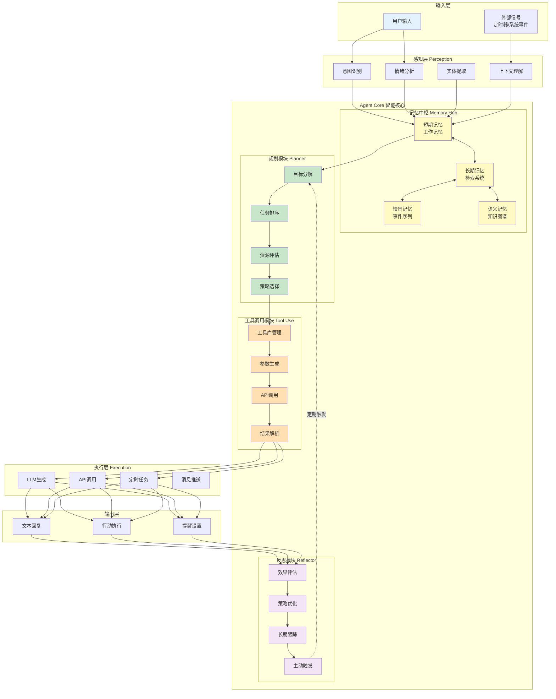

#### 8.2.2 核心模块详细设计

##### (1) 记忆中枢 Memory Hub

**功能定位**：Agent的"海马体"，管理所有记忆的存储、检索和更新。

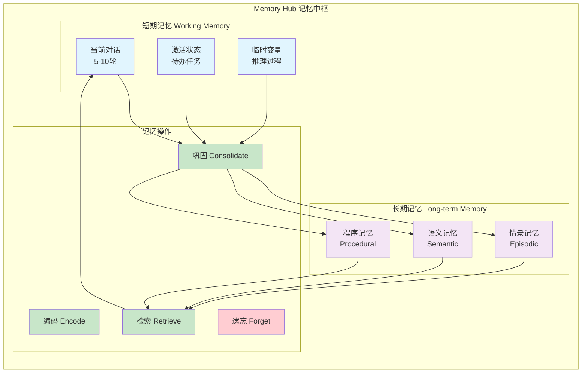

**技术实现**：
```python
class MemoryHub:
    """记忆中枢 - Agent的记忆系统核心"""
    
    def __init__(self):
        # 短期记忆（内存）
        self.working_memory = {
            "conversation": [],      # 当前对话
            "active_tasks": [],      # 激活任务
            "temp_variables": {}     # 临时变量
        }
        
        # 长期记忆（数据库）
        self.episodic_memory = EpisodicMemoryStore()  # 情景记忆
        self.semantic_memory = SemanticMemoryStore()   # 语义记忆
        self.procedural_memory = ProceduralMemoryStore()  # 程序记忆
        
        # 记忆管理器（复用现有系统）
        self.memory_manager = MemoryManager()
        
    def encode(self, experience: dict) -> Memory:
        """编码：将新经验转换为记忆"""
        memory = {
            "content": experience["content"],
            "emotion": experience["emotion"],
            "context": self.working_memory["conversation"][-5:],
            "timestamp": datetime.now(),
            "importance": self._calculate_importance(experience)
        }
        return memory
    
    def consolidate(self, memory: Memory):
        """巩固：将工作记忆转移到长期记忆"""
        # 情景记忆：存储事件
        if memory["type"] == "event":
            self.episodic_memory.store(memory)
        
        # 语义记忆：提取知识
        if memory["importance"] > 0.8:
            knowledge = self._extract_knowledge(memory)
            self.semantic_memory.store(knowledge)
        
        # 向量化存储（复用现有系统）
        self.memory_manager.save_memory(memory)
    
    def retrieve(self, query: str, context: dict) -> List[Memory]:
        """检索：基于查询和上下文检索相关记忆"""
        # 多路检索策略
        results = []
        
        # 1. 向量语义检索（相似度）
        semantic_results = self.memory_manager.search_memories(
            query=query,
            top_k=5
        )
        
        # 2. 时间序列检索（近期优先）
        temporal_results = self.episodic_memory.search_recent(
            days=7,
            limit=3
        )
        
        # 3. 情绪关联检索（情绪一致性）
        if context.get("emotion"):
            emotion_results = self.episodic_memory.search_by_emotion(
                emotion=context["emotion"],
                limit=2
            )
            results.extend(emotion_results)
        
        # 合并去重，按重要性排序
        results = self._merge_and_rank(
            semantic_results,
            temporal_results,
            emotion_results
        )
        
        return results[:5]  # 返回Top-5
    
    def forget(self, memory_id: str):
        """遗忘：降低记忆权重或删除"""
        # 衰减策略：重要性随时间降低
        memory = self.memory_manager.get_memory(memory_id)
        memory["importance"] *= 0.9
        self.memory_manager.update_memory(memory)
```

##### (2) 规划模块 Planner

**功能定位**：Agent的"前额叶"，负责目标分解、任务规划和策略选择。

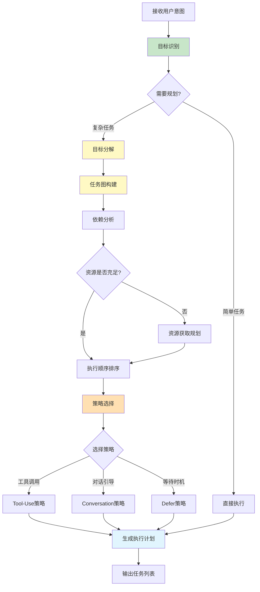

**技术实现**：
```python
class Planner:
    """规划模块 - Agent的任务规划器"""
    
    def __init__(self, llm, memory_hub: MemoryHub):
        self.llm = llm
        self.memory_hub = memory_hub
        self.tools = ToolRegistry()  # 工具注册表
        
    async def plan(self, user_input: str, context: dict) -> ExecutionPlan:
        """生成执行计划"""
        
        # 1. 目标识别
        goal = await self._identify_goal(user_input, context)
        
        # 2. 判断是否需要复杂规划
        if goal["complexity"] == "simple":
            return ExecutionPlan(
                steps=[{"action": "respond", "tool": "llm_generate"}]
            )
        
        # 3. 目标分解
        sub_goals = await self._decompose_goal(goal)
        
        # 4. 构建任务图
        task_graph = self._build_task_graph(sub_goals)
        
        # 5. 资源评估
        available_tools = self.tools.get_available_tools()
        feasible_tasks = self._filter_feasible_tasks(
            task_graph,
            available_tools
        )
        
        # 6. 策略选择
        strategy = self._select_strategy(feasible_tasks, context)
        
        # 7. 生成执行计划
        execution_plan = self._generate_plan(feasible_tasks, strategy)
        
        return execution_plan
    
    async def _identify_goal(self, user_input: str, context: dict) -> dict:
        """识别用户目标"""
        prompt = f"""
        分析用户输入，识别核心目标：
        
        用户输入：{user_input}
        上下文：{context}
        
        返回JSON格式：
        {{
            "goal_type": "信息查询|情感支持|问题解决|行为改变",
            "complexity": "simple|medium|complex",
            "urgency": "low|medium|high",
            "sub_goals": ["子目标1", "子目标2"]
        }}
        """
        
        response = await self.llm.generate(prompt)
        return json.loads(response)
    
    async def _decompose_goal(self, goal: dict) -> List[dict]:
        """目标分解"""
        if goal["complexity"] == "simple":
            return [goal]
        
        prompt = f"""
        将复杂目标分解为可执行的子任务：
        
        目标：{goal}
        
        要求：
        1. 每个子任务应该是原子操作
        2. 明确任务之间的依赖关系
        3. 评估每个任务的优先级
        
        返回JSON数组格式：
        [
            {{
                "task_id": "task_1",
                "description": "任务描述",
                "depends_on": [],
                "priority": "high|medium|low",
                "tools_needed": ["tool1", "tool2"]
            }}
        ]
        """
        
        response = await self.llm.generate(prompt)
        return json.loads(response)
    
    def _select_strategy(self, tasks: List[dict], context: dict) -> str:
        """策略选择"""
        # 规则1：如果用户情绪强度高，优先情感支持
        if context.get("emotion_intensity", 0) > 7.0:
            return "empathy_first"
        
        # 规则2：如果任务需要外部工具，使用Tool-Use策略
        if any(task.get("tools_needed") for task in tasks):
            return "tool_use"
        
        # 规则3：如果需要长期跟踪，使用Follow-up策略
        if any(task.get("requires_followup") for task in tasks):
            return "scheduled_followup"
        
        # 默认：对话引导策略
        return "conversational"
```

##### (3) 工具调用模块 Tool Use

**功能定位**：Agent的"运动皮层"，负责调用外部工具和API。

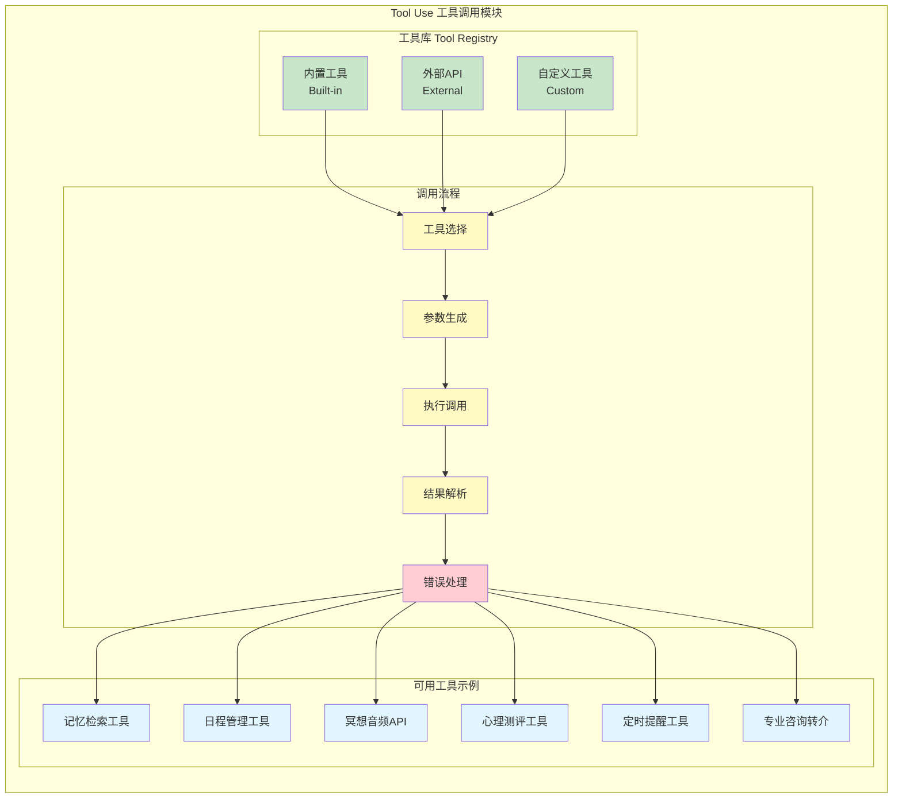

**技术实现**：
```python
class ToolUse:
    """工具调用模块 - Agent的工具接口"""
    
    def __init__(self):
        self.registry = ToolRegistry()
        self._register_builtin_tools()
    
    def _register_builtin_tools(self):
        """注册内置工具"""
        
        # 工具1：记忆检索
        self.registry.register(
            name="search_memory",
            description="搜索用户历史记忆和对话",
            parameters={
                "query": "搜索关键词",
                "time_range": "时间范围（天）",
                "emotion_filter": "情绪过滤"
            },
            function=self._search_memory
        )
        
        # 工具2：定时提醒
        self.registry.register(
            name="set_reminder",
            description="设置定时提醒任务",
            parameters={
                "content": "提醒内容",
                "schedule_time": "提醒时间",
                "repeat": "是否重复"
            },
            function=self._set_reminder
        )
        
        # 工具3：情绪日志
        self.registry.register(
            name="get_emotion_log",
            description="获取用户情绪变化记录",
            parameters={
                "days": "查询天数",
                "emotion_type": "情绪类型"
            },
            function=self._get_emotion_log
        )
        
        # 工具4：冥想音频
        self.registry.register(
            name="recommend_meditation",
            description="推荐冥想音频资源",
            parameters={
                "duration": "时长（分钟）",
                "theme": "主题（睡眠/焦虑/放松）"
            },
            function=self._recommend_meditation
        )
        
        # 工具5：专业评估
        self.registry.register(
            name="psychological_assessment",
            description="触发心理健康评估",
            parameters={
                "assessment_type": "评估类型",
                "urgency": "紧急程度"
            },
            function=self._psychological_assessment
        )
    
    async def call(self, tool_name: str, parameters: dict) -> dict:
        """调用工具"""
        try:
            tool = self.registry.get_tool(tool_name)
            
            # 验证参数
            self._validate_parameters(tool, parameters)
            
            # 执行调用
            result = await tool["function"](**parameters)
            
            return {
                "success": True,
                "tool": tool_name,
                "result": result
            }
            
        except Exception as e:
            return {
                "success": False,
                "tool": tool_name,
                "error": str(e)
            }
    
    async def _search_memory(self, query: str, time_range: int = 30,
                            emotion_filter: str = None) -> dict:
        """搜索记忆工具实现"""
        memory_hub = get_memory_hub()  # 获取记忆中枢
        
        results = memory_hub.retrieve(
            query=query,
            context={
                "time_range": time_range,
                "emotion": emotion_filter
            }
        )
        
        return {
            "count": len(results),
            "memories": [
                {
                    "content": m["content"],
                    "emotion": m["emotion"],
                    "date": m["timestamp"].strftime("%Y-%m-%d"),
                    "importance": m["importance"]
                }
                for m in results
            ]
        }
    
    async def _set_reminder(self, content: str, schedule_time: str,
                           repeat: bool = False) -> dict:
        """设置提醒工具实现"""
        from backend.services.scheduler_service import SchedulerService
        
        scheduler = SchedulerService()
        
        reminder_id = await scheduler.create_reminder(
            content=content,
            schedule_time=datetime.fromisoformat(schedule_time),
            repeat=repeat
        )
        
        return {
            "reminder_id": reminder_id,
            "scheduled_at": schedule_time,
            "status": "scheduled"
        }
    
    async def _get_emotion_log(self, days: int = 7,
                              emotion_type: str = None) -> dict:
        """获取情绪日志工具实现"""
        from backend.services.emotion_service import EmotionService
        
        emotion_service = EmotionService()
        
        logs = await emotion_service.get_emotion_history(
            days=days,
            emotion_type=emotion_type
        )
        
        # 分析趋势
        trend = self._analyze_emotion_trend(logs)
        
        return {
            "logs": logs,
            "trend": trend,
            "summary": {
                "dominant_emotion": trend["dominant"],
                "volatility": trend["volatility"],
                "improvement": trend["improvement"]
            }
        }
    
    async def _recommend_meditation(self, duration: int = 10,
                                   theme: str = "relaxation") -> dict:
        """推荐冥想音频工具实现"""
        # 可以对接第三方冥想API
        meditation_db = {
            "sleep": [
                {"title": "深度睡眠引导", "duration": 15, "url": "..."},
                {"title": "助眠白噪音", "duration": 30, "url": "..."}
            ],
            "anxiety": [
                {"title": "焦虑缓解冥想", "duration": 10, "url": "..."},
                {"title": "呼吸练习", "duration": 5, "url": "..."}
            ],
            "relaxation": [
                {"title": "全身放松扫描", "duration": 12, "url": "..."},
                {"title": "正念冥想", "duration": 10, "url": "..."}
            ]
        }
        
        recommendations = meditation_db.get(theme, [])
        filtered = [r for r in recommendations if r["duration"] <= duration]
        
        return {
            "theme": theme,
            "count": len(filtered),
            "recommendations": filtered
        }
```

##### (4) 反思模块 Reflector

**功能定位**：Agent的"元认知"，负责自我评估和长期优化。

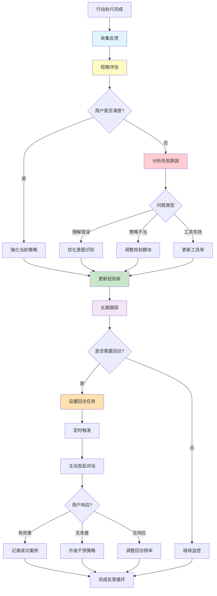

**技术实现**：
```python
class Reflector:
    """反思模块 - Agent的元认知系统"""
    
    def __init__(self, llm, memory_hub: MemoryHub):
        self.llm = llm
        self.memory_hub = memory_hub
        self.experience_db = ExperienceDatabase()
        
    async def evaluate(self, interaction: dict) -> dict:
        """评估交互效果"""
        
        # 1. 收集反馈指标
        metrics = {
            "user_satisfaction": interaction.get("feedback_score", 0),
            "response_time": interaction.get("response_time", 0),
            "goal_achieved": interaction.get("goal_achieved", False),
            "emotion_change": self._calculate_emotion_change(interaction)
        }
        
        # 2. 判断成功/失败
        success = self._is_successful(metrics)
        
        # 3. 分析原因
        analysis = await self._analyze_interaction(interaction, metrics)
        
        # 4. 生成改进建议
        improvements = self._generate_improvements(analysis)
        
        # 5. 更新经验库
        self.experience_db.store({
            "interaction_id": interaction["id"],
            "success": success,
            "metrics": metrics,
            "analysis": analysis,
            "improvements": improvements,
            "timestamp": datetime.now()
        })
        
        return {
            "success": success,
            "score": self._calculate_score(metrics),
            "improvements": improvements
        }
    
    async def plan_followup(self, user_id: str, context: dict) -> Optional[dict]:
        """规划回访任务"""
        
        # 1. 检索需要回访的记忆
        memories = self.memory_hub.retrieve(
            query="需要跟进的事件",
            context={"user_id": user_id, "requires_followup": True}
        )
        
        if not memories:
            return None
        
        # 2. 评估回访时机
        for memory in memories:
            time_since = (datetime.now() - memory["timestamp"]).days
            
            # 睡眠问题：7天后回访
            if "睡眠" in memory["content"] and time_since >= 7:
                return {
                    "type": "followup",
                    "memory_id": memory["id"],
                    "reason": "睡眠改善跟踪",
                    "message": "你最近睡眠有改善吗？之前建议的冥想练习有帮助吗？",
                    "schedule_time": datetime.now() + timedelta(days=1)
                }
            
            # 考试/面试：事件后3天回访
            if any(kw in memory["content"] for kw in ["考试", "面试"]) \
                and time_since >= 3:
                return {
                    "type": "followup",
                    "memory_id": memory["id"],
                    "reason": "重要事件结果跟踪",
                    "message": f"你的{memory['event']}怎么样了？结果还顺利吗？",
                    "schedule_time": datetime.now() + timedelta(hours=2)
                }
        
        return None
    
    async def trigger_proactive_action(self, user_id: str):
        """触发主动行动"""
        
        # 1. 检查是否有待回访任务
        followup = await self.plan_followup(user_id, {})
        
        if followup:
            # 发送主动消息
            await self._send_proactive_message(
                user_id=user_id,
                message=followup["message"],
                context={"type": "followup", "memory_id": followup["memory_id"]}
            )
            return
        
        # 2. 检查情绪异常
        emotion_log = await self._get_recent_emotions(user_id, days=7)
        if self._detect_emotional_crisis(emotion_log):
            await self._send_proactive_message(
                user_id=user_id,
                message="我注意到你最近情绪波动比较大，还好吗？需要聊聊吗？",
                context={"type": "emotional_support"}
            )
            return
        
        # 3. 检查用户活跃度
        days_since_last_chat = await self._get_days_since_last_interaction(user_id)
        if days_since_last_chat >= 7:
            await self._send_proactive_message(
                user_id=user_id,
                message="好久不见！最近过得怎么样？",
                context={"type": "engagement"}
            )
    
    def _detect_emotional_crisis(self, emotion_log: List[dict]) -> bool:
        """检测情绪危机"""
        # 规则1：连续3天负面情绪强度>7
        negative_emotions = ["焦虑", "抑郁", "愤怒", "恐惧"]
        high_intensity_count = sum(
            1 for log in emotion_log
            if log["emotion"] in negative_emotions
            and log["intensity"] > 7.0
        )
        
        if high_intensity_count >= 3:
            return True
        
        # 规则2：情绪急剧恶化（强度增长>3）
        if len(emotion_log) >= 2:
            intensity_change = emotion_log[0]["intensity"] - emotion_log[-1]["intensity"]
            if intensity_change > 3.0:
                return True
        
        return False
```

### 8.3 完整工作流示例

#### 8.3.1 场景：用户睡眠问题处理全流程

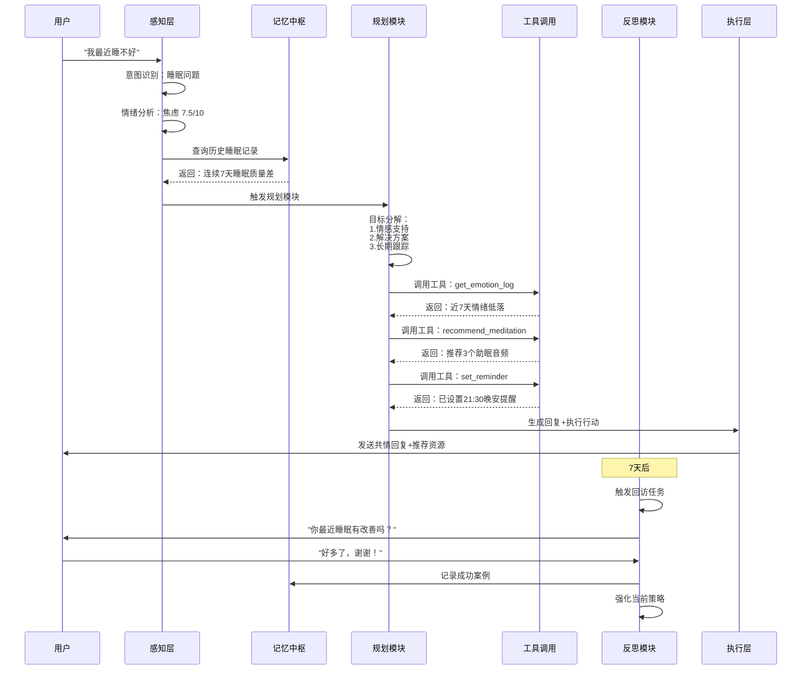

#### 8.3.2 完整代码集成示例

```python
class EmotionalChatAgent:
    """心语情感陪伴Agent - 完整集成"""
    
    def __init__(self):
        # 核心组件
        self.memory_hub = MemoryHub()
        self.planner = Planner(llm=get_llm(), memory_hub=self.memory_hub)
        self.tool_use = ToolUse()
        self.reflector = Reflector(llm=get_llm(), memory_hub=self.memory_hub)
        
        # 现有系统（复用）
        self.emotion_analyzer = EmotionAnalyzer()
        self.context_assembler = ContextAssembler()
        
    async def process(self, user_input: str, user_id: str) -> dict:
        """处理用户输入的完整流程"""
        
        # ===== 1. 感知层 =====
        perception = await self._perceive(user_input, user_id)
        
        # ===== 2. 记忆中枢 =====
        # 编码当前输入为记忆
        current_memory = self.memory_hub.encode({
            "content": user_input,
            "emotion": perception["emotion"],
            "user_id": user_id
        })
        
        # 检索相关记忆
        relevant_memories = self.memory_hub.retrieve(
            query=user_input,
            context=perception
        )
        
        # ===== 3. 规划模块 =====
        execution_plan = await self.planner.plan(
            user_input=user_input,
            context={
                "perception": perception,
                "memories": relevant_memories,
                "user_id": user_id
            }
        )
        
        # ===== 4. 工具调用 + 执行 =====
        results = []
        for step in execution_plan.steps:
            if step["action"] == "tool_call":
                result = await self.tool_use.call(
                    tool_name=step["tool"],
                    parameters=step["parameters"]
                )
                results.append(result)
            
            elif step["action"] == "respond":
                # 组装上下文
                context = self.context_assembler.assemble(
                    user_id=user_id,
                    memories=relevant_memories,
                    tool_results=results
                )
                
                # 生成回复
                response = await self._generate_response(
                    user_input=user_input,
                    context=context
                )
                results.append({"type": "response", "content": response})
        
        # ===== 5. 记忆巩固 =====
        self.memory_hub.consolidate(current_memory)
        
        # ===== 6. 反思评估 =====
        interaction = {
            "id": str(uuid.uuid4()),
            "user_id": user_id,
            "input": user_input,
            "perception": perception,
            "plan": execution_plan,
            "results": results,
            "timestamp": datetime.now()
        }
        
        evaluation = await self.reflector.evaluate(interaction)
        
        # 规划回访
        followup = await self.reflector.plan_followup(user_id, perception)
        if followup:
            await self._schedule_followup(followup)
        
        # ===== 7. 返回结果 =====
        return {
            "response": next(r["content"] for r in results if r.get("type") == "response"),
            "actions": [r for r in results if r.get("type") != "response"],
            "emotion": perception["emotion"],
            "evaluation": evaluation,
            "followup_scheduled": followup is not None
        }
    
    async def _perceive(self, user_input: str, user_id: str) -> dict:
        """感知层：分析用户输入"""
        # 复用现有情绪分析
        emotion_result = self.emotion_analyzer.analyze(user_input)
        
        # 意图识别
        intent = await self._identify_intent(user_input)
        
        return {
            "emotion": emotion_result["emotion"],
            "emotion_intensity": emotion_result["intensity"],
            "intent": intent,
            "entities": self._extract_entities(user_input)
        }
    
    async def _generate_response(self, user_input: str, context: dict) -> str:
        """生成回复（复用现有系统）"""
        from backend.services.chat_service import ChatService
        
        chat_service = ChatService()
        response = await chat_service.generate_response(
            user_input=user_input,
            context=context
        )
        
        return response
```

### 8.4 与现有系统集成方案

#### 8.4.1 集成架构图

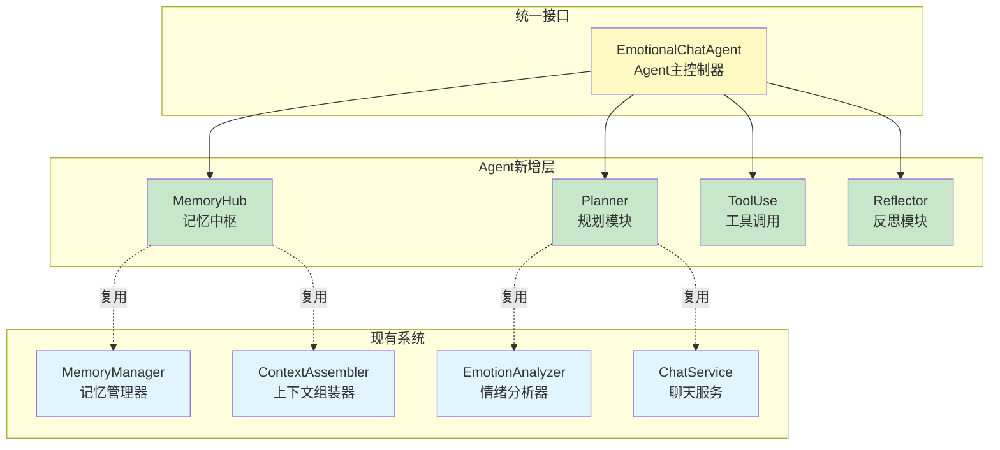

#### 8.4.2 渐进式升级路径

**阶段1：基础Agent（2周）**
- [ ] 实现MemoryHub（复用现有MemoryManager）
- [ ] 实现简化版Planner（规则based）
- [ ] 集成到现有ChatService

**阶段2：工具扩展（2周）**
- [ ] 实现ToolUse模块
- [ ] 开发5个核心工具
- [ ] 测试工具调用流程

**阶段3：反思回访（2周）**
- [ ] 实现Reflector模块
- [ ] 开发定时任务系统
- [ ] 测试主动回访功能

**阶段4：优化迭代（持续）**
- [ ] 收集用户反馈
- [ ] 优化规划策略
- [ ] 扩展工具库

### 8.5 技术栈扩展

| 技术 | 用途 | 版本 |
|------|------|------|
| **LangChain Agents** | Agent框架 | 0.1+ |
| **LangGraph** | 工作流编排 | 0.0.40+ |
| **APScheduler** | 定时任务 | 3.10+ |
| **Celery** | 异步任务队列 | 5.3+ |
| **Redis** | 消息队列/缓存 | 7.0+ |
| **Pydantic** | 数据验证 | 2.0+ |

### 8.6 核心代码文件结构

```
emotional_chat/
├── backend/
│   ├── agent/                      # Agent模块（新增）
│   │   ├── __init__.py
│   │   ├── agent_core.py           # Agent主控制器
│   │   ├── memory_hub.py           # 记忆中枢
│   │   ├── planner.py              # 规划模块
│   │   ├── tool_use.py             # 工具调用
│   │   ├── reflector.py            # 反思模块
│   │   └── tools/                  # 工具库
│   │       ├── memory_tools.py
│   │       ├── scheduler_tools.py
│   │       ├── emotion_tools.py
│   │       └── resource_tools.py
│   │
│   ├── services/                   # 现有服务（增强）
│   │   ├── chat_service.py         # ← 集成Agent
│   │   ├── scheduler_service.py    # ← 新增
│   │   └── ...
│   │
│   ├── tasks/                      # 定时任务（新增）
│   │   ├── followup_tasks.py
│   │   └── reflection_tasks.py
│   │
│   └── ...
```

### 8.7 下一步行动计划

#### 优先级P0（立即开始）
1. 实现基础MemoryHub（3天）
2. 实现规则based Planner（3天）
3. 集成到现有ChatService（2天）

#### 优先级P1（2周内）
4. 开发核心工具库（5天）
5. 实现ToolUse模块（3天）
6. 开发Reflector基础功能（4天）

#### 优先级P2（1个月内）
7. 定时任务系统（5天）
8. 主动回访功能（3天）
9. 性能优化和测试（5天）

---

**总结**：Agent化架构将"心语"从被动响应升级为主动服务，通过四个核心模块（记忆中枢、规划、工具调用、反思）实现真正的情感陪伴关系。该架构充分复用现有记忆系统，采用渐进式升级路径，可快速落地并持续优化。


