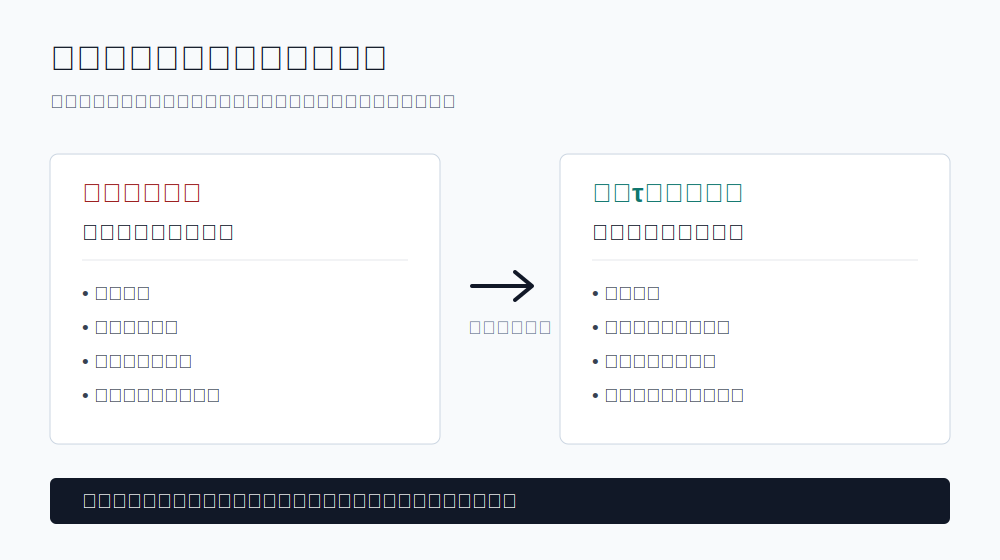
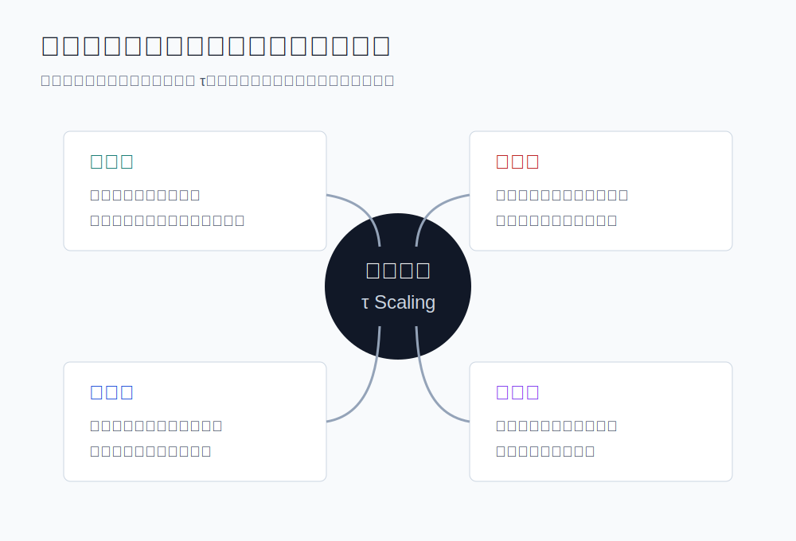
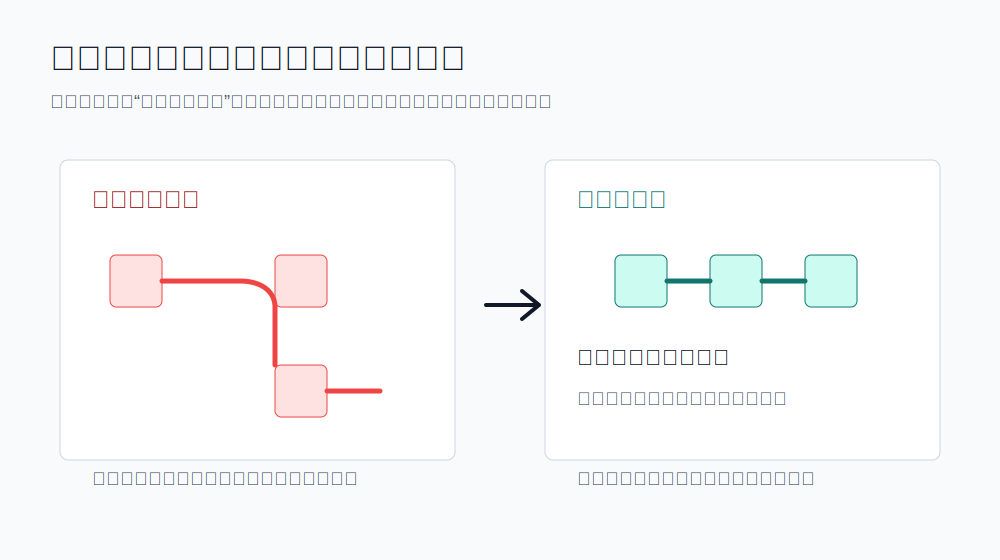
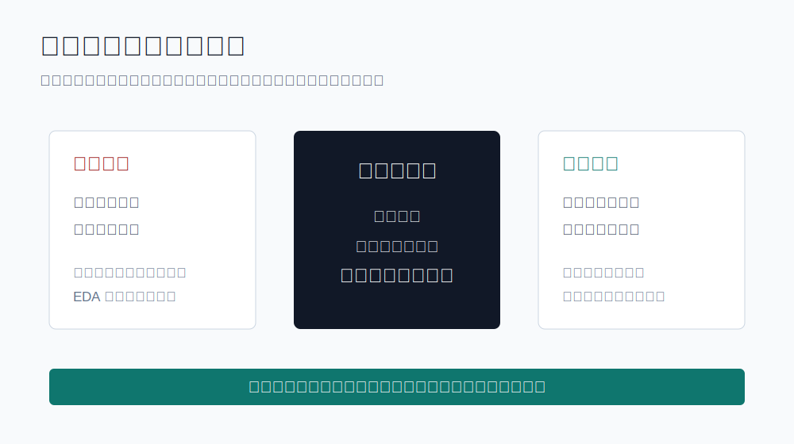

# 华为“韬定律”的真正含义：芯片竞争，正在从制程战争转向系统战争

过去几十年，全球半导体产业有一个近乎信仰般的坐标系：

**几纳米。**

谁能把晶体管做得更小，谁就拥有更先进的芯片；谁能率先进入更先进制程，谁就站在产业链的高处。

这套逻辑，就是摩尔定律塑造出来的产业秩序。

但现在，这个秩序正在松动。

2026年5月25日，华为在 IEEE 国际电路系统研讨会 ISCAS 2026 上正式提出“韬（τ）定律”。表面看，这是一个半导体技术原则；但更深一层看，它释放出的信号远不止技术本身。

它意味着，芯片产业的竞争维度，正在发生变化。

过去是制程战争。

未来可能是系统战争。

> 图：韬定律的关键，不是简单替代摩尔定律，而是把性能优化从“空间效率”扩展到“时间效率”。

## 一、韬定律不是“替代摩尔定律”，而是绕开单一路径依赖

讨论韬定律，最容易陷入一个误区：

把它简单理解为华为要用一个新定律“取代”摩尔定律。

这其实低估了问题的复杂性。

摩尔定律真正重要的地方，不只是“晶体管数量每隔一段时间翻倍”，而是它在全球半导体产业中形成了一整套分工体系、投资逻辑和竞争规则。

设备厂、EDA、晶圆厂、设计公司、封装企业、终端厂商，都围绕这条路线展开协作。

但问题是，先进制程走到今天，已经同时遭遇三重压力：

**物理极限越来越近。**

**制造成本越来越高。**

**产业链集中度越来越强。**

也就是说，继续沿着原来的路走，技术上越来越难，经济上越来越贵，地缘上越来越敏感。

在这个背景下，韬定律的关键意义，不是喊一句“我不走摩尔定律了”，而是提出另一种演进思路：

**既然几何缩微越来越难，那就从时间缩微入手。**

所谓时间缩微，就是不只盯着晶体管尺寸，而是盯着信号在器件、电路、芯片和系统之间流动的效率。

芯片性能的本质，不只是“有多少晶体管”，还包括“这些晶体管如何更快、更高效地协同工作”。

这是韬定律真正值得关注的地方。

它不是简单地反对先进制程，而是在先进制程之外，打开了一个新的优化空间。

## 二、从“空间压缩”到“时间压缩”，芯片性能的评价体系变了

过去我们评价芯片，太习惯用一个问题开场：

**这是几纳米？**

这个问题当然重要，但它越来越不够用了。

因为芯片不是晶体管的静态堆叠，而是一个高速运转的复杂系统。

信号怎么走，数据怎么流，指令怎么执行，内存怎么访问，不同模块之间怎么通信，都会决定最终性能。

换句话说，晶体管密度只是能力的一部分。

**系统效率才是最终答案。**

华为提出的韬定律，把焦点从“空间上的更小”转向“时间上的更短”。

这背后是一个重要变化：

**半导体竞争正在从单点制造能力，转向全栈系统能力。**

如果说摩尔定律时代的核心问题是：如何在单位面积里放下更多晶体管？

那么韬定律试图回答的问题是：如何让整个电子系统以更低时延、更高效率完成计算？

这就是为什么华为强调的不只是某个器件，而是从器件、电路、芯片到系统的多层级协同。

在器件层面，优化电阻和寄生电容。

在电路层面，通过逻辑折叠缩短关键路径。

在芯片层面，推动软件、架构、芯片协同设计。

在系统层面，降低通信时延，提升互联效率。

它的底层逻辑是：不把性能提升押注在某一个环节，而是从整个系统里找效率。

这是一种典型的工程型创新。

也是华为最擅长的创新方式。

> 图：韬定律强调器件、电路、芯片、系统的多层级协同，本质是从整个系统里找效率。

## 三、逻辑折叠的本质，是用结构创新对冲制程约束

韬定律里最容易被传播的概念，是“逻辑折叠”。

这个词听起来很技术，但可以用一个简单类比理解。

传统芯片设计，有点像在一张平面城市地图上规划道路。城市越来越复杂，道路越来越拥堵，信号要从一个地方到另一个地方，路径可能越来越长。

逻辑折叠要做的，是改变原来的布局方式，让关键路径更短，让信号少绕路，让系统内部的通信成本下降。

它不是简单的“把东西折起来”，而是通过结构设计，降低信号传播的时间成本。

这件事的重要性在于：

**当制程不能无限向前时，结构创新就会变得越来越重要。**

过去，先进制程像一台强大的发动机。只要工艺节点不断推进，很多性能问题都可以被制程红利掩盖。

但当制程红利变慢，架构、电路、封装、互联、软件协同的重要性就会被重新放大。

这就是为什么近年来全球半导体产业都在关注 Chiplet、先进封装、异构计算、存算协同、光互联等方向。

大家都意识到，不能再只靠“晶体管变小”解决所有问题。

华为的韬定律，本质上也是这个大趋势中的一部分。

只是它更进一步，把这些工程实践上升为一个新的演进原则：

**从几何缩微，走向时间缩微。**

> 图：逻辑折叠不是概念包装，而是试图通过结构设计缩短关键路径、降低信号传播成本。

## 四、韬定律背后，是中国半导体必须面对的现实主义

写华为韬定律，不能只写热血。

真正专业的分析，必须看到它背后的现实约束。

中国半导体产业最大的挑战，不是某一家企业不努力，而是先进制程背后牵涉极其复杂的全球产业链。

光刻机、材料、设备、EDA、工艺经验、生态协同，每一项都不是短期可以轻松补齐的。

所以，中国芯片突围不能只有一种想象：

在同一条路上，用同样的方式，把所有短板一次性补齐，然后实现全面反超。

这当然是目标之一，但不是唯一解法。

更现实的路径是：

**一边补短板，一边找新变量。**

韬定律的价值就在于，它提供了一个新变量。

它不是说制造工艺不重要，而是说，在制造工艺之外，系统设计能力同样可以创造巨大增量。

这对中国芯片尤其关键。

因为越是在外部环境受限的情况下，越不能把胜负完全交给单一环节。

必须通过架构创新、电路创新、软件协同、系统工程，把有限资源用到极致。

这不是情绪化突围，而是工程化突围。

## 五、华为真正要改写的，是“什么叫先进”

韬定律最值得咀嚼的地方，不在于它多了一个新名词，而在于它试图改变一个更底层的问题：

**到底什么叫先进芯片？**

过去很长一段时间，答案几乎被简化成一个数字。

几纳米，就是先进。

谁掌握更先进的制程，谁就掌握产业叙事；谁能把晶体管做得更小，谁就有资格定义下一代芯片。

这套评价体系强大、清晰，也极具压迫感。

它把全球半导体产业压进同一条赛道：设备、材料、制造、设计、封装、终端，都围绕先进制程展开竞赛。

问题是，当这条赛道被少数巨头、少数设备、少数工艺节点高度锁定时，后来者如果只在同一套规则里追赶，就会长期处在被动位置。

所以韬定律真正有野心的地方，不是宣布“我们也能做某个节点”，而是提出另一个判断框架：

**先进不只体现在晶体管尺寸上，也体现在信号传播的时间效率、系统协同的组织能力、软硬芯一体化的工程深度上。**

这就把问题从“谁的制程更小”，推进到“谁能让系统更高效”。

这一步很关键。

因为一旦评价体系发生变化，竞争的主战场也会随之变化。

过去，半导体竞争更像是沿着一条既定山路向上攀登，节点越高，门槛越陡。

而韬定律试图做的，是在这条山路旁边开出新的技术坡面：从时间、结构、架构、互联、软件协同中继续寻找性能增量。

这不是绕开制造能力的重要性。

恰恰相反，它承认制造能力依然重要，但拒绝让制造节点成为唯一的答案。

这也是华为这次表述中最有分量的部分。

它不是在讲一款芯片，也不是在讲一次产品发布，而是在尝试把中国半导体的表达方式，从“我追到哪里了”，推向“我如何定义下一阶段的先进”。

产品竞争解决的是一城一池。

路线竞争争夺的是未来十年的产业想象力。

如果韬定律后续能够被更多工程实践验证，它的意义就不只是华为多了一套技术语言，而是中国企业第一次更主动地参与半导体产业坐标系的重绘。

这才是“话语权”的真正含义。

不是声音更大，而是有能力提出一套让产业不得不认真讨论的新问题。

## 六、不要神化韬定律，但也不要低估它

对韬定律，最好的态度不是盲目兴奋，也不是条件反射式否定。

盲目兴奋会把一个复杂技术问题讲成民族情绪。

条件反射式否定，则会错过产业范式变化中的真实信号。

更理性的看法是：

**韬定律不是魔法，不能让芯片产业一夜之间越过所有技术鸿沟。**

**但它也不是一个普通营销词。**

它反映的是半导体产业正在发生的底层变化：

先进制程仍然重要，但不再是唯一变量。

晶体管密度仍然重要，但系统效率越来越重要。

制造能力仍然重要，但全栈协同能力正在成为新的竞争核心。

未来的芯片竞争，不会只属于“谁的纳米更小”，也会属于“谁能把整个系统组织得更高效”。

这就是韬定律最大的启示。

> 图：对韬定律最好的态度，是不神化，也不低估。

## 结语：芯片突围，不只是追赶旧答案，也要提出新问题

华为韬定律真正值得写的，不是“华为又发布了一个新概念”。

而是它提醒我们：

**中国芯片产业不能永远停留在追赶叙事里。**

追赶当然必要。

先进制程要追，设备材料要补，EDA生态要建，制造能力要提升。

但与此同时，我们也必须学会提出新问题。

当几何缩微越来越难，时间缩微有没有可能成为新路径？

当单点制程受限，系统工程能不能创造新优势？

当旧产业规则高度集中，中国企业能不能提出自己的技术坐标？

这才是韬定律的真正含义。

它不是终点，而是一个信号。

中国芯片的下一阶段，不只是继续追赶别人定义的先进。

更重要的是，开始定义属于自己的先进。

---

## 参考资料

- 华为官网：《华为发表韬(τ)定律，实现晶体管密度与系统性能突破》
- 人民网：《华为正式发表半导体领域新定律》
