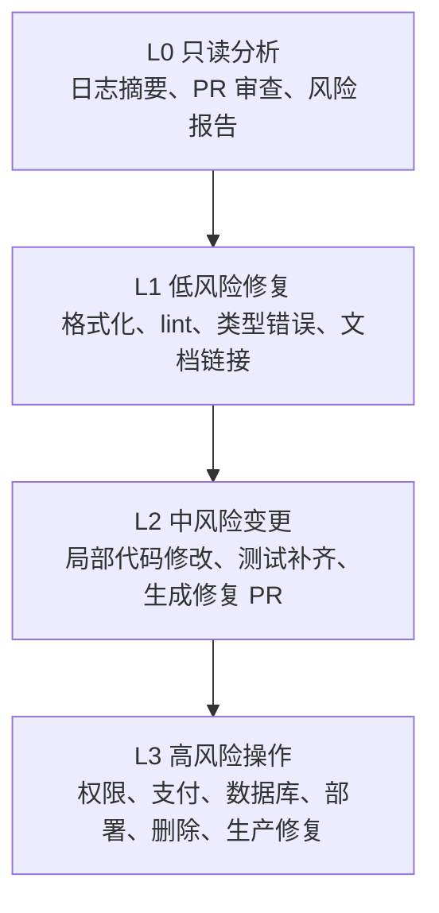

# 第 12 章 场景四：PR、Review 与 CI/CD 自动化

代码写完只完成了一半。从“代码完成”到“代码上线”之间，还有审查、构建、测试、部署和回滚。每一步都可能因为琐碎问题卡住：类型错误导致 CI 红灯，lint 警告需要逐一修复，PR 审查等待 reviewer 有空，安全扫描报出一长串需要判断真假的告警。

这些问题模式固定、耗时巨大，恰恰是 Codex 最适合介入的场景。但这一章不会只讨论“怎么把 Codex 接进 CI/CD”，而是先回答更重要的问题：哪些环节适合自动化，哪些环节只能自动生成建议，哪些变更必须停下来等待人工审批。

本章的主线可以概括为一句话：自动化的价值在于减少重复劳动，而不是替代人类判断。Codex 可以在无人值守环境里分析失败日志、生成修复 PR、执行第一轮代码审查、整理安全告警和部署风险；但真正决定能否合并、能否发布、能否扩大权限的，仍然应该是人和团队规则。

## 12.1 非交互模式：无人值守的前提条件

前面章节讨论的多是交互模式：你给 Codex 指令，它执行后返回结果，你审核后再给下一个指令。但很多工程场景不需要实时人工介入：CI 构建失败后自动分析日志，定时代码质量检查，批量处理积压的 PR 审查，或者在夜间生成一份风险报告。Codex 的非交互模式，就是为了这类无人值守任务而存在。

非交互模式的真正风险，不在于 Codex 能做什么，而在于你没有限制它不能做什么。使用非交互模式前，至少要确保两件事：工作目录是干净的，或至少所有重要变更已经提交；Codex 的结果不会直接进入主分支，而是创建 PR、评论或报告，等待人工审查。

表 12-1 汇总了几类常见运行方式。它不是参数手册，而是帮助团队先确定安全边界：分析任务尽量只读，修复任务限制写入范围，高风险任务只允许输出建议。

**表 12-1：非交互模式的常见安全边界**

| 场景 | 推荐边界 | 适合让 Codex 做什么 |
| --- | --- | --- |
| 日志分析 | 只读 | 读取 CI 日志，定位失败原因，输出诊断报告 |
| PR 审查 | 只读 | 读取 diff、测试和相关文件，输出 review findings |
| 机械修复 | 工作区可写，限制目录 | 修 lint、类型错误、格式化、明显拼写错误 |
| CI 自修复 | 工作区可写，结果提交到新 PR | 应用最小补丁，重新运行检查，生成修复 PR |
| 高风险变更 | 禁止写入，只输出计划 | 涉及权限、支付、数据库 schema、删除操作时只给建议 |

代码清单 12-1 给出几个非交互模式指令示例。实际参数名和支持能力应以当前 Codex 文档为准；在书稿里更重要的是表达使用原则：先限制权限，再运行任务。

**代码清单 12-1：非交互模式的几种典型用法**

```bash
# 只读分析：适合 CI 日志、PR diff、依赖风险排查
codex exec --sandbox read-only \
  "读取 ci.log，找出失败原因，输出根因、建议修复和验证命令"

# 工作区内修复：适合 lint、类型错误、格式化等低风险任务
codex exec --sandbox workspace-write \
  "修复 src/ 下的 TypeScript 类型错误，不修改数据库迁移和配置文件"

# 全自动前必须加外部约束：只允许生成 PR，不允许直接合并
codex exec --full-auto --sandbox workspace-write \
  "应用最小修复，运行测试，并输出变更摘要和剩余风险"
```

这类命令进入 CI 后，安全边界不应该只写在 prompt 里，还应该落实到仓库权限、GitHub Actions 权限、分支保护、CODEOWNERS 和审批规则里。prompt 可以约束 Codex 的意图，但真正能防事故的是系统边界。

## 12.2 CI 自修复：从构建失败到自动 PR

CI 构建失败是开发流程中最常见的摩擦点。每次失败都意味着切换上下文、翻看日志、定位根因、修复推送、等待下一次构建。如果修复还不正确，就再循环一次。对于类型错误、lint 错误、格式化失败、缺少导入这类高度机械化的问题，完全可以让 Codex 先做一轮自动处理。

### 12.2.1 自修复闭环的核心不是“自动合并”

CI 自修复不是“让 Codex 修复后直接推送到主分支”，而是“让 Codex 修复后创建 PR，等人工确认再合并”。这个区别至关重要。图 12-1 展示了完整闭环：失败触发、日志分析、最小修复、重新验证、创建 PR、人工审查。

**图 12-1：CI 自修复闭环**

[drawio 源文件：图12-1_CI自修复闭环.drawio](figures/图12-1_CI自修复闭环.drawio)

代码清单 12-2 给出一个简化的 GitHub Actions 配置。原文使用 `workflow_run` 触发器：当主 CI 工作流失败后，再启动 Codex 修复任务。这里保留这个思路，但把它写成出版稿更容易阅读的格式。

**代码清单 12-2：CI 失败后触发 Codex 生成修复 PR**

```yaml
name: codex-autofix

on:
  workflow_run:
    workflows: ["CI Build"]
    types: [completed]

jobs:
  autofix:
    if: ${{ github.event.workflow_run.conclusion == 'failure' }}
    runs-on: ubuntu-latest
    permissions:
      contents: write
      pull-requests: write

    steps:
      - uses: actions/checkout@v4
        with:
          fetch-depth: 0

      - name: Run Codex autofix
        uses: openai/codex-action@v1
        with:
          openai_api_key: ${{ secrets.OPENAI_API_KEY }}
          prompt: |
            分析失败日志并应用最小修复。
            只允许修改 src/ 和 tests/ 下的文件。
            不允许修改数据库迁移、部署配置和密钥文件。
          sandbox: workspace-write
          safety_strategy: drop-sudo

      - name: Create pull request
        uses: peter-evans/create-pull-request@v6
        with:
          branch: codex/autofix-${{ github.event.workflow_run.id }}
          title: "[Codex] Auto-fix CI failure #${{ github.event.workflow_run.id }}"
          labels: codex, auto-generated
```

这段配置的关键不在某个 action 名称，而在流程边界：Codex 可以修复，但只能生成 PR；可以写文件，但写入范围要受限；可以访问日志，但不应获得超过任务所需的权限。类似 `drop-sudo`、只读沙箱、最小权限 token、分支保护，都是为了避免自动化任务在 CI 环境里扩大影响面。

### 12.2.2 成本和失败率要一起控制

CI 自修复很容易从“节省时间”变成“制造新成本”。API 调用成本、CI 排队时间、误修复后的二次审查，都会消耗团队资源。因此上线前要先设置触发条件和硬上限。

表 12-2 把原文中的成本控制策略整理成一张表。它的作用是提醒团队：不要让每一次小失败都触发一次昂贵的自动修复。

**表 12-2：CI 自修复的成本控制策略**

| 控制点 | 推荐做法 | 目的 |
| --- | --- | --- |
| 触发范围 | 只在主分支、发布分支或高价值 PR 上触发 | 避免所有实验分支都消耗预算 |
| 任务分类 | 先用轻量模型做诊断，再决定是否进入补丁生成 | 避免简单失败直接进入高成本修复 |
| 日志输入 | 只传关键错误行、相关 diff 和失败测试名 | 降低上下文噪声 |
| 写入范围 | 限制目录和文件类型，排除迁移、部署和密钥文件 | 控制修改半径 |
| 时间上限 | 设置超时和最大 token 预算 | 避免长时间悬挂 |
| 输出形式 | 修复失败时输出诊断报告，不强行改代码 | 减少低质量补丁 |

对自修复能力必须保持诚实的评估。Codex 的修复是非确定性的，相同失败可能产生不同补丁，必须通过重新运行测试验证。大仓库日志可能超出上下文窗口，需要只传入关键错误行。修复可能通过当前测试，但引入其他回归，所以 PR 审查不可省略。对于复杂失败，如测试逻辑错误、依赖冲突、构建配置问题，Codex 的价值更多在于提供诊断报告，而不是直接修复。

## 12.3 AI 代码审查：先做第一道筛选

在部署 AI 代码审查之前，必须先回答一个问题：AI 代码审查到底有多大用？原文引用了多项研究和行业报告，它们呈现的图景比营销宣传复杂得多：AI 在样式、类型、安全直觉、简单缺陷上有价值，但在架构判断、复杂设计原则和业务语义上仍然需要人类把关。

### 12.3.1 不同任务的收益差异很大

AI 代码审查不应该被理解为“替代 reviewer”。更准确的定位是：它在 PR 创建或更新时自动运行第一轮审查，输出结构化意见，让人类 reviewer 更快看见低风险问题，并把精力集中在业务逻辑、架构决策和发布风险上。

表 12-3 把 AI 审查适合处理的问题和必须保留人工判断的问题分开。这个表比单纯比较“哪个 Agent 的 PR 接受率更高”更有实践价值，因为同一工具在不同任务上的表现会差很多。

**表 12-3：AI 代码审查与人工审查的分工**

| 审查对象 | AI 适合做什么 | 人必须判断什么 |
| --- | --- | --- |
| 代码风格 | 格式、命名、重复代码、明显坏味道 | 是否符合团队长期约定 |
| 类型安全 | 空值、类型不匹配、未处理分支 | 类型设计是否表达业务语义 |
| 错误处理 | 漏掉异常路径、错误码不一致 | 错误策略是否符合用户体验 |
| 测试覆盖 | 找缺失测试、弱断言、未跑验证 | 覆盖范围是否足够支撑发布 |
| 安全性 | 明显注入、硬编码密钥、危险 API | 风险是否可接受，是否需要延期 |
| 架构设计 | 提示耦合、复杂度、边界模糊 | 模块边界和长期演进方向 |

### 12.3.2 Review 应该只给 findings，不直接改代码

原文提到 Codex CLI 的 `/review` 模式，其核心思想非常适合出版稿保留：审查者模式应该读取 diff、相关依赖与测试，按优先级输出 findings，不修改任何代码。这使 AI Review 成为一个稳定的第一道筛选，而不是又一个会改动工作区的自动化进程。

示例 12-1 给出一个适合放进 PR 流程的审查指令。它强调输出结构化结果和优先级，而不是要求 Codex “顺手修掉”。

**示例 12-1：让 Codex 执行只读 PR 审查**

```text
请对当前 PR 做只读代码审查，不修改任何文件。

重点检查：
1. 是否存在明显 bug、空值、异常路径遗漏。
2. 前后端 API 契约是否一致。
3. 是否修改了安全敏感逻辑、权限、数据库迁移或部署配置。
4. 测试是否覆盖新增行为和主要异常路径。
5. 是否存在过度修改或无关重构。

输出格式：
- Findings：按 P0 / P1 / P2 排序，每条包含文件、位置、问题、影响和建议。
- Open questions：需要人确认的问题。
- Verification：建议 reviewer 重点运行的验证命令。
```

图 12-2 展示了三处自然触发点：开发者本地提交前、PR 创建或更新时、CI 中作为检查项运行。三者的权限应该不同：本地可以交互追问，PR 评论应只读，CI 中则应输出报告或阻断高风险变更。

**图 12-2：Codex Review 的三处触发点**

[drawio 源文件：图12-2_CodexReview三处触发点.drawio](figures/图12-2_CodexReview三处触发点.drawio)

这套流程的关键是：AI 审查可以帮人更快看见问题，但不能让人失去判断权。复杂架构判断、产品语义、权限边界和上线风险，仍然必须由明确的 owner 接住。

## 12.4 超越代码审查：安全扫描与 GitOps 演进

自动化的范围不限于代码审查。从安全扫描到部署运维，AI 正在扩展它的边界。但每一步扩展都伴随着新的风险：安全扫描可能误报，自动修复可能引入新漏洞，GitOps 自动同步可能把错误配置推向更多环境，根因分析也可能把复杂问题归因错。

### 12.4.1 安全扫描适合“工具初筛 + AI 精排”

传统 SAST 工具的核心痛点是误报多。开发者面对数百条告警，真正有价值的可能只有少数。原文引用的 SAST-Genius 思路很值得保留：让传统工具先做确定性的模式匹配，再让 LLM 结合上下文做精排、解释和修复建议。

图 12-3 展示了这种混合架构。它比“只用 LLM 找漏洞”更稳，因为传统工具提供可重复的初筛，LLM 负责降低噪声和补充上下文解释。

**图 12-3：安全扫描的混合架构**

[drawio 源文件：图12-3_安全扫描混合架构.drawio](figures/图12-3_安全扫描混合架构.drawio)

代码清单 12-3 给出一个简化的 CodeQL 工作流。它保留原文里“定期深扫 + PR 扫描 + 安全告警”的思路，但不把自动修复当作自动合并。

**代码清单 12-3：CodeQL 安全扫描工作流示例**

```yaml
name: CodeQL

on:
  push:
    branches: [main]
  pull_request:
    branches: [main]
  schedule:
    - cron: "0 6 * * 1"

jobs:
  analyze:
    runs-on: ubuntu-latest
    permissions:
      security-events: write
      pull-requests: write
    strategy:
      matrix:
        language: [python, javascript]

    steps:
      - uses: actions/checkout@v4
      - uses: github/codeql-action/init@v3
        with:
          languages: ${{ matrix.language }}
          queries: security-extended
      - uses: github/codeql-action/analyze@v3
```

这里的原则和本章其他部分一致：AI 可以减少误报、解释告警、生成修复建议，但它仍然是建议者，不是决策者。尤其是 AI 修改过的文件，更应该接受安全扫描和人工审查。

### 12.4.2 GitOps 自动化要保留审批点

CI/CD 自动化覆盖了代码构建和测试，而部署阶段正在从 GitOps 走向 AI 辅助 GitOps。GitOps 的核心理念是“声明式配置 + Git 作为唯一真相来源”；AI 加入之后，更合理的形态不是“让 AI 直接 kubectl apply”，而是“AI 建议配置变更 -> 人审批 -> Git 合并 -> ArgoCD 同步”。

原文中的 ApplicationSet + Progressive Sync 很适合保留。它表达了一个重要思想：部署不应该一次同步全部环境，而应该按 canary、staging、区域生产、全局生产逐步推进；前一批不健康，后续批次就暂停。

代码清单 12-4 给出一个简化的 ApplicationSet 渐进同步配置。真实项目需要根据集群标签、健康检查和同步策略调整。

**代码清单 12-4：ArgoCD ApplicationSet 渐进同步示例**

```yaml
apiVersion: argoproj.io/v1alpha1
kind: ApplicationSet
metadata:
  name: emotional-chat
spec:
  strategy:
    type: RollingSync
    rollingSync:
      steps:
        - matchExpressions:
            - key: env
              operator: In
              values: [canary]
          maxUpdate: 100%
        - matchExpressions:
            - key: env
              operator: In
              values: [staging]
          maxUpdate: 100%
        - matchExpressions:
            - key: env
              operator: In
              values: [prod-eu]
          maxUpdate: 50%
        - matchExpressions:
            - key: env
              operator: In
              values: [prod-global]
          maxUpdate: 100%
  generators:
    - clusters: {}
  template:
    metadata:
      name: "{{name}}-emotional-chat"
    spec:
      project: default
      source:
        repoURL: https://github.com/example/emotional-chat.git
        path: deploy/{{metadata.labels.env}}
        targetRevision: HEAD
      destination:
        server: "{{server}}"
        namespace: emo-chat
      syncPolicy:
        automated:
          prune: true
          selfHeal: true
```

图 12-4 把这条链路放回本章主线：Codex 可以修改代码或建议配置，CI 负责验证和产物，Git 保存事实来源，ArgoCD 分批同步，监控决定是否继续推进。

**图 12-4：AI 辅助 GitOps 的审批闭环**

[drawio 源文件：图12-4_AI辅助GitOps审批闭环.drawio](figures/图12-4_AI辅助GitOps审批闭环.drawio)

部署到生产环境后，AI 辅助运维会遇到更复杂的挑战。它可以做告警聚类、日志摘要、变更关联和初步根因分析，但当前最安全的定位仍然是辅助分诊。修复和升级的决策权，尤其是涉及生产流量、数据和权限的动作，必须留在人手里。

## 12.5 自动化的边界：风险分级与信任建立

自动化的能力边界取决于四个因素：变更的影响范围、错误的代价、可逆性、团队成熟度。一个成熟团队不会简单问“Codex 能不能做”，而会先问“这个任务属于哪一类风险，失败后能不能快速回滚，是否必须有人审批”。

### 12.5.1 用四级风险框架决定自动化权限

图 12-5 给出一个四级自动化风险分级框架。它把任务从只读报告到必须人工执行分成 L0 到 L3。这个框架的关键在于 L2 和 L3 的分界线：如果变更涉及认证、授权、支付、数据库 schema、生产部署、删除代码或大范围重构，就应该归入 L3。

**图 12-5：四级自动化风险分级框架**



表 12-4 把这个框架转成可执行规则。它适合进入团队的 `AGENTS.md`、CI 规则或自动化审批文档。

**表 12-4：四级自动化风险分级判别表**

| 等级 | 允许 Codex 做什么 | 是否可自动提交 | 是否必须人工审批 |
| --- | --- | --- | --- |
| L0 | 只读分析、审查、总结、风险报告 | 不提交代码 | 不一定 |
| L1 | 修格式、lint、类型错误、低风险文档修改 | 可创建 PR | 合并前审查 |
| L2 | 局部修复、测试补充、有限代码改动 | 可创建 PR | 必须审查 |
| L3 | 权限、支付、数据库、部署、删除、大范围重构 | 只输出计划 | 必须审批并人工执行 |

示例 12-2 是一段可以直接放进自动化任务 prompt 的安全规则。它把“什么时候停下来”说清楚，比事后追责更有用。

**示例 12-2：自动化修复任务的人工审批触发条件**

```text
执行修复时请遵守以下安全规则：

1. 如果修改文件数超过 5 个，暂停并报告。
2. 如果涉及 backend/core/、auth/、payments/、migrations/ 或 deploy/，暂停并报告。
3. 如果有删除操作超过 20 行，暂停并报告。
4. 如果需要修改数据库 schema、权限逻辑或生产配置，只输出方案，不修改代码。
5. 对每个修复给出置信度评分（1-10），低于 7 分的暂停并报告。
6. 输出最终 diff 摘要、已运行验证和剩余风险。
```

### 12.5.2 信任要通过渐进式落地建立

将 Codex 的自动化能力落地到实际项目，不应该一开始就给最大权限。更合理的方式是分阶段扩大自主范围，让团队用真实数据建立信任。

表 12-5 保留原文中的四阶段落地路径，并把每一阶段的权限边界写清楚。

**表 12-5：Codex 自动化能力的渐进式落地路径**

| 阶段 | 时间建议 | 自动化范围 | 目标 |
| --- | --- | --- | --- |
| 第一阶段 | 1-2 周 | 本地非交互模式，手动触发，只读或低风险修复 | 建立使用习惯和审查标准 |
| 第二阶段 | 2-4 周 | 接入 CI，但只生成报告，不自动提交代码 | 验证诊断质量和误报率 |
| 第三阶段 | 1-2 个月 | 允许处理 L0-L2 任务并创建 PR | 建立审批门禁和回滚习惯 |
| 第四阶段 | 持续优化 | 根据数据扩大或收缩自动化范围 | 形成团队级规则和默认流程 |

信任是逐步建立的。AI 代码审查在简单任务上有效，但在复杂判断上存在偏差；安全扫描的混合架构可以降低噪声，但 AI 生成的修复本身也需要审查；GitOps 的 AI 演进方向清晰，但根因分析和生产处置仍然需要 human-in-the-loop。自动化的价值在于减少重复劳动，而不是替代人类判断。这个原则在任何阶段都不应该动摇。

## 本章小结

PR 审查和 CI/CD 自动化，是将 Codex 从个人开发助手推进到团队工程流程的重要一环。本章的核心线索是“自动化的边界”：CI 自修复可以减少机械失败带来的摩擦，但结果应该进入 PR；AI 代码审查可以做第一道筛选，但复杂设计和业务语义仍需人判断；安全扫描可以通过“工具初筛 + AI 精排”降低噪声，但安全修复不能自动放行；GitOps 可以把代码、配置和部署串成流水线，但生产环境动作必须保留审批和回滚。

如果只把 Codex 接进 CI，却没有风险分级、权限边界和人工审批，它会放大不确定性；如果先把 L0 到 L3 的边界说清楚，再逐步扩大自动化范围，它就能把大量重复劳动从团队流程里拿掉，让人把注意力放回真正需要判断的地方。

下一章会进入团队级研发流程：当不再只是一个人使用 Codex，而是第二个人、第三个人和值班同事都要接住同一条任务链路时，团队应该如何共享规则、权限、能力包和交接方式。

## 延伸阅读与配套仓库

**官方文档与一线实践**

- OpenAI Developers：Codex use cases 与代码审查相关示例。
- OpenAI Developers Cookbook：Build Code Review with the Codex SDK。
- GitHub Docs：Responsible use of Copilot Autofix for code scanning。
- ArgoCD Docs：ApplicationSet Progressive Sync。
- GitHub CodeQL：Code scanning 与 CodeQL workflow 配置。

**本书配套仓库**

对应目录建议保留为：

- `ch12/codex-review-pre-commit/`
- `ch12/codex-action-ci-autofix/`
- `ch12/codeql-default-setup/`
- `ch12/argocd-progressive-applicationset/`

这些目录可以放置本章用到的 `AGENTS.md` 片段、Prompt 模板、CI/CD 工作流示例、代码审查报告样例、安全扫描配置和渐进式部署配置。仓库内容应随 Codex 产品和相关 CI/CD 工具链演进定期更新。
