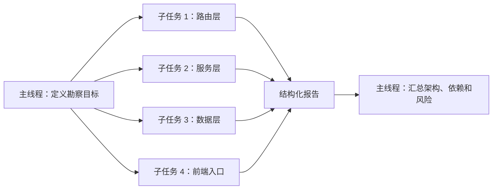
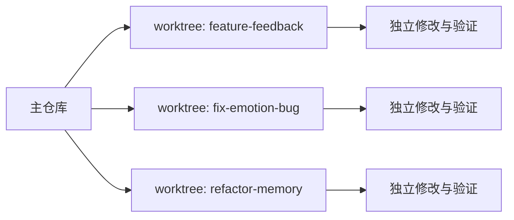
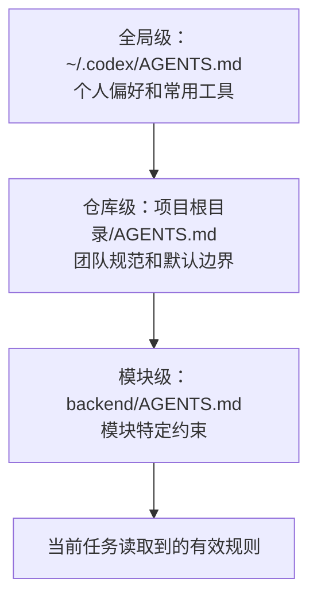
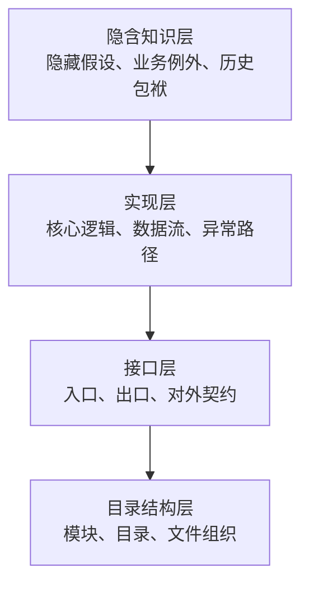
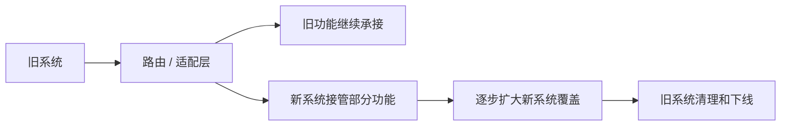

# 第 9 章 场景一：接手陌生代码库

前面几章讲的是闭环、说明书、控制和能力系统。从第 9 章开始，我们把这些方法放进第一个真实场景：一个你还不熟悉、但必须开始工作的代码库。

接手陌生代码库，是工程师最常见也最容易焦虑的场景之一。你面对的往往不是一份清楚的系统说明，而是一堆“看起来能跑、但没人完全说得清”的代码。传统方式下，你可能需要数天甚至数周的串行阅读，才能做出第一个有意义的修改。本章要讲的，是一条更稳也更快的路：利用 Codex 的并行勘察、项目规则初始化和结构化分析，把冷启动从“漫无目的地读代码”变成一条可验证、可交接、可逐步收敛的工作流。

这一章的重点不是让 Codex 替你“猜懂整个项目”，而是让它帮助你更快建立三件事：全局结构、局部风险和修改边界。只要这三件事建立起来，陌生代码库就不再是一团雾，而会变成一张可以逐步探索的地图。

## 9.1 并行勘察：从串行阅读到全局俯瞰

接手陌生代码库的第一步，通常是看目录结构、读 README、尝试跑起来。但中型以上项目往往有十几个模块，人工逐个阅读不仅耗时，而且容易“看了后面忘前面”。更麻烦的是，模块之间的依赖关系本来就是交织的：你需要理解 A 模块的输出，才能理解 B 模块的输入；你需要知道前端如何调用接口，才能判断后端路由是否真的稳定。

这正是并行勘察适合发挥作用的地方。多个子任务可以同时阅读不同模块，各自输出结构化报告，再由主线程汇总为全局视图。图 9-1 展示了这种主线程分发、子任务勘察、最终汇总的基本形态。

**图 9-1：并行勘察的任务分发与结果汇总**



并行勘察的价值，不在于一次性读完所有文件，而在于先建立一张“够用的地图”：项目有哪些模块，哪些文件是入口，数据大致怎么流动，哪些区域改动风险最高。地图一旦建立，后续阅读就不再是盲扫，而是有方向的深入。

### 9.1.1 先让每个模块输出同一种报告

以 `emotional_chat` 为例，项目里同时有后端路由、业务服务、核心模块、数据库模型、前端组件和运行时能力。第一次勘察时，不应该让 Codex 随意发挥，而应该要求每个模块统一输出四类信息：模块职责、核心文件、内外部依赖、潜在风险点。

代码清单 9-1 用目录树说明一个陌生项目可以怎样先被切成几个勘察区域。它的作用不是完整描述项目，而是帮助读者理解：并行勘察要先有稳定分区。

**代码清单 9-1：`emotional_chat` 的并行勘察分区**

```text
emotional_chat/
|-- backend/
|   |-- routers/          # FastAPI 路由层
|   |-- services/         # 业务逻辑层
|   |-- modules/          # 核心功能模块
|   |-- agent/            # 独立智能体实现
|   |-- runtime/          # 运行时与技能架构
|   |-- database.py       # SQLAlchemy 模型
|   `-- models.py         # Pydantic 数据模型
|-- frontend/
|   `-- src/
|       |-- components/   # React 组件
|       |-- services/     # API 调用层
|       `-- hooks/        # 自定义 Hooks
|-- alembic/              # 数据库迁移
|-- requirements.txt
`-- Makefile
```

勘察指令可以写得很简单：分别阅读 `routers/`、`services/`、`modules/`、`database.py`、`models.py`、`frontend/src/`，每个区域输出“职责、核心文件、依赖、风险点”。表 9-1 展示了一份汇总报告可能长什么样。它不是最终结论，而是后续深挖的入口。

**表 9-1：并行勘察后应优先汇总的发现**

| 区域 | 典型发现 | 后续动作 |
| --- | --- | --- |
| `routers/chat.py` | 流式响应、文件上传、鉴权边界需要确认 | 继续追踪请求入口和异常路径 |
| `services/chat_service.py` | 方法过长、职责混合、异常处理不一致 | 拆出关键路径，先理解再修改 |
| `database.py` | 逻辑关联多于物理约束 | 检查删除和迁移风险 |
| `models.py` | 类型定义偏宽，部分字段缺少枚举约束 | 对照接口和测试确认契约 |
| `frontend/src/` | API 调用和组件状态分散 | 找出用户主流程的前端入口 |

这类汇总最重要的价值，是把陌生代码库从“很多文件”变成“几个可以继续追问的问题”。你不必第一天就理解所有实现，但应该知道接下来该深挖哪里。

实际使用时，可以直接给 Codex 一个高层指令：请它分别勘察 `routers/`、`services/`、`modules/`、`database.py`、`models.py` 和 `frontend/src/`，并要求每个区域都按同一格式输出四项信息：模块职责、核心文件、内外部依赖、潜在风险点。这样得到的汇总不会只是“读过哪些文件”，而会变成一组可以继续追问的关键发现。例如，`routers/chat.py` 可能暴露出 SSE 流式响应缺少超时处理、文件上传大小限制硬编码；`services/chat_service.py` 可能出现 `_chat_with_memory` 方法过长、职责不单一、异常处理风格不一致等问题；`database.py` 可能显示外键更多依赖逻辑关联而非物理约束，删除用户时存在孤儿数据风险；`models.py` 可能暴露出 `feedback_type` 仍用 `str` 而不是 `Enum`，`ChatResponse.context` 的 `Dict[str, Any]` 过于宽松。这样的输出已经不只是概览，而是在告诉你下一轮应该把注意力放在哪里。

不过，能并行勘察不等于应该无限并行。模块越多，输出越多，后续审阅、对比和追问的成本也越高。所以下一步要讨论的，不是怎样把并发数开到最大，而是怎样选择一个人类也能接住的并发范围。

### 9.1.2 并发不是越高越好

并行勘察听起来很美，但并发度不是越高越好。并发越高，输出越多，人类审阅和汇总的压力也越大。更现实的做法，是把并发控制在自己能读完、能比较、能追问的范围内。

表 9-2 给出一个实用的并发度判断。它不追求精确到某个硬件数值，而是帮助读者意识到：并行勘察的瓶颈经常不是模型，而是人的审阅带宽。

**表 9-2：并行勘察的并发度选择**

| 并发任务数 | 更适合什么情况 | 主要风险 |
| --- | --- | --- |
| 1-2 | 小项目、深度阅读、风险较高的模块 | 速度慢，但容易控制 |
| 3-5 | 中型项目的第一轮勘察 | 输出量适中，适合汇总 |
| 6+ | 大型项目分批勘察 | 人类审阅和上下文管理容易成为瓶颈 |

除了并发度，还要注意长上下文任务中的信息损耗。大规模勘察会不断累积文件片段、搜索结果、命令输出和中间判断；一旦对话过长，后续模型未必还能稳定保留早期细节。因此，陌生代码库勘察不要只依赖一条越来越长的对话历史，而应该在关键节点主动沉淀阶段性报告：已经确认什么、仍然不确定什么、下一轮要深挖哪里。

实操上，可以把上下文管理当成勘察流程的一部分：每完成一轮模块扫描，就要求 Codex 输出结构化摘要；进入修改前，再把关键结论整理成任务说明或交接说明。对于特别长的任务，可以在关键节点另开线程或分支继续推进，让原始勘察记录和后续修改任务分开保存。这样即使上下文被压缩或任务被接力，团队也不会丢失最重要的判断依据。

还有一个小技巧，是按任务类型选择推理强度。Codex 支持 `low`、`medium`、`high`、`xhigh` 等推理强度。勘察任务只读不写，通常 `low` 或 `medium` 已经足够；只有架构决策、复杂 bug 修复或高风险影响分析，才值得提高推理预算。代码清单 9-2 展示了两类不同任务的选择方式。

**代码清单 9-2：按任务类型选择推理强度**

```bash
# 勘察任务：先用较低推理强度建立地图
codex --reasoning-effort low "分析 backend/services/ 的模块职责和依赖关系"

# 架构判断：需要更高推理强度评估取舍
codex --reasoning-effort high "评估将 chat_service 拆分为独立服务的可行性"
```

### 9.1.3 用 worktree 把并行勘察延伸到并行修改

并行勘察解决的是“同时读懂多个模块”。但读懂之后，如果一个工程师同时跑三件事，比如修 A 的 bug、做 B 的新功能、重构 C 模块，用同一个工作目录不断切分支几乎一定会乱：临时改动、未提交文件、跑了一半的测试都可能污染另一条任务线。

图 9-2 展示了 worktree 的价值：同一个仓库可以派生出多个相互隔离的工作树，每条任务线都有自己的分支和工作目录。

**图 9-2：用 worktree 隔离三条并行任务线**



代码清单 9-3 给出一个最小用法。这里的重点不是记住命令，而是建立习惯：并行任务应该有物理隔离，不要把多个任务的中间状态堆在同一个工作目录里。

**代码清单 9-3：用 worktree 启动并行任务**

```bash
# 起三个并行 Codex 任务，每个任务使用自己的工作树
codex --worktree feature-feedback --tmux
codex --worktree fix-emotion-bug --tmux
codex --worktree refactor-memory --tmux

# 查看当前所有 worktree
git worktree list

# 任务完成后清理
git worktree remove .codex/worktrees/feature-feedback
```

需要提醒两点边界。第一，worktree 共享同一份 Git 元数据，但不共享 `node_modules`、`.venv` 等构建产物，首次进入新工作树通常需要重新安装依赖。第二，并行任务的 CPU、内存和 token 成本会叠加；本地机器同时跑太多任务时，瓶颈会很快出现。

## 9.2 AGENTS.md：先把项目规则写下来

当你或 Codex 开始修改代码时，最怕的事情不是“不理解逻辑”，而是“不小心违反项目约定”。这些约定可能涉及代码风格、命名规范、提交信息格式、分支策略、测试要求，也可能包括各种隐性规则，比如某个模块不能直接调用另一个模块，某些迁移文件不能再改，某些目录只能由 owner 审批。

传统团队协作中，这些规则散落在 Wiki、README、口头传授和 lint 配置中。对 Agent 来说，更稳的做法是把它们集中成一份可读取、可维护、可审查的项目说明书：`AGENTS.md`。

### 9.2.1 一份够用的 AGENTS.md 应该写什么

`AGENTS.md` 放在项目根目录，告诉 Codex 这个项目的特殊约定。代码清单 9-4 给出一个压缩后的示例。它不追求覆盖全部规则，而是示范一份项目说明书至少应该同时包含代码风格、架构约定、测试要求、Git 规范、数据库边界和禁止事项。

**代码清单 9-4：`emotional_chat` 的 AGENTS.md 最小骨架**

```text
Project Rules for emotional_chat

代码风格：
- 使用 Python 3.10+ 语法。
- 文件命名使用 snake_case，类名使用 PascalCase。
- 行长度遵循 Black 默认设置。

架构约定：
- 分层架构：Router -> Service -> Module / Database。
- Router 层只做参数校验和调用 Service，不包含业务逻辑。
- Service 层可以调用其他 Service，但不能绕过约定直接操作数据库。
- 模块间禁止循环导入。

测试要求：
- 每个 Service 应有对应的单元测试。
- 使用 pytest，改动后至少跑相关测试。

Git 规范：
- 使用 Conventional Commits。
- 禁止直接推送到 main 分支。

数据库：
- 使用 SQLAlchemy + Alembic 管理迁移。
- 已发布 migration 文件不可直接修改。

禁止事项：
- 不要修改敏感核心目录，除非任务明确要求。
- 不要使用 print() 进行日志记录，统一使用 logging。
- 不要在代码中硬编码 API Key。
```

如果接手的项目没有 `AGENTS.md`，可以先让 Codex 根据配置文件、目录结构、import 关系、现有测试和 git log 自动生成一份初稿。但这份初稿必须人工审查：命名规范是否真实，架构分层是否准确，禁止事项是否过宽或过窄。项目说明书不是越长越好，而是越能减少误解越好。

### 9.2.2 从个人偏好到团队规范：分层说明

实际项目中，规则通常不是一层就够。个人有个人偏好，仓库有团队规范，某些模块还有自己的特殊约束。代码清单 9-5 展示了最常见的三层放置方式：全局级放个人偏好，仓库级放团队规范，模块级放局部约束。

**代码清单 9-5：AGENTS.md 的三层放置方式**

```text
~/.codex/AGENTS.md
  全局级：个人偏好，例如常用工具、编码习惯

项目根目录/AGENTS.md
  仓库级：团队规范，例如架构约定、测试要求

项目根目录/backend/AGENTS.md
  模块级：模块特定约束，例如后端目录的访问边界
```

图 9-3 进一步说明了三层规则之间的优先级：越靠近当前工作目录，规则越具体，优先级也越高。

**图 9-3：AGENTS.md 的三层说明与优先级**



更值得注意的是，`AGENTS.md` 正在从某个工具的专属配置，演变成跨工具协作的项目说明形式。团队中有人用 Codex、有人用其他 AI 编码工具时，最好仍然维护一份统一的项目规则：硬性约束放进项目说明，工具偏好放进工具链偏好，特定工具的高级配置则放进对应目录。这样既能统一底线，又不会把某个工具的细节强塞给所有人。

### 9.2.3 已知陷阱：把犯过的错写进规则

`AGENTS.md` 中有一个经常被忽视但很有价值的版块：已知陷阱（Known Pitfalls）。每当 Codex 犯了一个可以复现、可以归纳的错误，就应该把它转成一条规则，而不是只在 review 里口头提醒一次。

代码清单 9-6 展示了已知陷阱的写法。它的作用是把团队已经付过学费的错误，沉淀成下一次任务开始前就能读取的约束。

**代码清单 9-6：已知陷阱的写法**

```text
已知陷阱：
- 不要修改由代码生成工具维护的文件。
- 不要在 Router 层直接注入数据库 Session。
- `alembic/versions/` 中已发布的迁移文件禁止修改。
```

### 9.2.4 搜索工具链：fd、rg 与 sg 的分工

Codex 执行任务时依赖代码搜索工具理解项目结构。在 `AGENTS.md` 中明确指定搜索工具，能减少它在搜索阶段浪费的时间，也能降低因为目录噪声、正则误判或生成文件干扰而造成的错误。表 9-3 把 `fd`、`rg` 和 `sg` 的分工放在一起，方便团队把搜索策略写成项目默认值。

**表 9-3：搜索工具链的分工**

| 工具 | 更适合做什么 | 典型用法 |
| --- | --- | --- |
| `fd` | 按文件名快速定位 | 已知文件名或目录名，先找位置 |
| `rg` | 按文本内容搜索 | 搜函数名、配置项、错误信息、TODO |
| `sg` | 按代码结构搜索 | 找所有调用某 API 的代码、所有 async 函数定义 |

`fd` 适合解决“文件在哪里”，`rg` 适合解决“哪些地方出现了这个字符串”，`sg` 或其他 AST 工具则适合解决“哪些代码结构符合这个模式”。例如，搜索“所有调用了 `chat_service` 的文件”或“所有 async 函数定义”时，结构化搜索通常比单纯正则更稳，因为它不容易被注释和字符串字面量干扰。

更复杂的场景里，代码结构搜索也可以通过 MCP 等结构化接口提供给 Agent 使用。它的价值不在于多接一个工具，而在于让 Agent 能把搜索规则迭代得更准确：先写一个初始规则，执行搜索，再根据假阳性和假阴性调整规则，直到结果足够可靠。对遗留代码库来说，这类能力尤其有用，比如查找所有使用已废弃 API 的位置，或者定位跨模块调用链上的高风险入口。

`rg` 的高级模式也值得写进项目说明。多行搜索可以用于查找跨行结构，PCRE2 模式可以处理更复杂的匹配，Unicode 模式可以搜索中文注释中的 TODO 或 FIXME。对 Codex 来说，工具链策略写得越清楚，它越容易在复杂搜索任务中选择正确的工具和参数。

代码清单 9-7 展示了可以写进 `AGENTS.md` 的搜索工具策略。它的重点不是强迫所有人使用同一条命令，而是为 Agent 提供默认搜索路线。

**代码清单 9-7：AGENTS.md 中的搜索工具策略**

```text
搜索工具策略：
- 文件名搜索：优先使用 fd；不适用时再用 find。
- 文本内容搜索：优先使用 rg，不用 grep。
- 代码结构搜索：使用 sg（ast-grep）或其他 AST 工具。
- 多行模式搜索：需要跨行匹配时使用 rg --multiline。
- 排除目录：.git、node_modules、__pycache__、.venv、dist。
```

### 9.2.5 Rules：让约束按场景生效

`AGENTS.md` 适合放项目级默认规则，但有些约束只应该在特定目录、文件类型或任务场景下生效。比如数据库迁移、部署配置、API schema、测试文件，它们的风险边界并不相同。如果所有规则都塞进根目录说明书，读者和 Agent 都很难判断哪些约束在当前任务里真正相关。

这时可以把更细粒度的规则放进 `.codex/rules/`。Rules 通常按 glob 模式匹配文件，只在命中的场景里生效。表 9-4 给出几类常见规则，它们的共同点是：规则不需要全局生效，但一旦命中就应该非常明确。

**表 9-4：适合写成 Rules 的细粒度约束**

| 场景 | 规则示例 |
| --- | --- |
| 代码审查 | 新增 public 方法必须说明输入输出和异常路径 |
| 数据库迁移 | schema 变更必须有对应 Alembic migration |
| 部署配置 | Docker 镜像必须使用具体版本，禁止 latest |
| 环境变量 | 禁止硬编码密钥、token 和生产地址 |
| 测试文件 | 新增服务逻辑必须补对应单元测试 |

Rules 文件本身也应该进入版本控制，并在 Code Review 中被认真审查。原因很简单：规则文件改变的不是某一行业务代码，而是 Agent 之后会怎样理解和执行整个项目边界；它的影响面可能比单个代码文件更大。

## 9.3 先理解，再修改

并行勘察给出了全局视图，但真正动手之前还需要一层深入。接手陌生代码库最危险的状态，是“刚刚看懂一点，就急着改”。这一节要建立的原则很简单：先理解，再修改；先缩小影响面，再让 Codex 执行。

### 9.3.1 代码理解有四层

可以把陌生代码库的理解分成四层。图 9-4 用金字塔表示这四层：越往上，越依赖人工判断；越往下，越适合让 Codex 先做结构化勘察。

**图 9-4：代码理解的四层金字塔**



目录结构层和接口层通常可以通过自动化勘察快速建立；实现层需要你与 Codex 交互式探索；隐含知识层往往需要结合 owner、历史 issue、生产反馈和人工经验判断。

### 9.3.2 从全局视图进入局部深挖

完成并行勘察后，可以让 Codex 进一步生成架构概览：模块间依赖关系、关键数据流路径、核心模块和辅助模块的区分，以及潜在架构问题。表 9-5 给出从全局视图进入局部深挖时最该追问的几个问题。

**表 9-5：从全局视图进入局部深挖的追问**

| 追问 | 目的 |
| --- | --- |
| 这个模块的 public 方法各自承担什么职责 | 避免把入口和内部实现混在一起 |
| 这个模块依赖哪些外部服务或数据库对象 | 找出修改可能影响的外部边界 |
| 用户主流程经过哪些文件和函数 | 建立关键路径，而不是只看单文件 |
| 哪些异常路径和降级逻辑最容易被忽略 | 找出隐藏风险 |
| 现有测试覆盖了哪些行为 | 用测试反向确认接口契约 |

这里的关键原则是：让 Codex 先读，你来问。不要自己从 `chat_service.py` 第一行读到最后一行，而是先让 Codex 分析所有 public 方法的职责、入参出参、调用关系和外部交互点，然后你基于分析结果追问。Codex 的优势是遍历和整理，人类的优势是判断什么问题值得继续问。

### 9.3.3 修改前必须做影响分析

当你对项目有了基本理解，准备规划第一个修改时，最重要的一步是评估影响范围：会影响哪些文件，需要新增哪些依赖，需要修改哪些测试，是否会影响其他模块的行为。这种修改前影响分析，是接手陌生代码库时最重要的安全网。

表 9-6 可以作为修改前的检查表。它要确保你不会在不知情的情况下引入连锁变更。

**表 9-6：修改前影响分析检查表**

| 检查问题 | 为什么重要 |
| --- | --- |
| 这次修改的最小文件集合是什么 | 防止顺手扩大范围 |
| 哪些文件明确不该改 | 给 Codex 设置禁区 |
| 哪些测试能证明修改有效 | 避免只凭解释合并 |
| 哪些模块可能受到间接影响 | 提前发现连锁风险 |
| 是否需要 owner 或 reviewer 提前确认 | 把责任链放到执行前 |

这一节的落点是：理解不是为了写一份漂亮的架构文档，而是为了让第一次修改更小、更准、更容易审查。

## 9.4 产出审查友好的最小变更

接手陌生代码库时，最容易犯的错误就是“为了修一个 bug 重写半个模块”。审查难度高、风险不可控、信任成本高。新人一次性提交大量变更，团队很难放心。正确做法是最小变更：只改必须改的，其他一律不动。

Codex 在这方面可以很有帮助，但前提是你给它明确约束：哪些文件必须修改，哪些文件禁止修改，新增代码的风格必须与现有代码一致，验证命令是什么，输出摘要要说明哪些地方没有动。

### 9.4.1 一个最小变更应该长什么样

假设要修复 `_chat_with_memory` 方法中 `KeyError: 'intensity'` 的问题，代码清单 9-8 展示了一种审查友好的最小变更。它的重点是：源头补默认值，调用方安全读取，每处改动都能被 reviewer 快速理解。

**代码清单 9-8：修复缺失字段的最小 diff**

```diff
diff --git a/backend/services/chat_service.py b/backend/services/chat_service.py
- emotion_intensity=emotion_result["intensity"],
+ emotion_intensity=emotion_result.get("intensity", 0.5),

diff --git a/backend/services/emotion_service.py b/backend/services/emotion_service.py
  result = self._call_llm_for_emotion_analysis(message)
+ result.setdefault("emotion", "neutral")
+ result.setdefault("intensity", 0.5)
  return result
```

两处修改形成了双保险：源头确保返回格式完整，调用方用 `.get()` 安全兜底。每个文件的变更都很小，reviewer 不需要重新理解整个模块，就能判断这次修复是否合理。

### 9.4.2 提交说明也要服务审查

最小变更不仅体现在 diff，也体现在提交说明里。代码清单 9-9 给出一条精炼的 commit message。它说明了修改内容、风险原因和关联问题，方便 reviewer 快速进入上下文。

**代码清单 9-9：审查友好的 commit message**

```bash
git commit -m "fix(services): safely access emotion_result keys

- Use defaults for missing emotion and intensity values
- Prevent KeyError when LLM response format is incomplete
- Root cause: emotion_service may return partial result

Refs: #PROJ-1234"
```

如果 `AGENTS.md` 已经定义了 Conventional Commits 或 issue 关联格式，Codex 生成提交说明时就能更稳定地遵循团队规范。提交前仍然要人工检查两件事：描述是否夸大了改动范围，关联 issue 是否准确。

## 9.5 遗留项目的上下文工程

并非所有陌生代码库都是“干净”的。很多工程师接手的是积累多年的遗留系统：代码风格混乱，文档缺失，测试覆盖率很低，依赖版本过时。这些系统有一个共同特点：能跑，但没人敢动。

Codex 在处理遗留系统时面临的特殊挑战，是上下文质量低。缺少注释和类型定义，模块边界模糊，隐性依赖多，都会降低分析精度。但 Codex 的优势恰恰在于处理信息量大的场景：只要你能提供足够清楚的上下文引导，它仍然能发挥价值。

### 9.5.1 先改善上下文，再修改代码

处理遗留项目的核心原则是：先改善上下文，再修改代码。表 9-7 把常见策略按风险从低到高排列。它的作用是提醒读者：不要一上来就让 Agent 重构核心业务逻辑，先把可理解性和安全网补起来。

**表 9-7：遗留项目的上下文改善策略**

| 策略 | 做法 | 风险等级 |
| --- | --- | --- |
| 建立注释层 | 让 Codex 生成注释草稿，人工审核确认 | 低 |
| 识别危险区域 | 标出副作用、隐含假设和外部耦合 | 低 |
| 渐进式类型化 | 为公共方法补类型注解，用类型检查验证 | 中 |
| 建立变更安全网 | 补测试、备份分支、回滚脚本和影响分析 | 中 |
| 从外围到核心 | 先改工具函数、配置和错误处理，再动核心逻辑 | 高 |

这几条策略的共同点，是先提升系统的可读性、可验证性和可回退性。只有当上下文质量上来之后，后续修改才不会完全依赖某个人的记忆或直觉。

### 9.5.2 从认识到改造：四阶段执行框架

技术手段之外，遗留代码改造还需要一套执行顺序来回答：先改什么，后改什么，怎么验证，何时算完成。表 9-8 给出一个四阶段框架。它适合中大型遗留系统，也适合团队评估“是否已经可以放大改造范围”。

**表 9-8：遗留项目改造的四阶段框架**

| 阶段 | 目标 | 主要动作 | 通过标准 |
| --- | --- | --- | --- |
| 全面评估 | 建立完整认知，不急着改代码 | 并行勘察、依赖图、风险分区 | 关键模块和风险区说得清 |
| 安全网构建 | 让修改可验证、可回退 | 补测试、接 CI、准备回滚 | 核心路径有最小验证 |
| 小规模试点 | 在低风险边界内验证方法 | 选一个小热点生成 PR | 无停机事故，review 可接受 |
| 持续优化 | 让改造成为长期节奏 | 跟踪技术债、缺陷和交付周期 | 指标能持续改善 |

这个框架的重点，不是把遗留系统改造包装成大工程，而是防止团队在没有安全网时就把改造范围放大。Codex 可以在评估、注释、类型化、测试补齐和局部改造中发挥很大作用，但越接近核心业务逻辑，越需要人工判断和审批。

### 9.5.3 用 Strangler Fig 降低迁移风险

四阶段框架解决的是管理流程问题，Strangler Fig 模式解决的是技术策略问题：如何在不停机的前提下，把遗留系统逐步替换为新系统。它的基本思路是，在旧系统旁边建立新路径，让新系统逐步接管一部分流量和功能，直到旧系统可以被安全移除。

图 9-5 展示了这个迁移过程。它的重点是“逐步替换”，而不是一次性重写。

**图 9-5：Strangler Fig 渐进式迁移模式**



传统 Strangler Fig 的最大瓶颈是依赖映射：你需要知道旧系统的每个接口被哪些消费者调用，才能安全地逐步替换。Codex 可以在这里做大量高噪声工作：分析旧接口的调用方，跨仓库搜索消费者，整理内部和外部依赖，预测每个接口替换的影响范围。

影响范围的核心度量可以理解为爆炸半径。表 9-9 给出一个简单分级，用来决定哪些改动可以自动推进，哪些必须人工确认，哪些需要架构评审。

**表 9-9：爆炸半径分级与审批要求**

| 等级 | 定义 | 示例 | 审批要求 |
| --- | --- | --- | --- |
| L0 小半径 | 仅影响单个模块内部 | 修改私有方法 | 自动通过或轻量 review |
| L1 中半径 | 影响模块公开接口 | 修改 Service 类公开方法 | 人工确认 |
| L2 大半径 | 影响跨模块交互协议 | 修改 API 响应格式 | 架构评审 |

掌握 AI 辅助的遗留代码改造方法，并不意味着让 Agent 自动重写旧系统。更现实的价值，是让它帮你更快看清依赖、更早建立安全网、更稳定地推进小步迁移。

## 本章小结

接手陌生代码库的核心挑战，是冷启动成本高：从零开始理解一个陌生系统的架构、约定和风险点，传统方式需要数天甚至数周。本章的方法论，是把这个过程系统化：并行勘察建立全局认知，`AGENTS.md` 锁定项目规则，结构化阅读深入局部，最小变更降低审查风险，遗留系统先改善上下文再改代码。

如果只保留几条实践判断，可以这样记：

- 并行勘察不是为了读完所有文件，而是为了更快建立项目地图。
- `AGENTS.md` 的价值不是“写文档”，而是把项目规则变成 Agent 能读取的执行边界。
- 修改陌生代码前，影响分析比代码生成更重要。
- 最小变更的目标，是让 reviewer 能快速理解意图和风险。
- 遗留系统不要急着重构，先建立上下文、安全网和小步迁移路径。

读完这一章，你应该已经能把“接手陌生代码库”从一次焦虑的个人阅读任务，改造成一条可执行的工程流程。下一章会继续进入更具体的修改场景：当 bug 已经出现、测试需要补齐、回归风险需要控制时，Codex 应该怎样参与修复和验证。
